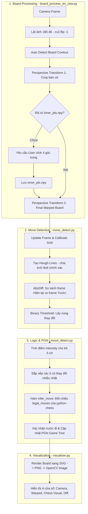

# ♟️ Computer Vision Chess Move Tracker

Hệ thống theo dõi nước đi cờ vua thời gian thực từ camera, số hóa trạng thái bàn cờ và xuất dữ liệu dưới định dạng PGN.

## 🚀 Pipeline Overview

The system operates in four distinct phases to transform raw video into structured chess data:

---

## 🛠️ Chi tiết các thành phần (Components Breakdown)

### 1. Xử lý bàn cờ (`board_process_en_new.py`)
* **Phát hiện tự động**: Sử dụng thuật toán tìm đường bao (contour detection) kết hợp tăng cường độ tương phản CLAHE và ngưỡng Otsu để xác định vị trí bàn cờ.
* **Hiệu chuẩn hai giai đoạn**:
    * **Giai đoạn 1**: Cắt vùng chứa bàn cờ từ khung hình gốc.
    * **Giai đoạn 2**: Sử dụng lựa chọn 4 điểm thủ công (lưu tại `inner_pts.npy`) để loại bỏ viền gỗ, xuất ra hình ảnh $8 \times 8$ hoàn hảo chỉ chứa các ô cờ.
* **Hướng khung hình**: Tự động lật khung hình đầu vào 180° để đảm bảo góc nhìn từ trên xuống (top-down) đồng nhất.

### 2. Nhận diện nước đi (`move_detect.py`)
* **Hiệu chuẩn lưới**: Sử dụng biến đổi Hough Line để phát hiện các đường rãnh thực tế giữa các ô cờ, giúp lập bản đồ lưới với độ chính xác cao.
* **Phát hiện thay đổi**: Tính toán sự khác biệt tuyệt đối (`cv2.absdiff`) giữa khung hình tham chiếu và trạng thái hiện tại.
* **Suy luận nước đi**: Xếp hạng các ô cờ dựa trên cường độ thay đổi và xác thực các nước đi ứng viên bằng công cụ luật cờ của `python-chess`.

### 3. Hiển thị (`visualizer.py`)
* **Render bàn cờ**: Chuyển đổi trạng thái PGN hiện tại sang định dạng SVG, sau đó render lại thành định dạng hình ảnh tương thích với OpenCV.
* **Đầu ra đa cửa sổ**:
    1.  **Camera**: Luồng video gốc kèm đường bao bàn cờ.
    2.  **Warped Board**: Lưới $8 \times 8$ đã được chuẩn hóa.
    3.  **Chess Visual**: Đại diện bàn cờ 2D đã số hóa.
    4.  **Diff Detection**: Bản đồ nhiệt nhị phân (binary heatmap) của chuyển động.

---

## 🎮 Phím điều khiển (Controls)

| Phím | Hành động |
| :--- | :--- |
| **`i`** | **Calibrate**: Đặt khung hình hiện tại làm điểm tham chiếu để phát hiện chuyển động. |
| **`SPACE`** | **Confirm Move**: Phân tích sự khác biệt giữa khung tham chiếu và hiện tại để chốt nước đi. |
| **`r`** | **Undo**: Hoàn tác nước đi cuối cùng trên bàn cờ kỹ thuật số và cây dữ liệu PGN. |
| **`q`** | **Quit & Save**: Thoát ứng dụng và lưu trận đấu vào tệp `.pgn`. |

---

## ⚙️ Yêu cầu hệ thống (Requirements)

* **Python 3.x**
* **Thư viện**: 
    * `opencv-python`
    * `numpy`
    * `chess`
    * `cairosvg`