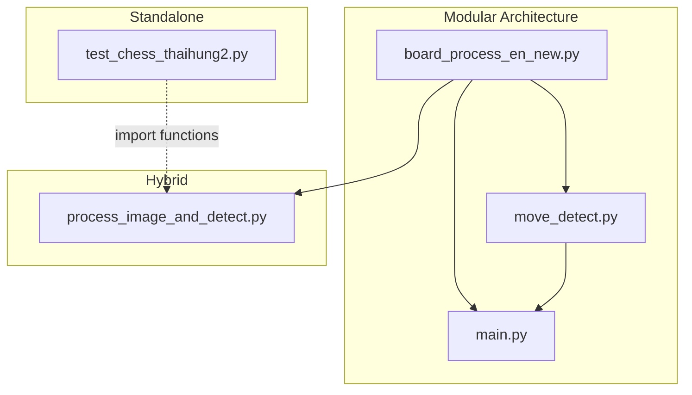

# 🔍 Phân Tích Project XLA_ck — Chess Board Detection & Move Recognition

## 1. Mục Đích Tổng Thể

Project này xây dựng một hệ thống **nhận diện bàn cờ vua từ camera/video** bằng Computer Vision (OpenCV) và **tự động phát hiện nước đi** bằng cách so sánh trạng thái bàn cờ trước/sau. Hệ thống kết hợp thư viện `python-chess` để kiểm tra tính hợp lệ của nước đi theo luật cờ vua và ghi lại lịch sử ván cờ dưới dạng PGN.

### Pipeline tổng quan:


---

## 2. Cấu Trúc File & Phụ Thuộc

| File | Vai trò | Import từ |
|---|---|---|
| [board_process_en_new.py](file:///c:/Users/Admin/XLA_ck/board_process_en_new.py) | Module xử lý bàn cờ (detect + warp) | — (module gốc) |
| [move_detect.py](file:///c:/Users/Admin/XLA_ck/move_detect.py) | Module detect nước đi + visualize bàn cờ ảo | `board_process_en_new` |
| [main.py](file:///c:/Users/Admin/XLA_ck/main.py) | Entry point chính (modular) | `board_process_en_new`, `move_detect` |
| [test_chess_thaihung2.py](file:///c:/Users/Admin/XLA_ck/test_chess_thaihung2.py) | File all-in-one (self-contained), nhiều tính năng nhất | — (standalone) |
| [process_image_and_detect.py](file:///c:/Users/Admin/XLA_ck/process_image_and_detect.py) | File lai (hybrid), dùng module + import functions từ test | `board_process_en_new`, `test_chess_thaihung2` |



---

## 3. Phân Tích Chi Tiết Từng File

---

### 3.1. [board_process_en_new.py](file:///c:/Users/Admin/XLA_ck/board_process_en_new.py) — Board Processor Module

**Mục đích**: Phát hiện bàn cờ trong frame camera và biến đổi phối cảnh (perspective transform) để trả về ảnh bàn cờ nhìn từ trên xuống (top-down view).

**Class**: [ChessBoardProcessor](file:///c:/Users/Admin/XLA_ck/board_process_en_new.py#5-131)

| Hàm | Mục đích | Logic |
|---|---|---|
| [__init__()](file:///c:/Users/Admin/XLA_ck/test_chess_thaihung2.py#20-37) | Khởi tạo, load cấu hình `inner_pts.npy` nếu có | Load file numpy chứa 4 góc inner đã calibrate trước đó |
| [calculate_optimal_side()](file:///c:/Users/Admin/XLA_ck/board_process_en_new.py#18-30) | Tính kích thước tối ưu cho ảnh warp | Tính độ dài 4 cạnh, lấy max, làm tròn theo `side_step` |
| [order_points()](file:///c:/Users/Admin/XLA_ck/test_chess_thaihung2.py#89-98) | Sắp xếp 4 điểm theo TL→TR→BR→BL | Dùng tổng/hiệu tọa độ để xác định góc |
| [get_board_contour_auto()](file:///c:/Users/Admin/XLA_ck/board_process_en_new.py#42-60) | **Auto-detect** bàn cờ trong frame | Grayscale → CLAHE → OTSU → Contours → Tìm contour lớn nhất có 4 đỉnh |
| [select_and_save_inner_points()](file:///c:/Users/Admin/XLA_ck/board_process_en_new.py#61-93) | Cho user click chọn 4 góc inner | GUI click 4 điểm → Lưu `inner_pts.npy` |
| [process_frame()](file:///c:/Users/Admin/XLA_ck/board_process_en_new.py#95-131) | **Pipeline chính**: Frame → Warped Board | Detect contour → Warp lần 1 (outer) → Warp lần 2 (inner) → Trả ảnh bàn cờ phẳng |

**Pipeline chi tiết của [process_frame()](file:///c:/Users/Admin/XLA_ck/board_process_en_new.py#95-131)**:
```
Frame gốc
  │
  ├─ get_board_contour_auto() → 4 góc ngoài
  │
  ├─ Perspective Transform lần 1 (M1): Warp theo 4 góc ngoài
  │     → warped (ảnh bàn cờ thô, có viền)
  │
  └─ Perspective Transform lần 2 (M2): Warp theo inner_pts
        → final_board (ảnh bàn cờ chính xác, chỉ có 64 ô)
```

---

### 3.2. [move_detect.py](file:///c:/Users/Admin/XLA_ck/move_detect.py) — Move Detector Module

**Mục đích**: Nhận diện nước đi bằng cách phân tích sự thay đổi giữa 2 frame (trước/sau khi đi quân), quản lý logic cờ vua, và vẽ bàn cờ ảo.

**Class [MoveDetector](file:///c:/Users/Admin/XLA_ck/move_detect.py#84-224)**:

| Hàm | Mục đích | Logic |
|---|---|---|
| [get_occupancy_matrix()](file:///c:/Users/Admin/XLA_ck/move_detect.py#104-123) | Chuyển ảnh bàn cờ → ma trận 8x8 (0/1) | Canny edge → Chia 64 ô → Đếm pixel cạnh mỗi ô → So với `threshold` |
| [update_frame()](file:///c:/Users/Admin/XLA_ck/move_detect.py#124-135) | Cập nhật frame hiện tại | Lưu `curr_warped`, tính `matrix_after` |
| [confirm_move()](file:///c:/Users/Admin/XLA_ck/move_detect.py#139-180) | **Xác nhận nước đi** (nhấn Space) | `diff = after - before` → Ô = -1 (quân đi ra) / +1 (quân đi vào) → Tạo `chess.Move` → Kiểm tra `legal_moves` |
| [get_diff_image()](file:///c:/Users/Admin/XLA_ck/move_detect.py#184-201) | Tạo heatmap thay đổi | Vẽ rect đỏ (quân đi ra) / xanh (quân đi vào) lên ảnh |
| [draw_grid()](file:///c:/Users/Admin/XLA_ck/move_detect.py#202-212) | Vẽ lưới 8x8 lên ảnh | Chia đều theo width/height |
| [undo()](file:///c:/Users/Admin/XLA_ck/move_detect.py#213-218) | Hoàn tác nước đi | `board.pop()` |
| [set_reference_frame()](file:///c:/Users/Admin/XLA_ck/move_detect.py#219-224) | Đặt mốc tham chiếu mới (phím 'i') | Lưu ảnh hiện tại làm `prev_warped` |

**Class [ChessVisualizer](file:///c:/Users/Admin/XLA_ck/test_chess_thaihung2.py#19-84)**: Vẽ bàn cờ ảo 2D với asset quân cờ PNG (alpha blending).

**Phương pháp detect move (Canny-based)**:
```
Warped Image → Grayscale → GaussianBlur → Canny Edge
  → Chia 64 ô → Đếm edge pixels mỗi ô
  → Nếu > threshold → Ô có quân (matrix = 1)
  → So sánh matrix_before vs matrix_after
  → Ô thay đổi -1 = from_square, +1 = to_square
```

---

### 3.3. [main.py](file:///c:/Users/Admin/XLA_ck/main.py) — Entry Point (Modular)

**Mục đích**: Điều phối tổng thể, kết nối [ChessBoardProcessor](file:///c:/Users/Admin/XLA_ck/board_process_en_new.py#5-131) và [MoveDetector](file:///c:/Users/Admin/XLA_ck/move_detect.py#84-224), hiển thị 4 cửa sổ.

**Pipeline chính**:
```
while True:
  1. cap.read() → frame
  2. processor.process_frame(frame) → warped_board  (Board Detection + Warp)
  3. detector.update_frame(warped_board)              (Cập nhật occupancy matrix)
  4. Hiển thị 4 cửa sổ:
     - Raw Camera + Bounding Box
     - Warped Board + Grid
     - Move Heatmap (diff)
     - Digital Board (bàn cờ ảo)
  5. Xử lý phím:
     - 'i': set_reference_frame (calibrate)
     - Space: confirm_move (xác nhận nước đi)
     - 'r': undo
     - 'q': quit
```

---

### 3.4. [test_chess_thaihung2.py](file:///c:/Users/Admin/XLA_ck/test_chess_thaihung2.py) — All-in-One Standalone

**Mục đích**: File self-contained hoàn chỉnh, chứa **toàn bộ logic** từ detect board đến infer move, có thêm nhiều tính năng nâng cao.

**Tính năng nổi bật so với main.py**:
- ✅ Chế độ **tự động / thủ công** (phím 'm') để chọn 4 góc bàn cờ
- ✅ **HoughLines + Clustering** để calibrate grid chính xác hơn (thay vì chia đều)
- ✅ **Stabilize transform matrix** (`alpha = 0.85`) để giảm rung
- ✅ **Inner Padding** (trackbar) để cắt bớt viền
- ✅ **PGN export** (phím 's') để lưu ván cờ
- ✅ Trackbar cho Threshold, AngleDelta, InnerPad

**Phương pháp detect move (Pixel-diff-based)** — khác với [move_detect.py](file:///c:/Users/Admin/XLA_ck/move_detect.py):
```
detect_changes():
  prev_img, curr_img → Grayscale → GaussianBlur → absdiff → threshold
  → Chia 64 ô theo h_grid/v_grid (đã calibrate)
  → Đếm pixel trắng (thay đổi) mỗi ô
  → Trả về danh sách ô có thay đổi (sorted by intensity)

infer_move():
  → Lấy top 4 ô thay đổi
  → Duyệt legal_moves
  → Tìm move mà cả from_square & to_square đều nằm trong các ô thay đổi
```

**Hàm tiện ích export**:
- [detect_changes()](file:///c:/Users/Admin/XLA_ck/test_chess_thaihung2.py#103-147) — phát hiện ô thay đổi
- [infer_move()](file:///c:/Users/Admin/XLA_ck/test_chess_thaihung2.py#149-176) — suy luận nước đi
- [draw_grid()](file:///c:/Users/Admin/XLA_ck/move_detect.py#202-212) — vẽ lưới
- [ChessVisualizer](file:///c:/Users/Admin/XLA_ck/test_chess_thaihung2.py#19-84) — vẽ bàn cờ ảo
- `PIECE_MAP`, `ASSET_PATH` — constants

---

### 3.5. [process_image_and_detect.py](file:///c:/Users/Admin/XLA_ck/process_image_and_detect.py) — Hybrid Entry Point

**Mục đích**: Entry point thay thế, kết hợp [ChessBoardProcessor](file:///c:/Users/Admin/XLA_ck/board_process_en_new.py#5-131) (module) với các hàm detect từ [test_chess_thaihung2.py](file:///c:/Users/Admin/XLA_ck/test_chess_thaihung2.py).

**Khác biệt so với main.py**:
- Dùng [detect_changes()](file:///c:/Users/Admin/XLA_ck/test_chess_thaihung2.py#103-147) + [infer_move()](file:///c:/Users/Admin/XLA_ck/test_chess_thaihung2.py#149-176) từ `test_chess_thaihung2` (pixel-diff) thay vì [MoveDetector](file:///c:/Users/Admin/XLA_ck/move_detect.py#84-224) (Canny-based)
- Có hàm [calibrate_grid()](file:///c:/Users/Admin/XLA_ck/process_image_and_detect.py#26-44) riêng (HoughLines + Clustering)
- Gọi `processor.select_inner_corners()` (hàm không tồn tại trong class hiện tại — **BUG**)

---

## 4. So Sánh 2 Phương Pháp Detect Move

| Đặc điểm | [move_detect.py](file:///c:/Users/Admin/XLA_ck/move_detect.py) (Canny-based) | [test_chess_thaihung2.py](file:///c:/Users/Admin/XLA_ck/test_chess_thaihung2.py) (Pixel-diff) |
|---|---|---|
| **Input** | Ảnh warped | Ảnh warped |
| **Tiền xử lý** | Canny Edge Detection | GaussianBlur + absdiff |
| **Chia ô** | Chia đều 8×8 theo kích thước ảnh | Theo grid đã calibrate (HoughLines) |
| **Occupancy** | Đếm edge pixels > threshold | Đếm pixel thay đổi > 100 |
| **So sánh** | Ma trận before - after | absdiff giữa 2 ảnh |
| **Suy luận** | Ô diff = -1 (from), +1 (to) | Sort top changes → match legal moves |
| **Ưu điểm** | Đơn giản, nhanh | Chính xác hơn nhờ grid calibrate |
| **Nhược điểm** | Grid chia đều có thể lệch | Phức tạp hơn, phụ thuộc HoughLines |

---

## 5. Bugs & Vấn Đề Tiềm Ẩn

> [!WARNING]
> **Bug trong [process_image_and_detect.py](file:///c:/Users/Admin/XLA_ck/process_image_and_detect.py) (dòng 94)**: Gọi `processor.select_inner_corners()` nhưng class [ChessBoardProcessor](file:///c:/Users/Admin/XLA_ck/board_process_en_new.py#5-131) không có hàm này (chỉ có [select_and_save_inner_points()](file:///c:/Users/Admin/XLA_ck/board_process_en_new.py#61-93)). Sẽ gây `AttributeError` khi chạy.

> [!NOTE]
> **Code trùng lặp**: [ChessVisualizer](file:///c:/Users/Admin/XLA_ck/test_chess_thaihung2.py#19-84) được định nghĩa ở cả [move_detect.py](file:///c:/Users/Admin/XLA_ck/move_detect.py) và [test_chess_thaihung2.py](file:///c:/Users/Admin/XLA_ck/test_chess_thaihung2.py) với code gần như giống hệt. Nên giữ một bản duy nhất.

> [!NOTE]
> **Hardcoded paths**: Video path trong [main.py](file:///c:/Users/Admin/XLA_ck/main.py) (dòng 10) trỏ tới `E:\Python_Project\...` — cần cập nhật cho phù hợp.

---

## 6. Tóm Tắt

Project có **2 luồng chạy song song**:

1. **Luồng Modular** ([main.py](file:///c:/Users/Admin/XLA_ck/main.py) → [board_process_en_new.py](file:///c:/Users/Admin/XLA_ck/board_process_en_new.py) + [move_detect.py](file:///c:/Users/Admin/XLA_ck/move_detect.py)): Kiến trúc sạch, tách biệt, dùng Canny-based detection
2. **Luồng Standalone** ([test_chess_thaihung2.py](file:///c:/Users/Admin/XLA_ck/test_chess_thaihung2.py)): All-in-one, nhiều tính năng hơn (manual mode, HoughLines grid, PGN, trackbar), dùng pixel-diff detection
3. **Luồng Hybrid** ([process_image_and_detect.py](file:///c:/Users/Admin/XLA_ck/process_image_and_detect.py)): Kết hợp cả hai nhưng **có bug**, đang ở trạng thái phát triển dở

File [test_chess_thaihung2.py](file:///c:/Users/Admin/XLA_ck/test_chess_thaihung2.py) là **file hoàn chỉnh nhất** về mặt tính năng.
