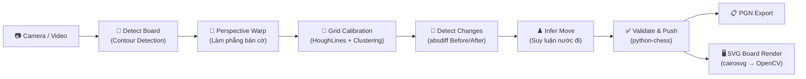
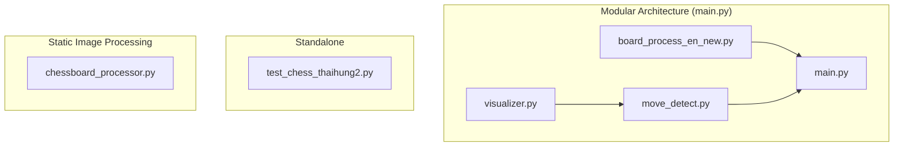

# 🔍 Phân Tích Project BTL_XLA — Chess Board Detection & Move Recognition

## 1. Mục Đích Tổng Thể

Project này xây dựng một hệ thống **nhận diện bàn cờ vua từ camera/video** bằng Computer Vision (OpenCV) và **tự động phát hiện nước đi** bằng cách so sánh trạng thái bàn cờ trước/sau. Hệ thống kết hợp thư viện `python-chess` để kiểm tra tính hợp lệ của nước đi theo luật cờ vua và ghi lại lịch sử ván cờ dưới dạng PGN.

### Pipeline tổng quan:



---

## 2. Cấu Trúc File & Phụ Thuộc

| File | Vai trò | Import từ |
|---|---|---|
| [board_process_en_new.py](file:///c:/Users/Admin/BTL_XLA/testChess/board_process_en_new.py) | Module xử lý bàn cờ (detect + warp) | — (module gốc) |
| [move_detect.py](file:///c:/Users/Admin/BTL_XLA/testChess/move_detect.py) | Module detect nước đi + quản lý game state + PGN | `visualizer` |
| [visualizer.py](file:///c:/Users/Admin/BTL_XLA/testChess/visualizer.py) | Module render bàn cờ ảo (SVG → PNG → OpenCV) | `chess.svg`, `cairosvg` |
| [main.py](file:///c:/Users/Admin/BTL_XLA/testChess/main.py) | Entry point chính (modular) | `board_process_en_new`, `move_detect` |
| [test_chess_thaihung2.py](file:///c:/Users/Admin/BTL_XLA/testChess/test_chess_thaihung2.py) | File all-in-one (self-contained), nhiều tính năng nhất | — (standalone) |
| [chessboard_processor.py](file:///c:/Users/Admin/BTL_XLA/testChess/chessboard_processor.py) | Module xử lý ảnh tĩnh: detect board bằng Hough + Intersection Clustering | `scipy.spatial`, `scipy.cluster` |



---

## 3. Phân Tích Chi Tiết Từng File

---

### 3.1. [board_process_en_new.py](file:///c:/Users/Admin/BTL_XLA/testChess/board_process_en_new.py) — Board Processor Module

**Mục đích**: Phát hiện bàn cờ trong frame camera và biến đổi phối cảnh (perspective transform) để trả về ảnh bàn cờ nhìn từ trên xuống (top-down view).

**Class**: [ChessBoardProcessor](file:///c:/Users/Admin/BTL_XLA/testChess/board_process_en_new.py#L5-L132)

| Hàm | Mục đích | Logic |
|---|---|---|
| [__init__()](file:///c:/Users/Admin/BTL_XLA/testChess/board_process_en_new.py#L6-L16) | Khởi tạo, load cấu hình `inner_pts.npy` nếu có | Load file numpy chứa 4 góc inner đã calibrate, lưu `last_board_contour` |
| [calculate_optimal_side()](file:///c:/Users/Admin/BTL_XLA/testChess/board_process_en_new.py#L18-L29) | Tính kích thước tối ưu cho ảnh warp | Tính độ dài 4 cạnh, lấy max, làm tròn theo `side_step` |
| [order_points()](file:///c:/Users/Admin/BTL_XLA/testChess/board_process_en_new.py#L31-L40) | Sắp xếp 4 điểm theo TL→TR→BR→BL | Dùng tổng/hiệu tọa độ để xác định góc |
| [get_board_contour_auto()](file:///c:/Users/Admin/BTL_XLA/testChess/board_process_en_new.py#L42-L59) | **Auto-detect** bàn cờ trong frame | Grayscale → CLAHE → OTSU → Contours → Tìm contour lớn nhất có 4 đỉnh |
| [select_and_save_inner_points()](file:///c:/Users/Admin/BTL_XLA/testChess/board_process_en_new.py#L61-L92) | Cho user click chọn 4 góc inner | GUI click 4 điểm → Lưu `inner_pts.npy` |
| [process_frame()](file:///c:/Users/Admin/BTL_XLA/testChess/board_process_en_new.py#L95-L130) | **Pipeline chính**: Frame → Warped Board | Detect contour → Warp lần 1 (outer) → Warp lần 2 (inner) → Trả ảnh bàn cờ phẳng |

**Pipeline chi tiết của [process_frame()](file:///c:/Users/Admin/BTL_XLA/testChess/board_process_en_new.py#L95-L130)**:
```
Frame gốc
  │
  ├─ get_board_contour_auto() → 4 góc ngoài
  │     → Lưu last_board_contour để hiển thị bounding box
  │
  ├─ Perspective Transform lần 1 (M1): Warp theo 4 góc ngoài
  │     → warped (ảnh bàn cờ thô, có viền)
  │
  └─ Perspective Transform lần 2 (M2): Warp theo inner_pts
        → Nếu chưa có inner_pts → gọi select_and_save_inner_points()
        → final_board (ảnh bàn cờ chính xác, chỉ có 64 ô)
```

---

### 3.2. [move_detect.py](file:///c:/Users/Admin/BTL_XLA/testChess/move_detect.py) — Move Detector Module

**Mục đích**: Nhận diện nước đi bằng phương pháp pixel-diff (absdiff), hỗ trợ grid calibration bằng HoughLines, quản lý game state (python-chess + PGN), và cung cấp visual output.

**Class [MoveDetector](file:///c:/Users/Admin/BTL_XLA/testChess/move_detect.py#L9-L293)**:

#### Grid Calibration

| Hàm | Mục đích | Logic |
|---|---|---|
| [calibrate_grid()](file:///c:/Users/Admin/BTL_XLA/testChess/move_detect.py#L34-L41) | Grid mặc định chia đều 8×8 | `np.linspace()` theo kích thước ảnh |
| [_cluster_lines()](file:///c:/Users/Admin/BTL_XLA/testChess/move_detect.py#L43-L59) | Gom nhóm đường thẳng Hough | Cluster lines cách nhau > 40px, fallback về linspace nếu ≠ 9 đường |
| [calibrate_grid_from_hough()](file:///c:/Users/Admin/BTL_XLA/testChess/move_detect.py#L61-L82) | **Grid calibration nâng cao** | Canny → HoughLines → Phân loại H/V → Cluster → Grid chính xác |

#### Game State Management

| Hàm | Mục đích | Logic |
|---|---|---|
| [_rebuild_game()](file:///c:/Users/Admin/BTL_XLA/testChess/move_detect.py#L87-L97) | Rebuild PGN tree sau undo/reset | Tạo lại Game từ `board.move_stack` |
| [get_pgn_string()](file:///c:/Users/Admin/BTL_XLA/testChess/move_detect.py#L99-L101) | Xuất chuỗi PGN | `StringExporter` với headers |
| [reset()](file:///c:/Users/Admin/BTL_XLA/testChess/move_detect.py#L114-L122) | Reset toàn bộ game | Reset board, clear images, rebuild PGN |

#### Frame Control

| Hàm | Mục đích | Logic |
|---|---|---|
| [set_reference_frame()](file:///c:/Users/Admin/BTL_XLA/testChess/move_detect.py#L106-L112) | Đặt mốc tham chiếu + calibrate grid | **Gọi `calibrate_grid_from_hough()`** → Lưu ref/prev/curr |
| [update_frame()](file:///c:/Users/Admin/BTL_XLA/testChess/move_detect.py#L124-L132) | Cập nhật frame hiện tại | Auto calibrate nếu chưa init hoặc size thay đổi |

#### Detection Core

| Hàm | Mục đích | Logic |
|---|---|---|
| [_prepare_diff()](file:///c:/Users/Admin/BTL_XLA/testChess/move_detect.py#L137-L144) | Tiền xử lý diff giữa 2 ảnh | Grayscale → GaussianBlur → absdiff → threshold(40) |
| [detect_changes()](file:///c:/Users/Admin/BTL_XLA/testChess/move_detect.py#L146-L174) | **Phát hiện ô thay đổi** | Dùng grid đã calibrate, đếm pixel thay đổi > 100 mỗi ô, sort by intensity |
| [_expected_squares_for_move()](file:///c:/Users/Admin/BTL_XLA/testChess/move_detect.py#L176-L199) | Tính ô kỳ vọng cho 1 nước đi | Xử lý đặc biệt cho Castling (4 ô) và En Passant (3 ô) |
| [infer_move()](file:///c:/Users/Admin/BTL_XLA/testChess/move_detect.py#L201-L217) | **Suy luận nước đi** | Lấy top 4 ô → Match với legal_moves → Trả về move |

#### Actions

| Hàm | Mục đích | Logic |
|---|---|---|
| [confirm_move()](file:///c:/Users/Admin/BTL_XLA/testChess/move_detect.py#L222-L247) | **Xác nhận nước đi** (nhấn Space) | detect_changes → infer_move → board.push → PGN update → cập nhật prev_img |
| [undo()](file:///c:/Users/Admin/BTL_XLA/testChess/move_detect.py#L249-L254) | Hoàn tác nước đi | `board.pop()` + rebuild PGN |

#### Visuals

| Hàm | Mục đích | Logic |
|---|---|---|
| [get_visual_board()](file:///c:/Users/Admin/BTL_XLA/testChess/move_detect.py#L259-L260) | Render bàn cờ ảo | Gọi `board_to_image()` từ `visualizer.py` |
| [get_diff_image()](file:///c:/Users/Admin/BTL_XLA/testChess/move_detect.py#L262-L268) | Tạo heatmap thay đổi | Chuyển diff threshold sang BGR với kênh đỏ highlight |
| [draw_grid()](file:///c:/Users/Admin/BTL_XLA/testChess/move_detect.py#L270-L292) | Vẽ lưới 8×8 + status text | Vẽ line theo h_grid/v_grid + putText status |

**Phương pháp detect move (Pixel-diff-based)**:
```
_prepare_diff():
  prev_img, curr_img → Grayscale → GaussianBlur(5,5) → absdiff → threshold(40)

detect_changes():
  → Chia 64 ô theo h_grid/v_grid (đã calibrate bằng HoughLines)
  → Đếm pixel trắng (thay đổi) mỗi ô
  → Lọc ô có non_zero > 100
  → Trả về danh sách ô có thay đổi (sorted by intensity)

infer_move():
  → Lấy top 4 ô thay đổi
  → Duyệt legal_moves
  → Tìm move mà cả from_square & to_square đều nằm trong các ô thay đổi
```

---

### 3.3. [visualizer.py](file:///c:/Users/Admin/BTL_XLA/testChess/visualizer.py) — Chess Board Visualizer Module

**Mục đích**: Render bàn cờ ảo 2D. Có 2 phương pháp:

#### Hàm [board_to_image()](file:///c:/Users/Admin/BTL_XLA/testChess/visualizer.py#L14-L22) — SVG-based (được dùng bởi `move_detect.py`)
```
chess.Board → chess.svg.board() → SVG string
  → cairosvg.svg2png() → PNG bytes
  → np.frombuffer → cv2.imdecode → OpenCV BGR image
```
- **Ưu điểm**: Render đẹp, có sẵn quân cờ vector, không cần asset PNG
- **Yêu cầu**: Thư viện `cairosvg` (cần cài thêm)

#### Class [ChessVisualizer](file:///c:/Users/Admin/BTL_XLA/testChess/visualizer.py#L24-L87) — Asset-based (legacy, **thiếu import `os`**)
- Load PNG assets từ `assets/pieces/`
- Alpha blending overlay quân cờ lên bàn cờ
- Highlight nước đi gần nhất bằng khung vàng
- **Lưu ý**: Class này không được import/dùng bởi file nào trong luồng modular hiện tại

---

### 3.4. [main.py](file:///c:/Users/Admin/BTL_XLA/testChess/main.py) — Entry Point (Modular)

**Mục đích**: Điều phối tổng thể, kết nối [ChessBoardProcessor](file:///c:/Users/Admin/BTL_XLA/testChess/board_process_en_new.py#L5-L132) và [MoveDetector](file:///c:/Users/Admin/BTL_XLA/testChess/move_detect.py#L9-L293), hiển thị 4 cửa sổ.

**Hàm tiện ích**:
- [draw_board_outline()](file:///c:/Users/Admin/BTL_XLA/testChess/main.py#L8-L12): Vẽ bounding box contour lên camera frame
- [save_pgn()](file:///c:/Users/Admin/BTL_XLA/testChess/main.py#L14-L21): Lưu game ra file `.pgn`

**Pipeline chính** ([main()](file:///c:/Users/Admin/BTL_XLA/testChess/main.py#L23-L175)):
```
while True:
  1. cap.read() → frame
  2. cv2.flip(frame, -1)                                  (Lật 180°)
  3. processor.process_frame(frame) → warped_board         (Board Detection + Warp)
  4. detector.update_frame(warped_board)                    (Cập nhật occupancy)
  5. Hiển thị 4 cửa sổ:
     - Camera + Bounding Box (processor.last_board_contour)
     - Warped Board + Grid (detector.draw_grid)
     - Chess Visual (detector.get_visual_board → visualizer.board_to_image)
     - Diff Detection (detector.get_diff_image)
  6. Xử lý phím:
     - 'i': set_reference_frame (calibrate HoughLines grid)
     - Space: confirm_move (xác nhận nước đi)
     - 'r': undo
     - 'q': quit + save PGN
```

---

### 3.5. [test_chess_thaihung2.py](file:///c:/Users/Admin/BTL_XLA/testChess/test_chess_thaihung2.py) — All-in-One Standalone

**Mục đích**: File self-contained hoàn chỉnh, chứa **toàn bộ logic** từ detect board đến infer move, có thêm nhiều tính năng nâng cao.

**Tính năng nổi bật so với main.py**:
- ✅ Chế độ **tự động / thủ công** (phím 'm') để chọn 4 góc bàn cờ
- ✅ **HoughLines + Clustering** để calibrate grid chính xác hơn (thay vì chia đều)
- ✅ **Stabilize transform matrix** (`alpha = 0.85`) để giảm rung
- ✅ **Inner Padding** (trackbar) để cắt bớt viền
- ✅ **PGN export** (phím 's') để lưu ván cờ
- ✅ Trackbar cho Threshold, AngleDelta, InnerPad
- ✅ Resize frame cố định 800×600

**Class [ChessVisualizer](file:///c:/Users/Admin/BTL_XLA/testChess/test_chess_thaihung2.py#L19-L83)**: Vẽ bàn cờ ảo 2D với asset quân cờ PNG (alpha blending), hỗ trợ fallback text nếu thiếu assets, highlight nước đi gần nhất bằng màu xanh.

**Các hàm chính**:
- [order_points()](file:///c:/Users/Admin/BTL_XLA/testChess/test_chess_thaihung2.py#L89-L97) — Sắp xếp 4 điểm TL→TR→BR→BL
- [detect_changes()](file:///c:/Users/Admin/BTL_XLA/testChess/test_chess_thaihung2.py#L103-L146) — Phát hiện ô thay đổi giữa 2 ảnh (pixel-diff)
- [infer_move()](file:///c:/Users/Admin/BTL_XLA/testChess/test_chess_thaihung2.py#L149-L175) — Suy luận nước đi hợp lệ
- [draw_grid()](file:///c:/Users/Admin/BTL_XLA/testChess/test_chess_thaihung2.py#L177-L190) — Vẽ lưới lên ảnh warped
- [mouse_callback()](file:///c:/Users/Admin/BTL_XLA/testChess/test_chess_thaihung2.py#L195-L200) — Xử lý click chuột cho chế độ thủ công

---

### 3.6. [chessboard_processor.py](file:///c:/Users/Admin/BTL_XLA/testChess/chessboard_processor.py) — Static Image Processing (Standalone)

**Mục đích**: Xử lý **ảnh tĩnh** bàn cờ — detect board, warp, và cắt 64 ô ra file ảnh riêng. Dùng pipeline khác hoàn toàn so với `board_process_en_new.py`.

**Pipeline**:
```
Image File → Grayscale → Blur(4,4) → Canny(80,200) → Dilate(3×3)
  → HoughLines(ρ=2, θ=π/180, thresh=600)
  → Sort H/V lines
  → Calculate Intersections (H×V)
  → Cluster Intersections (hierarchical clustering, max_dist=40)
  → Find 4 Corners (sum/diff method)
  → Warp Image
  → Cut 64 Tiles → Save to files
```

**Hàm chính**:

| Hàm | Mục đích |
|---|---|
| [canny()](file:///c:/Users/Admin/BTL_XLA/testChess/chessboard_processor.py#L13-L16) | Canny edge detection (80, 200) |
| [hough_lines()](file:///c:/Users/Admin/BTL_XLA/testChess/chessboard_processor.py#L19-L21) | Hough transform với threshold cao (600) |
| [sort_lines()](file:///c:/Users/Admin/BTL_XLA/testChess/chessboard_processor.py#L24-L37) | Phân loại đường ngang/dọc theo theta |
| [calculate_intersections()](file:///c:/Users/Admin/BTL_XLA/testChess/chessboard_processor.py#L40-L56) | Tìm giao điểm H×V (Hesse normal form) |
| [cluster_intersections()](file:///c:/Users/Admin/BTL_XLA/testChess/chessboard_processor.py#L59-L73) | Gom nhóm giao điểm bằng hierarchical clustering (`scipy`) |
| [find_chessboard_corners()](file:///c:/Users/Admin/BTL_XLA/testChess/chessboard_processor.py#L76-L88) | Tìm 4 góc ngoài cùng (sum/diff) |
| [warp_image()](file:///c:/Users/Admin/BTL_XLA/testChess/chessboard_processor.py#L100-L123) | Perspective transform về hình vuông |
| [cut_chessboard()](file:///c:/Users/Admin/BTL_XLA/testChess/chessboard_processor.py#L126-L131) | Cắt 64 ô, lưu file ảnh |
| [process_chessboard()](file:///c:/Users/Admin/BTL_XLA/testChess/chessboard_processor.py#L146-L253) | **Pipeline hoàn chỉnh** (có debug mode) |

**Dependencies đặc biệt**: `scipy.spatial`, `scipy.cluster` (dùng cho hierarchical clustering)

---

## 4. So Sánh Các Luồng Xử Lý

### 4.1. Move Detection: `move_detect.py` vs `test_chess_thaihung2.py`

| Đặc điểm | [move_detect.py](file:///c:/Users/Admin/BTL_XLA/testChess/move_detect.py) | [test_chess_thaihung2.py](file:///c:/Users/Admin/BTL_XLA/testChess/test_chess_thaihung2.py) |
|---|---|---|
| **Phương pháp** | Pixel-diff (absdiff) | Pixel-diff (absdiff) |
| **Grid Calibration** | HoughLines + Clustering (tích hợp) | HoughLines + Clustering (inline) |
| **PGN Support** | ✅ Tích hợp (`_rebuild_game`, `get_pgn_string`) | ✅ Inline trong main() |
| **Castling/En Passant** | ✅ `_expected_squares_for_move()` hỗ trợ | ❌ Không xử lý riêng |
| **Game Reset** | ✅ `reset()` method | ❌ Không có |
| **Undo** | ✅ `undo()` + rebuild PGN | ❌ Không có |
| **Manual Mode** | ❌ | ✅ Click 4 góc + phím 'm' |
| **Stabilize Matrix** | ❌ | ✅ `alpha = 0.85` |
| **Inner Padding** | ❌ (dùng `inner_pts.npy`) | ✅ Trackbar InnerPad |
| **Kiến trúc** | OOP (class MoveDetector) | Procedural (functions + main) |

### 4.2. Board Detection: `board_process_en_new.py` vs `chessboard_processor.py`

| Đặc điểm | [board_process_en_new.py](file:///c:/Users/Admin/BTL_XLA/testChess/board_process_en_new.py) | [chessboard_processor.py](file:///c:/Users/Admin/BTL_XLA/testChess/chessboard_processor.py) |
|---|---|---|
| **Input** | Video/Camera frame (real-time) | Ảnh tĩnh (file) |
| **Detect Method** | Contour (CLAHE + OTSU + 4-point approx) | HoughLines + Intersection Clustering |
| **Output** | Ảnh warped (trong bộ nhớ) | 64 file ảnh tile |
| **Inner Calibration** | GUI click 4 điểm → `inner_pts.npy` | Tự động từ 81 giao điểm |
| **Dependencies** | OpenCV, NumPy | OpenCV, NumPy, **SciPy** |
| **Sử dụng** | Luồng modular (main.py) | Standalone utility |

---

## 5. Visualizer: Hai Phương Pháp Render

| Đặc điểm | `board_to_image()` (SVG-based) | `ChessVisualizer` (Asset-based) |
|---|---|---|
| **File** | [visualizer.py](file:///c:/Users/Admin/BTL_XLA/testChess/visualizer.py#L14-L22) | [visualizer.py](file:///c:/Users/Admin/BTL_XLA/testChess/visualizer.py#L24-L87) & [test_chess_thaihung2.py](file:///c:/Users/Admin/BTL_XLA/testChess/test_chess_thaihung2.py#L19-L83) |
| **Được dùng bởi** | `move_detect.py` → `main.py` | `test_chess_thaihung2.py` (standalone) |
| **Cơ chế** | `chess.svg` → `cairosvg` → PNG → OpenCV | Load PNG assets → Alpha blending |
| **Yêu cầu** | `cairosvg` library | Thư mục `assets/pieces/*.png` |
| **Highlight Move** | ❌ (dùng mặc định của chess.svg) | ✅ Khung vàng / xanh |

---

## 6. Bugs & Vấn Đề Tiềm Ẩn

> [!WARNING]
> **Bug trong [visualizer.py](file:///c:/Users/Admin/BTL_XLA/testChess/visualizer.py) (dòng 30)**: Class `ChessVisualizer` sử dụng `os.path.join()` nhưng **không import `os`**. Sẽ gây `NameError: name 'os' is not defined` nếu khởi tạo class này.

> [!NOTE]
> **Hardcoded path**: Video path trong [main.py](file:///c:/Users/Admin/BTL_XLA/testChess/main.py) (dòng 28) trỏ tới `E:\Python_Project\chessboard_move.mp4` — cần cập nhật cho phù hợp.

> [!NOTE]
> **Code trùng lặp**: `ChessVisualizer` class được định nghĩa ở cả [visualizer.py](file:///c:/Users/Admin/BTL_XLA/testChess/visualizer.py#L24-L87) và [test_chess_thaihung2.py](file:///c:/Users/Admin/BTL_XLA/testChess/test_chess_thaihung2.py#L19-L83) với logic tương tự. Phiên bản trong `test_chess_thaihung2.py` hoàn chỉnh hơn (có fallback text, highlight xanh).

> [!NOTE]
> **Chưa sử dụng**: Hàm `_expected_squares_for_move()` trong [move_detect.py](file:///c:/Users/Admin/BTL_XLA/testChess/move_detect.py#L176-L199) được định nghĩa nhưng **không được gọi** bởi bất kỳ hàm nào (cả `confirm_move` và `infer_move` đều không dùng). Logic castling/en passant chưa được tích hợp vào detection pipeline.

---

## 7. Tóm Tắt

Project có **3 luồng chạy**:

1. **Luồng Modular** ([main.py](file:///c:/Users/Admin/BTL_XLA/testChess/main.py) → [board_process_en_new.py](file:///c:/Users/Admin/BTL_XLA/testChess/board_process_en_new.py) + [move_detect.py](file:///c:/Users/Admin/BTL_XLA/testChess/move_detect.py) + [visualizer.py](file:///c:/Users/Admin/BTL_XLA/testChess/visualizer.py)):
   - Kiến trúc OOP sạch, tách biệt
   - Pixel-diff detection với HoughLines grid calibration
   - SVG-based board render (cairosvg)
   - PGN support đầy đủ (export, undo, rebuild)
   - Hỗ trợ logic castling/en passant (nhưng chưa tích hợp vào detection)

2. **Luồng Standalone** ([test_chess_thaihung2.py](file:///c:/Users/Admin/BTL_XLA/testChess/test_chess_thaihung2.py)):
   - All-in-one, nhiều tính năng UI hơn (manual mode, trackbar, stabilize matrix, inner padding)
   - Pixel-diff detection + HoughLines grid (inline)
   - Asset-based board render
   - PGN export

3. **Luồng Static** ([chessboard_processor.py](file:///c:/Users/Admin/BTL_XLA/testChess/chessboard_processor.py)):
   - Xử lý ảnh tĩnh duy nhất
   - Pipeline hoàn toàn khác: HoughLines → Intersections → Clustering → Warp → Cut tiles
   - Có debug mode hiển thị từng bước
   - Dùng `scipy` cho clustering

**File [test_chess_thaihung2.py](file:///c:/Users/Admin/BTL_XLA/testChess/test_chess_thaihung2.py)** là file hoàn chỉnh nhất về mặt **tính năng UI**. **Luồng Modular** (main.py) có kiến trúc tốt hơn và hỗ trợ **PGN/undo/game management** hoàn chỉnh hơn.
