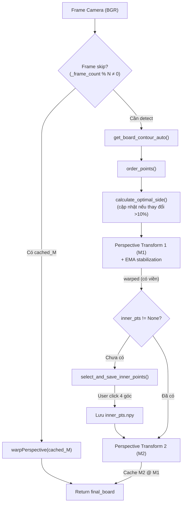

# 📐 Logic Chi Tiết — `board_process_en_new.py`

> File này giải thích **từng dòng logic** của module xử lý bàn cờ. Dùng để trình bày và hiểu rõ cách hệ thống biến một frame camera thô thành ảnh bàn cờ phẳng 8×8.

---

## Tổng Quan

`board_process_en_new.py` chứa **một class duy nhất**: `ChessBoardProcessor`, chịu trách nhiệm:

1. **Phát hiện bàn cờ** trong frame camera (auto-detect contour)
2. **Biến đổi phối cảnh lần 1** (perspective transform) — cắt vùng bàn cờ thô
3. **EMA stabilization** — giảm jitter giữa các frame (mới)
4. **Biến đổi phối cảnh lần 2** — dùng 4 điểm inner đã calibrate để loại viền, lấy đúng 64 ô
5. **Frame skip** — cache transform matrix, chỉ detect contour mỗi N frame (mới)



---

## Import

```python
import cv2         # OpenCV — xử lý ảnh, contour, perspective transform
import numpy as np # NumPy — mảng số, phép tính ma trận
import os          # OS — kiểm tra file tồn tại, đường dẫn
from config import CFG  # [MỚI] Thông số tập trung (thay hardcoded values)
```

---

## Class `ChessBoardProcessor`

### `__init__(self, side_step=None, config_path="inner_pts.npy")`

**Mục đích**: Khởi tạo processor, tự động load cấu hình inner points nếu đã có file.

**Tham số**:
| Tham số | Kiểu | Mặc định | Ý nghĩa |
|---|---|---|---|
| `side_step` | `int/None` | `None` (→ `CFG.side_step=10`) | Bước làm tròn kích thước ảnh warp |
| `config_path` | `str` | `"inner_pts.npy"` | Đường dẫn file lưu 4 góc inner đã calibrate |

**Thuộc tính được khởi tạo**:

```python
self.inner_pts = None           # numpy array shape (4,2), float32
self.side_step = side_step or CFG.side_step  # Dùng config nếu không truyền
self.wrap_size = None           # int: kích thước cạnh ảnh warp
self.config_path = config_path
self.last_board_contour = None  # numpy array shape (4,1,2) — contour gần nhất

# [P5] Cache CLAHE object — tạo 1 lần, dùng lại mỗi frame
self._clahe = cv2.createCLAHE(
    clipLimit=CFG.clahe_clip_limit,     # 2.0
    tileGridSize=CFG.clahe_tile_grid    # (8, 8)
)
# TRƯỚC: cv2.createCLAHE() tạo mới MỖI FRAME → lãng phí
# SAU:   Tạo 1 lần trong __init__, tái sử dụng

# [L2] EMA stabilization cho perspective transform
self._prev_M1 = None   # Ma trận M1 frame trước (dùng cho EMA smoothing)

# [P2] Cache combined transform matrix + frame skip
self._cached_M_combined = None  # Ma trận tổng hợp M2 @ M1
self._frame_count = 0           # Đếm frame để skip
```

**Logic auto-load**:
```python
if os.path.exists(self.config_path):
    self.inner_pts = np.load(self.config_path)
    # → inner_pts = array([[x1,y1], [x2,y2], [x3,y3], [x4,y4]])
```

> **Ý nghĩa**: Lần chạy đầu tiên, user phải click 4 góc inner. Từ lần thứ 2 trở đi, hệ thống tự load 4 góc đã lưu.

---

### `calculate_optimal_side(self, board_contour)`

**Mục đích**: Tính kích thước cạnh (pixel) tối ưu cho ảnh vuông sau khi warp.

**Tham số**: `board_contour`: `numpy array (4, 1, 2)` — 4 đỉnh contour

**Trả về**: `int` — kích thước cạnh ảnh warp (ví dụ: `490`, `500`)

```python
pts = board_contour.reshape(4, 2)

def dist(p1, p2):
    return np.sqrt(np.sum((p1 - p2) ** 2))

sides = [
    dist(pts[0], pts[3]),  # Cạnh trái
    dist(pts[1], pts[2]),  # Cạnh phải
    dist(pts[0], pts[1]),  # Cạnh trên
    dist(pts[3], pts[2])   # Cạnh dưới
]
max_side = max(sides)
return int((max_side // self.side_step) * self.side_step)
# Lấy cạnh dài nhất → làm tròn theo side_step
```

---

### `order_points(self, pts)`

**Mục đích**: Sắp xếp 4 điểm → thứ tự **TL → TR → BR → BL** (theo chiều kim đồng hồ).

```python
rect = np.zeros((4, 2), dtype="float32")
pts = pts.reshape(4, 2)
s = pts.sum(axis=1)
rect[0] = pts[np.argmin(s)]   # TL: x+y nhỏ nhất
rect[2] = pts[np.argmax(s)]   # BR: x+y lớn nhất
diff = np.diff(pts, axis=1)
rect[1] = pts[np.argmin(diff)] # TR: y-x nhỏ nhất
rect[3] = pts[np.argmax(diff)] # BL: y-x lớn nhất
return rect
```

---

### `get_board_contour_auto(self, frame)`

**Mục đích**: Tự động phát hiện vùng bàn cờ trong frame camera.

**Pipeline xử lý ảnh**:

```python
# 1. Chuyển xám
gray = cv2.cvtColor(frame, cv2.COLOR_BGR2GRAY)

# 2. [P5] CLAHE — dùng object đã cache (thay vì tạo mới)
contrast = self._clahe.apply(gray)
# TRƯỚC: clahe = cv2.createCLAHE(2.0, (8,8)); contrast = clahe.apply(gray)
# SAU:   contrast = self._clahe.apply(gray)  ← tái sử dụng

# 3. OTSU threshold
_, thresh = cv2.threshold(contrast, 0, 255, cv2.THRESH_BINARY + cv2.THRESH_OTSU)
thresh_bit = cv2.bitwise_not(thresh)

# 4. Tìm contour
contours, _ = cv2.findContours(thresh_bit, cv2.RETR_EXTERNAL, cv2.CHAIN_APPROX_SIMPLE)

# 5. Lọc: diện tích > CFG.min_contour_area (thay hardcoded 5000)
if contours:
    largest = max(contours, key=cv2.contourArea)
    if cv2.contourArea(largest) > CFG.min_contour_area:
        peri = cv2.arcLength(largest, True)
        approx = cv2.approxPolyDP(largest, 0.02 * peri, True)
        if len(approx) == 4:
            self.last_board_contour = approx
            return approx
return None
```

---

### `select_and_save_inner_points(self, warped)`

**Mục đích**: Mở GUI cho user click chọn 4 góc bên trong bàn cờ (loại viền gỗ).

*(Logic không thay đổi so với phiên bản trước — xem file code cho chi tiết.)*

> **Thứ tự click**: TL → TR → BR → BL (theo chiều kim đồng hồ).

---

### `process_frame(self, frame)` — **HÀM CHÍNH (Pipeline)**

**Mục đích**: Nhận 1 frame camera, trả về ảnh bàn cờ phẳng (top-down, chỉ có 64 ô).

**Thay đổi quan trọng so với phiên bản trước**:
1. **[P2] Frame skip**: Dùng cached transform mỗi N frame, chỉ full detect khi `frame_count % skip_interval == 0`
2. **[L1] Dynamic wrap_size**: Cập nhật khi kích thước bàn cờ thay đổi > 10%
3. **[L2] EMA stabilization**: Làm mượt ma trận M1 giữa các frame
4. **[P2] Combined matrix cache**: `M2 @ M1` cho frame skip

```python
self._frame_count += 1
final_board = None

# =====================================
# [P2] FRAME SKIP — dùng cached transform
# =====================================
if (self._cached_M_combined is not None
        and self.wrap_size is not None
        and self._frame_count % CFG.frame_skip_interval != 0):
    return cv2.warpPerspective(frame, self._cached_M_combined,
                               (self.wrap_size, self.wrap_size))
    # → Chỉ 1 lần warpPerspective thay vì full pipeline
    # → Tiết kiệm ~60% CPU trên các frame skip

# =====================================
# FULL DETECTION (chỉ mỗi N frame)
# =====================================
board_contour = self.get_board_contour_auto(frame)

if board_contour is not None:
    # [L1] Cập nhật wrap_size khi thay đổi đáng kể
    new_size = self.calculate_optimal_side(board_contour)
    if self.wrap_size is None or abs(new_size - self.wrap_size) > self.wrap_size * CFG.wrap_size_update_ratio:
        self.wrap_size = new_size
    # TRƯỚC: if self.wrap_size is None: ... (chỉ tính 1 lần)
    # SAU:   Cập nhật khi thay đổi > 10% → thích ứng zoom/di chuyển camera

    pts_src = self.order_points(board_contour)
    pts_dst = np.array([
        [0, 0], [self.wrap_size - 1, 0],
        [self.wrap_size - 1, self.wrap_size - 1], [0, self.wrap_size - 1]
    ], dtype="float32")

    M1 = cv2.getPerspectiveTransform(pts_src, pts_dst)

    # [L2] EMA stabilization — giảm rung lắc warped board
    if self._prev_M1 is not None:
        M1 = CFG.ema_alpha * self._prev_M1 + (1 - CFG.ema_alpha) * M1
        # Công thức: M1_new = α × M1_old + (1-α) × M1_raw
        # α = 0.85 → 85% từ frame trước, 15% từ frame hiện tại
        # → Loại bỏ jitter nhỏ giữa các frame
    self._prev_M1 = M1.copy()
    # TRƯỚC: Không có EMA → warped board rung
    # SAU:   Ma trận M1 mượt → warped ổn định → detect move chính xác hơn

    warped = cv2.warpPerspective(frame, M1, (self.wrap_size, self.wrap_size))

    # Calibrate inner points (chỉ lần đầu)
    if self.inner_pts is None:
        self.inner_pts = self.select_and_save_inner_points(warped)
        if self.inner_pts is None:
            return None

    M2 = cv2.getPerspectiveTransform(self.inner_pts, pts_dst)
    final_board = cv2.warpPerspective(warped, M2, (self.wrap_size, self.wrap_size))

    # [P2] Cache combined transform cho frame skip
    self._cached_M_combined = M2 @ M1
    # M2 @ M1 = nhân ma trận → ghép 2 perspective transform thành 1
    # → Frame skip chỉ cần 1 lần warpPerspective thay vì 2

return final_board
```

**Minh họa Frame Skip**:
```
Frame 1: Full detect → contour → M1 (EMA) → warp1 → M2 → warp2 → cache M2@M1
Frame 2: Skip → warpPerspective(frame, cached_M) → done ← NHANH
Frame 3: Skip → warpPerspective(frame, cached_M) → done ← NHANH
Frame 4: Skip → warpPerspective(frame, cached_M) → done ← NHANH
Frame 5: Skip → warpPerspective(frame, cached_M) → done ← NHANH
Frame 6: Full detect → cập nhật cached_M → ...
```

---

## Tóm Tắt Flow Gọi Hàm

```
main.py gọi:
    processor.process_frame(frame)
        │
        ├── [P2] Frame skip? → dùng cached_M_combined → return nhanh
        │
        ├── get_board_contour_auto(frame)        ← [P5] CLAHE cached
        │     └── Trả về: contour (4,1,2) hoặc None
        │
        ├── [L1] calculate_optimal_side(contour)  ← cập nhật khi thay đổi >10%
        │
        ├── order_points(contour)
        │
        ├── getPerspectiveTransform + [L2] EMA stabilization
        │     └── M1 = α × prev_M + (1-α) × M1_raw
        │
        ├── warpPerspective(M1) → warped (còn viền)
        │
        ├── select_and_save_inner_points(warped)  ← chỉ lần đầu
        │
        ├── getPerspectiveTransform(inner_pts) → M2
        │
        ├── warpPerspective(M2) → final_board (64 ô)
        │
        ├── [P2] Cache: _cached_M_combined = M2 @ M1
        │
        └── return final_board
```

---

## Lưu Ý Quan Trọng

1. **Tại sao cần 2 lần warp?**
   - Lần 1: Loại bỏ méo phối cảnh
   - Lần 2: Loại bỏ viền gỗ → chỉ giữ 64 ô cờ
   - Frame skip ghép 2 thành 1 (`M2 @ M1`) để tăng tốc

2. **EMA α = 0.85**: Tăng → mượt hơn nhưng chậm phản ứng. Giảm → phản ứng nhanh nhưng rung hơn.

3. **Frame skip interval = 5**: Camera cố định → tăng lên. Camera di chuyển nhiều → giảm xuống.

4. **Tất cả thông số** (`min_contour_area`, `ema_alpha`, `frame_skip_interval`, ...) nằm trong `config.py` → tinh chỉnh tại 1 nơi duy nhất.
