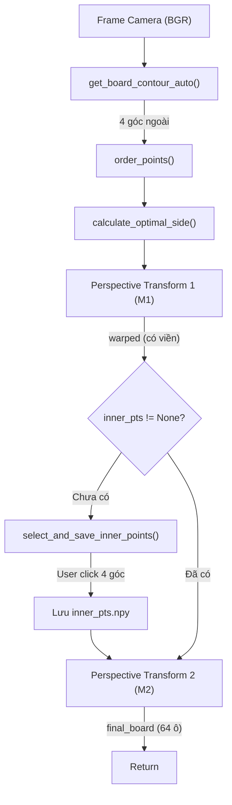

# 📐 Logic Chi Tiết — `board_process_en_new.py`

> File này giải thích **từng dòng logic** của module xử lý bàn cờ. Dùng để trình bày và hiểu rõ cách hệ thống biến một frame camera thô thành ảnh bàn cờ phẳng 8×8.

---

## Tổng Quan

`board_process_en_new.py` chứa **một class duy nhất**: `ChessBoardProcessor`, chịu trách nhiệm:

1. **Phát hiện bàn cờ** trong frame camera (auto-detect contour)
2. **Biến đổi phối cảnh lần 1** (perspective transform) — cắt vùng bàn cờ thô
3. **Biến đổi phối cảnh lần 2** — dùng 4 điểm inner đã calibrate để loại viền, lấy đúng 64 ô



---

## Import

```python
import cv2       # OpenCV — xử lý ảnh, contour, perspective transform
import numpy as np  # NumPy — mảng số, phép tính ma trận
import os        # OS — kiểm tra file tồn tại, đường dẫn
```

---

## Class `ChessBoardProcessor`

### `__init__(self, side_step=10, config_path="inner_pts.npy")`

**Mục đích**: Khởi tạo processor, tự động load cấu hình inner points nếu đã có file.

**Tham số**:
| Tham số | Kiểu | Mặc định | Ý nghĩa |
|---|---|---|---|
| `side_step` | `int` | `10` | Bước làm tròn kích thước ảnh warp (ví dụ: 497 → 490) |
| `config_path` | `str` | `"inner_pts.npy"` | Đường dẫn file lưu 4 góc inner đã calibrate |

**Thuộc tính được khởi tạo**:

```python
self.inner_pts = None           # numpy array shape (4,2), float32
                                # Chứa tọa độ 4 góc bên trong bàn cờ (loại bỏ viền gỗ)
                                # Giá trị: None nếu chưa calibrate, hoặc load từ file

self.side_step = side_step      # int: bước làm tròn (10 → kích thước luôn chia hết cho 10)

self.wrap_size = None           # int hoặc None
                                # Kích thước cạnh ảnh warp vuông (ví dụ: 490, 500)
                                # Tính MỘT LẦN DUY NHẤT ở frame đầu tiên, giữ cố định suốt session

self.config_path = config_path  # str: đường dẫn file .npy

self.last_board_contour = None  # numpy array shape (4,1,2) hoặc None
                                # Contour bàn cờ phát hiện được gần nhất
                                # Dùng để main.py vẽ bounding box lên camera frame
```

**Logic auto-load**:
```python
if os.path.exists(self.config_path):    # Kiểm tra file inner_pts.npy có tồn tại?
    self.inner_pts = np.load(self.config_path)  # Load mảng numpy từ file
    # → inner_pts = array([[x1,y1], [x2,y2], [x3,y3], [x4,y4]], dtype=float32)
```

> **Ý nghĩa thực tế**: Lần chạy đầu tiên, user phải click 4 góc inner. Từ lần thứ 2 trở đi, hệ thống tự load 4 góc đã lưu → không cần click lại.

---

### `calculate_optimal_side(self, board_contour)`

**Mục đích**: Tính kích thước cạnh (pixel) tối ưu cho ảnh vuông sau khi warp, dựa trên kích thước thực của bàn cờ trong frame.

**Tham số**:
- `board_contour`: `numpy array shape (4, 1, 2)` — 4 đỉnh contour bàn cờ từ `approxPolyDP`

**Trả về**: `int` — kích thước cạnh ảnh warp (ví dụ: `490`, `500`)

**Logic chi tiết**:

```python
# Bước 1: Reshape từ (4,1,2) → (4,2) để dễ tính toán
pts = board_contour.reshape(4, 2)
# Ví dụ: pts = [[100,50], [400,55], [405,350], [95,345]]

# Bước 2: Hàm tính khoảng cách Euclidean giữa 2 điểm
def dist(p1, p2):
    return np.sqrt(np.sum((p1 - p2) ** 2))
    # = √((x₂-x₁)² + (y₂-y₁)²)

# Bước 3: Tính độ dài 4 cạnh của contour
sides = [
    dist(pts[0], pts[3]),  # Cạnh trái:  TL → BL
    dist(pts[1], pts[2]),  # Cạnh phải:  TR → BR
    dist(pts[0], pts[1]),  # Cạnh trên:  TL → TR
    dist(pts[3], pts[2])   # Cạnh dưới:  BL → BR
]
# Ví dụ: sides = [295.0, 295.1, 300.0, 310.2]

# Bước 4: Lấy cạnh dài nhất
max_side = max(sides)  # = 310.2

# Bước 5: Làm tròn xuống theo side_step
return int((max_side // self.side_step) * self.side_step)
# = int((310.2 // 10) * 10) = int(31 * 10) = 310
```

> **Tại sao lấy cạnh dài nhất?** Vì bàn cờ trong ảnh bị méo (perspective), 4 cạnh không bằng nhau. Lấy cạnh dài nhất đảm bảo ảnh warp đủ lớn, không bị mất thông tin. Làm tròn theo `side_step` giúp chia đều 8 ô dễ hơn.

---

### `order_points(self, pts)`

**Mục đích**: Sắp xếp 4 điểm bất kỳ thành thứ tự chuẩn: **Top-Left → Top-Right → Bottom-Right → Bottom-Left** (theo chiều kim đồng hồ).

**Tham số**:
- `pts`: `numpy array shape (4, 1, 2)` hoặc `(4, 2)` — 4 điểm chưa sắp xếp

**Trả về**: `numpy array shape (4, 2), dtype float32` — 4 điểm đã sắp xếp `[TL, TR, BR, BL]`

**Logic chi tiết**:

```python
rect = np.zeros((4, 2), dtype="float32")  # Khởi tạo mảng kết quả 4 điểm
pts = pts.reshape(4, 2)                   # Đảm bảo shape (4,2)

# === NGUYÊN LÝ TOÁN HỌC ===
# Với hệ tọa độ ảnh (gốc = góc trái trên, x → phải, y → xuống):
#
#   Top-Left (TL):     x nhỏ, y nhỏ  → x+y NHỎ NHẤT
#   Bottom-Right (BR): x lớn, y lớn  → x+y LỚN NHẤT
#   Top-Right (TR):    x lớn, y nhỏ  → x-y LỚN NHẤT (diff dương lớn)
#   Bottom-Left (BL):  x nhỏ, y lớn  → x-y NHỎ NHẤT (diff âm lớn)

# Bước 1: Tính tổng x+y cho mỗi điểm
s = pts.sum(axis=1)          # Ví dụ: [150, 455, 755, 440]
rect[0] = pts[np.argmin(s)]  # TL = điểm có x+y nhỏ nhất
rect[2] = pts[np.argmax(s)]  # BR = điểm có x+y lớn nhất

# Bước 2: Tính hiệu x-y cho mỗi điểm (np.diff tính hiệu cột liền kề)
diff = np.diff(pts, axis=1)  # Ví dụ: [[-50], [345], [55], [-250]]
                             # Mỗi phần tử = y - x (vì np.diff = cột sau - cột trước)
                             # Nhưng logic vẫn đúng vì:
                             #   TR: y nhỏ, x lớn → y-x âm → NHỎ NHẤT
                             #   BL: y lớn, x nhỏ → y-x dương → LỚN NHẤT
rect[1] = pts[np.argmin(diff)]  # TR = điểm có y-x nhỏ nhất
rect[3] = pts[np.argmax(diff)]  # BL = điểm có y-x lớn nhất

return rect  # [TL, TR, BR, BL]
```

> **Lưu ý**: `np.diff(pts, axis=1)` tính `cột_1 - cột_0` = `y - x` (không phải `x - y`). Do đó argmin cho TR (x lớn, y nhỏ → y-x âm nhất) và argmax cho BL (x nhỏ, y lớn → y-x dương nhất).

**Ví dụ minh họa**:
```
Input (chưa sắp xếp):       Output (đã sắp xếp):
  pts[0] = [100, 50]          rect[0] = [100, 50]   ← TL (sum=150, nhỏ nhất)
  pts[1] = [400, 55]          rect[1] = [400, 55]   ← TR (diff=-345, nhỏ nhất)
  pts[2] = [405, 350]         rect[2] = [405, 350]  ← BR (sum=755, lớn nhất)
  pts[3] = [95, 345]          rect[3] = [95, 345]   ← BL (diff=250, lớn nhất)
```

---

### `get_board_contour_auto(self, frame)`

**Mục đích**: Tự động phát hiện vùng bàn cờ trong frame camera. Trả về 4 đỉnh contour nếu tìm thấy.

**Tham số**:
- `frame`: `numpy array (H, W, 3), dtype uint8` — frame BGR từ camera

**Trả về**:
- `numpy array shape (4, 1, 2)` — 4 đỉnh contour bàn cờ, **hoặc**
- `None` — nếu không tìm thấy bàn cờ

**Pipeline xử lý ảnh chi tiết**:

```python
# ========== BƯỚC 1: Chuyển ảnh xám ==========
gray = cv2.cvtColor(frame, cv2.COLOR_BGR2GRAY)
# Input:  frame BGR (H, W, 3)
# Output: gray (H, W), giá trị 0-255
# Công thức: Y = 0.299R + 0.587G + 0.114B

# ========== BƯỚC 2: Tăng tương phản cục bộ bằng CLAHE ==========
clahe = cv2.createCLAHE(clipLimit=2.0, tileGridSize=(8, 8))
contrast = clahe.apply(gray)
# CLAHE = Contrast Limited Adaptive Histogram Equalization
# - Chia ảnh thành lưới 8×8 vùng (tile)
# - Cân bằng histogram cho TỪNG vùng riêng biệt
# - clipLimit=2.0: giới hạn biên độ tăng contrast, tránh khuếch đại noise
# → Kết quả: ảnh có contrast đồng đều, viền bàn cờ nổi rõ hơn
#   (đặc biệt hiệu quả khi ánh sáng không đều)

# ========== BƯỚC 3: Nhị phân hóa bằng Otsu ==========
_, thresh = cv2.threshold(contrast, 0, 255, cv2.THRESH_BINARY + cv2.THRESH_OTSU)
# OTSU tự động tìm ngưỡng tối ưu chia ảnh thành 2 nhóm:
# - Pixel sáng (> threshold) → 255 (trắng)
# - Pixel tối (≤ threshold) → 0 (đen)
# Tham số thresh=0 vì OTSU tự tính ngưỡng
# → Bàn cờ thường có ô trắng → nhiều pixel 255

# ========== BƯỚC 4: Đảo ngược ==========
thresh_bit = cv2.bitwise_not(thresh)
# Đảo trắng ↔ đen
# → Vùng bàn cờ chuyển thành vùng sáng (đối tượng foreground)
# → Giúp findContours tìm đúng contour bàn cờ

# ========== BƯỚC 5: Tìm contour ==========
contours, _ = cv2.findContours(thresh_bit, cv2.RETR_EXTERNAL, cv2.CHAIN_APPROX_SIMPLE)
# RETR_EXTERNAL: chỉ lấy contour ngoài cùng (bỏ contour lồng nhau)
# CHAIN_APPROX_SIMPLE: nén contour, chỉ giữ đỉnh góc
# → contours: list các numpy array, mỗi array là 1 contour

# ========== BƯỚC 6: Lọc contour bàn cờ ==========
if contours:
    # 6a. Lấy contour có diện tích lớn nhất
    largest = max(contours, key=cv2.contourArea)
    
    # 6b. Kiểm tra diện tích đủ lớn (> 5000 pixel²)
    #     → Loại bỏ nhiễu nhỏ, giữ lại bàn cờ chiếm phần lớn frame
    if cv2.contourArea(largest) > 5000:
        
        # 6c. Xấp xỉ đa giác (Douglas-Peucker)
        peri = cv2.arcLength(largest, True)             # Chu vi contour
        approx = cv2.approxPolyDP(largest, 0.02 * peri, True)
        # epsilon = 2% chu vi → sai số cho phép khi xấp xỉ
        # Contour có nhiều điểm → giảm xuống ít điểm nhất có thể
        
        # 6d. Kiểm tra có đúng 4 đỉnh (hình chữ nhật/hình thang)?
        if len(approx) == 4:
            self.last_board_contour = approx  # Lưu lại để vẽ bounding box
            return approx  # shape (4, 1, 2)

return None  # Không tìm thấy bàn cờ hợp lệ
```

**Sơ đồ luồng quyết định**:
```
Frame → Grayscale → CLAHE → OTSU → Invert → findContours
  │
  ├─ Không có contour → return None
  │
  ├─ Contour lớn nhất < 5000 px² → return None
  │
  ├─ approxPolyDP ≠ 4 đỉnh → return None (hình dạng không phải tứ giác)
  │
  └─ ✅ Tứ giác hợp lệ → return approx (4, 1, 2)
```

---

### `select_and_save_inner_points(self, warped)`

**Mục đích**: Mở GUI cho user click chọn 4 góc **bên trong** bàn cờ (loại bỏ viền gỗ). Lưu kết quả vào file `.npy`.

**Tham số**:
- `warped`: `numpy array (H, W, 3)` — ảnh bàn cờ đã warp lần 1 (vẫn còn viền)

**Trả về**:
- `numpy array shape (4, 2), dtype float32` — 4 góc inner, **hoặc**
- `None` — nếu user nhấn ESC hủy

**Logic chi tiết**:

```python
points = []  # List tạm lưu tọa độ click

# Hàm callback xử lý sự kiện chuột
def mouse_click(event, x, y, flags, param):
    if event == cv2.EVENT_LBUTTONDOWN:  # Click chuột trái
        if len(points) < 4:            # Chỉ nhận tối đa 4 điểm
            points.append((x, y))      # Lưu tọa độ
            # Vẽ chấm đỏ tại vị trí click để user thấy
            cv2.circle(param, (x, y), 5, (0, 0, 255), -1)
            cv2.imshow("Select Inner Corners", param)

# Hiển thị ảnh warped và gắn callback chuột
clone = warped.copy()  # Copy để vẽ lên không ảnh hưởng ảnh gốc
cv2.imshow("Select Inner Corners", clone)
cv2.setMouseCallback("Select Inner Corners", mouse_click, clone)
# param=clone → callback vẽ trực tiếp lên clone

# Vòng lặp chờ đủ 4 điểm
while len(points) < 4:
    if cv2.waitKey(1) & 0xFF == 27:  # ESC = hủy
        cv2.destroyAllWindows()
        return None

cv2.destroyAllWindows()

# Chuyển list tuple → numpy float32 array
pts = np.array(points, dtype="float32")
# pts = [[x1,y1], [x2,y2], [x3,y3], [x4,y4]]

# Lưu ra file để lần sau không cần click lại
np.save(self.config_path, pts)  # Tạo file inner_pts.npy

return pts
```

> **Thứ tự click quan trọng**: User phải click theo thứ tự **TL → TR → BR → BL** (góc trái trên → phải trên → phải dưới → trái dưới). Sai thứ tự sẽ khiến Perspective Transform lần 2 bị méo sai.

---

### `process_frame(self, frame)` — **HÀM CHÍNH (Pipeline)**

**Mục đích**: Nhận 1 frame camera, trả về ảnh bàn cờ phẳng (top-down, chỉ có 64 ô). Đây là hàm duy nhất được gọi từ bên ngoài (`main.py`).

**Tham số**:
- `frame`: `numpy array (H, W, 3), dtype uint8` — frame BGR từ camera

**Trả về**:
- `numpy array (wrap_size, wrap_size, 3)` — ảnh bàn cờ vuông, **hoặc**
- `None` — nếu không detect được bàn cờ hoặc user hủy calibration

**Logic chi tiết từng bước**:

```python
final_board = None  # Giá trị mặc định: trả về None nếu thất bại

# =====================================
# BƯỚC 1: TÌM BÀN CỜ TRONG FRAME
# =====================================
board_contour = self.get_board_contour_auto(frame)
# → Trả về 4 đỉnh contour (4,1,2) hoặc None

if board_contour is not None:
    # =====================================
    # BƯỚC 2: TÍNH KÍCH THƯỚC WARP (chỉ lần đầu)
    # =====================================
    if self.wrap_size is None:
        self.wrap_size = self.calculate_optimal_side(board_contour)
        # → Tính 1 lần, giữ cố định cho toàn bộ session
        # → Đảm bảo mọi frame warped đều cùng kích thước

    # =====================================
    # BƯỚC 3: PERSPECTIVE TRANSFORM LẦN 1 (OUTER)
    # =====================================
    # 3a. Sắp xếp 4 góc contour thành [TL, TR, BR, BL]
    pts_src = self.order_points(board_contour)
    # pts_src = [[x_tl, y_tl], [x_tr, y_tr], [x_br, y_br], [x_bl, y_bl]]

    # 3b. Định nghĩa 4 góc đích (hình vuông chuẩn)
    pts_dst = np.array([
        [0, 0],                              # TL → góc trái trên
        [self.wrap_size - 1, 0],             # TR → góc phải trên
        [self.wrap_size - 1, self.wrap_size - 1],  # BR → góc phải dưới
        [0, self.wrap_size - 1]              # BL → góc trái dưới
    ], dtype="float32")

    # 3c. Tính ma trận biến đổi phối cảnh 3×3
    M1 = cv2.getPerspectiveTransform(pts_src, pts_dst)
    # M1 là ma trận 3×3 thỏa mãn: pts_dst = M1 × pts_src (trong tọa độ đồng nhất)
    # Công thức:
    #   [x']   [m11 m12 m13] [x]
    #   [y'] = [m21 m22 m23] [y]
    #   [w']   [m31 m32 m33] [1]
    #   x_final = x'/w', y_final = y'/w'

    # 3d. Áp dụng biến đổi lên toàn bộ frame
    warped = cv2.warpPerspective(frame, M1, (self.wrap_size, self.wrap_size))
    # → warped: ảnh vuông (wrap_size × wrap_size)
    # → Bàn cờ đã phẳng NHƯNG vẫn còn viền gỗ xung quanh

    # =====================================
    # BƯỚC 4: KIỂM TRA INNER POINTS
    # =====================================
    if self.inner_pts is None:
        # Lần đầu chạy (chưa có file inner_pts.npy)
        # → Mở GUI cho user click 4 góc inner
        self.inner_pts = self.select_and_save_inner_points(warped)
        if self.inner_pts is None:
            return None  # User nhấn ESC → hủy

    # =====================================
    # BƯỚC 5: PERSPECTIVE TRANSFORM LẦN 2 (INNER)
    # =====================================
    M2 = cv2.getPerspectiveTransform(self.inner_pts, pts_dst)
    # inner_pts: 4 góc bên trong bàn cờ (trên ảnh warped lần 1)
    # pts_dst:   cùng 4 góc đích vuông chuẩn
    # → M2 biến đổi vùng inner → phủ kín ảnh output

    final_board = cv2.warpPerspective(warped, M2, (self.wrap_size, self.wrap_size))
    # → final_board: ảnh vuông CHỈ chứa 64 ô cờ
    # → Viền gỗ đã bị loại bỏ hoàn toàn

return final_board
# → Ảnh (wrap_size, wrap_size, 3) hoặc None
```

**Minh họa 2 lần warp**:
```
┌─────────────────────┐     Warp 1 (M1)     ┌───────────────┐     Warp 2 (M2)     ┌─────────────┐
│                     │    ──────────→      │ ┌───────────┐ │    ──────────→      │ ░░░░░░░░░░░ │
│    ┌──────┐         │                     │ │  64 ô cờ  │ │                     │ ░ 64 ô cờ ░ │
│    │ Bàn  │         │                     │ │           │ │                     │ ░ (full)  ░ │
│    │ cờ   │         │                     │ └───────────┘ │                     │ ░░░░░░░░░░░ │
│    └──────┘         │                     │  viền gỗ      │                     └─────────────┘
│                     │                     └───────────────┘
│  Frame camera (méo) │                      warped (phẳng,     final_board
└─────────────────────┘                       còn viền)          (chỉ 64 ô)
```

---

## Tóm Tắt Flow Gọi Hàm

```
main.py gọi:
    processor.process_frame(frame)
        │
        ├── get_board_contour_auto(frame)
        │     └── Trả về: contour (4,1,2) hoặc None
        │
        ├── calculate_optimal_side(contour)  ← chỉ gọi 1 lần
        │     └── Trả về: int (kích thước cạnh warp)
        │
        ├── order_points(contour)
        │     └── Trả về: float32 array (4,2) [TL,TR,BR,BL]
        │
        ├── cv2.getPerspectiveTransform() + cv2.warpPerspective()  ← Warp lần 1
        │     └── Kết quả: warped (ảnh vuông, còn viền)
        │
        ├── select_and_save_inner_points(warped)  ← chỉ gọi 1 lần
        │     └── Trả về: float32 array (4,2) hoặc None
        │
        ├── cv2.getPerspectiveTransform() + cv2.warpPerspective()  ← Warp lần 2
        │     └── Kết quả: final_board (ảnh vuông, chỉ 64 ô)
        │
        └── return final_board
```

---

## Lưu Ý Quan Trọng Khi Trình Bày

1. **Tại sao cần 2 lần warp?**
   - Lần 1: Loại bỏ méo phối cảnh (camera nhìn xiên → nhìn thẳng)
   - Lần 2: Loại bỏ viền gỗ (chỉ giữ 64 ô cờ)
   - Nếu chỉ warp 1 lần, ảnh sẽ chứa cả viền → detect move bị sai

2. **Tại sao dùng CLAHE + OTSU thay vì Canny?**
   - CLAHE cân bằng ánh sáng cục bộ → hoạt động tốt trong điều kiện ánh sáng không đều
   - OTSU tự động tìm ngưỡng tối ưu → không cần chỉnh tay
   - Canny phù hợp detect đường kẻ, nhưng ở đây cần detect **vùng** (contour)

3. **`wrap_size` chỉ tính 1 lần** → Mọi frame warped đều cùng kích thước → đảm bảo consistency cho `move_detect.py` so sánh pixel-diff

4. **`last_board_contour`** được lưu lại → `main.py` dùng `processor.last_board_contour` để vẽ bounding box xanh lá lên camera frame, giúp user biết hệ thống đang track bàn cờ ở đâu
