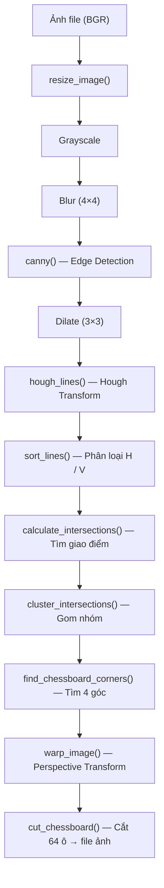

# 🔬 Logic Chi Tiết — `chessboard_processor.py`

> Module xử lý **ảnh tĩnh** bàn cờ. Pipeline hoàn toàn khác `board_process_en_new.py`: dùng **Hough Lines + Intersection Clustering** (thay vì Contour Detection) để tìm bàn cờ, warp, và cắt 64 ô ra file ảnh riêng.

---

## Tổng Quan Pipeline



---

## Import

```python
import math                       # Hàm cos, sin cho render đường Hough
import operator                   # operator.itemgetter dùng trong sort
import sys                        # sys.exit khi file không tồn tại
from collections import defaultdict  # Dict tự tạo key mặc định

import numpy as np                # Mảng số, giải hệ phương trình
import cv2                        # OpenCV — xử lý ảnh

import scipy.spatial as spatial   # Tính ma trận khoảng cách (pdist)
import scipy.cluster as clstr     # Hierarchical clustering
```

---

## Các Hàm Chi Tiết

---

### `canny(img)`

**Mục đích**: Phát hiện cạnh (edge) trong ảnh xám.

**Tham số**: `img` — ảnh grayscale `(H, W)`, dtype `uint8`

**Trả về**: ảnh nhị phân `(H, W)` — pixel 255 = cạnh, 0 = không

```python
edges = cv2.Canny(img, 80, 200)
# Thuật toán Canny Edge Detection:
#   1. Gaussian Blur (giảm nhiễu)
#   2. Tính gradient (Sobel) → biên độ + hướng
#   3. Non-Maximum Suppression → giữ pixel mạnh nhất trên hướng gradient
#   4. Double Thresholding:
#       - pixel > 200 (high) → chắc chắn là cạnh ✅
#       - pixel < 80 (low) → chắc chắn KHÔNG phải cạnh ❌
#       - 80 ≤ pixel ≤ 200 → chỉ giữ nếu liền kề pixel cạnh mạnh
#   5. Hysteresis → nối cạnh yếu vào cạnh mạnh
return edges
```

---

### `hough_lines(img)`

**Mục đích**: Phát hiện các **đường thẳng** trong ảnh cạnh bằng biến đổi Hough.

**Tham số**: `img` — ảnh nhị phân từ Canny `(H, W)`

**Trả về**: `numpy array (N, 1, 2)` — mỗi phần tử `[ρ, θ]` mô tả 1 đường thẳng

```python
rho, theta, thresh = 2, np.pi / 180, 600
return cv2.HoughLines(img, rho, theta, thresh)

# === NGUYÊN LÝ HOUGH TRANSFORM ===
# Mỗi đường thẳng được biểu diễn bằng (ρ, θ) — dạng Hesse Normal Form:
#   x·cos(θ) + y·sin(θ) = ρ
#
# Thuật toán:
#   1. Với mỗi pixel cạnh (x,y), tính tất cả (ρ,θ) có thể
#   2. Tích lũy vào "bộ đếm" (accumulator) trong không gian (ρ,θ)
#   3. Đường thẳng ↔ ô tích lũy vượt ngưỡng threshold
#
# Tham số:
#   rho = 2      → độ phân giải ρ: 2 pixel (mỗi bin = 2px)
#   theta = π/180 → độ phân giải θ: 1 độ
#   thresh = 600  → ngưỡng cao → chỉ giữ đường thẳng rất rõ ràng
#                  (Bàn cờ có đường kẻ dài, nên thresh cao giúp lọc noise)
```

> **Tại sao thresh = 600?** Bàn cờ có 9 đường ngang + 9 đường dọc rất dài → cần threshold cao để chỉ lấy đường kẻ bàn cờ, bỏ qua các cạnh ngắn/nhiễu.

---

### `sort_lines(lines)`

**Mục đích**: Phân loại đường Hough thành **ngang (horizontal)** và **dọc (vertical)** dựa vào góc θ.

**Tham số**: `lines` — output từ `hough_lines()`, shape `(N, 1, 2)`

**Trả về**: `(h, v)` — hai list, mỗi phần tử `[ρ, θ]`

```python
h = []  # Đường ngang
v = []  # Đường dọc

for i in range(lines.shape[0]):
    rho = lines[i][0][0]
    theta = lines[i][0][1]
    
    # === PHÂN LOẠI THEO GÓC θ ===
    # θ ≈ 0° hoặc ≈ 180° → đường gần thẳng đứng (DỌC)
    # θ ≈ 90°            → đường gần nằm ngang (NGANG)
    #
    #       θ < π/4 (45°)                → DỌC
    #       θ > π - π/4 (135°)           → DỌC  
    #       π/4 ≤ θ ≤ 3π/4 (45°-135°)   → NGANG
    
    if theta < np.pi / 4 or theta > np.pi - np.pi / 4:
        v.append([rho, theta])  # Đường dọc
    else:
        h.append([rho, theta])  # Đường ngang

return h, v
```

**Minh họa**:
```
θ = 0°    → | (đường dọc)     → v
θ = 45°   → / (đường chéo)    → ranh giới
θ = 90°   → — (đường ngang)   → h
θ = 135°  → \ (đường chéo)    → ranh giới
θ = 180°  → | (đường dọc)     → v
```

---

### `calculate_intersections(h, v)`

**Mục đích**: Tìm **tất cả giao điểm** giữa mỗi đường ngang với mỗi đường dọc.

**Tham số**:
- `h`: list `[ρ, θ]` — các đường ngang
- `v`: list `[ρ, θ]` — các đường dọc

**Trả về**: `numpy array (N, 2)` — tọa độ (x, y) các giao điểm

**Logic toán học**:
```python
# Mỗi đường thẳng dạng Hesse: x·cos(θ) + y·sin(θ) = ρ
# Giao 2 đường = giải hệ 2 phương trình 2 ẩn:
#
#   cos(θ₁)·x + sin(θ₁)·y = ρ₁    (đường ngang)
#   cos(θ₂)·x + sin(θ₂)·y = ρ₂    (đường dọc)
#
# Dạng ma trận: A·[x, y]ᵀ = b

for rho1, theta1 in h:         # Duyệt mỗi đường ngang
    for rho2, theta2 in v:     # × mỗi đường dọc
        A = np.array([
            [np.cos(theta1), np.sin(theta1)],  # Hệ số đường 1
            [np.cos(theta2), np.sin(theta2)]   # Hệ số đường 2
        ])
        b = np.array([[rho1], [rho2]])

        point = np.linalg.solve(A, b)  # Giải A·x = b → x = A⁻¹·b
        # point[0] = x, point[1] = y

        point = int(np.round(point[0])), int(np.round(point[1]))
        points.append(point)

return np.array(points)  # (len(h)*len(v), 2)
```

> **Số giao điểm**: Nếu có 9H × 9V = 81 giao điểm (đúng cho bàn cờ 8×8). Thực tế Hough detect nhiều đường trùng/gần nhau → số giao điểm >> 81 → cần clustering.

---

### `cluster_intersections(points, max_dist=40)`

**Mục đích**: Gom nhóm các giao điểm gần nhau thành 1 điểm đại diện (trung bình). Giảm từ hàng trăm giao điểm xuống ~81 điểm thực.

**Tham số**:
- `points`: `numpy array (N, 2)` — tọa độ giao điểm thô
- `max_dist`: `int = 40` — khoảng cách tối đa (pixel) để 2 điểm thuộc cùng cluster

**Trả về**: `list` of `[x, y]` — tọa độ trung bình mỗi cluster

```python
# Bước 1: Tính ma trận khoảng cách giữa TẤT CẢ cặp điểm
Y = spatial.distance.pdist(points)
# pdist = pairwise distance → vector 1D chứa N*(N-1)/2 khoảng cách
# Ví dụ: 200 điểm → 19900 cặp khoảng cách

# Bước 2: Hierarchical Clustering (Single Linkage)
Z = clstr.hierarchy.single(Y)
# Single Linkage: khoảng cách giữa 2 cluster = khoảng cách NHỎ NHẤT
# giữa 2 điểm bất kỳ từ 2 cluster
# → Tạo cây phân cấp (dendrogram)

# Bước 3: Cắt cây ở khoảng cách max_dist=40
T = clstr.hierarchy.fcluster(Z, max_dist, 'distance')
# T[i] = số cluster mà points[i] thuộc về
# Ví dụ: T = [1, 1, 2, 3, 3, 3, ...] → points[0,1] thuộc cluster 1

# Bước 4: Nhóm điểm theo cluster
clusters = defaultdict(list)
for i in range(len(T)):
    clusters[T[i]].append(points[i])
# clusters = {1: [[x1,y1],[x2,y2]], 2: [[x3,y3]], ...}

# Bước 5: Tính trung bình mỗi cluster → điểm đại diện
clusters = map(
    lambda arr: (
        np.mean(np.array(arr)[:, 0]),  # x trung bình
        np.mean(np.array(arr)[:, 1])   # y trung bình
    ),
    clusters
)

# Chuyển về list
result = [[point[0], point[1]] for point in clusters]
return result  # Kỳ vọng: 81 điểm (9×9 giao điểm lưới bàn cờ)
```

**Minh họa clustering**:
```
Trước clustering:           Sau clustering:
  ·· ·  ·· ·  ·· ·           ●     ●     ●
  · ··  · ··  · ··
                              ●     ●     ●
  ·· ·  ·· ·  ·· ·
  · ··  · ··  · ··            ●     ●     ●

(nhiều điểm gần nhau)      (1 điểm đại diện mỗi nhóm)
```

---

### `find_chessboard_corners(points)`

**Mục đích**: Tìm 4 góc ngoài cùng của bàn cờ từ ~81 điểm giao.

**Tham số**: `points` — list `[x, y]`, ~81 điểm

**Trả về**: list 4 phần tử `[TL, TR, BL, BR]`

```python
# === NGUYÊN LÝ (giống order_points) ===
#
# Hệ tọa độ ảnh: gốc = góc trái trên, x→phải, y→xuống
#
#   Top-Left (TL):     x nhỏ + y nhỏ → (x+y) NHỎ NHẤT
#   Bottom-Right (BR): x lớn + y lớn → (x+y) LỚN NHẤT
#   Top-Right (TR):    x lớn + y nhỏ → (x-y) LỚN NHẤT
#   Bottom-Left (BL):  x nhỏ + y lớn → (x-y) NHỎ NHẤT

# enumerate(...) → [(index, value), ...]
# operator.itemgetter(1) → lấy value để so sánh

bottom_right, _ = max(enumerate([pt[0] + pt[1] for pt in points]), key=operator.itemgetter(1))
top_left,     _ = min(enumerate([pt[0] + pt[1] for pt in points]), key=operator.itemgetter(1))
bottom_left,  _ = min(enumerate([pt[0] - pt[1] for pt in points]), key=operator.itemgetter(1))
top_right,    _ = max(enumerate([pt[0] - pt[1] for pt in points]), key=operator.itemgetter(1))

return [points[top_left], points[top_right], points[bottom_left], points[bottom_right]]
# Thứ tự: [TL, TR, BL, BR]
```

> **Lưu ý**: Thứ tự trả về là `[TL, TR, BL, BR]` — **khác** với `order_points` trong `board_process_en_new.py` (`[TL, TR, BR, BL]`). Hàm `warp_image()` dùng đúng thứ tự này.

---

### `distance_between(p1, p2)`

**Mục đích**: Tính khoảng cách Euclidean giữa 2 điểm.

**Tham số**: `p1, p2` — mỗi điểm là list/tuple `[x, y]`

**Trả về**: `float` — khoảng cách

```python
a = p2[0] - p1[0]   # Δx
b = p2[1] - p1[1]   # Δy
return np.sqrt((a ** 2) + (b ** 2))   # √(Δx² + Δy²)
```

---

### `warp_image(img, edges)`

**Mục đích**: Biến đổi phối cảnh (perspective transform) — biến ảnh méo thành ảnh vuông.

**Tham số**:
- `img`: ảnh gốc BGR `(H, W, 3)`
- `edges`: list 4 điểm `[TL, TR, BL, BR]` từ `find_chessboard_corners()`

**Trả về**: `numpy array (side, side, 3)` — ảnh vuông đã warp

```python
top_left, top_right, bottom_left, bottom_right = edges[0], edges[1], edges[2], edges[3]

# Nguồn: 4 góc bàn cờ trong ảnh gốc
# Thứ tự: TL → TR → BR → BL (theo yêu cầu của getPerspectiveTransform)
warp_src = np.array([top_left, top_right, bottom_right, bottom_left], dtype='float32')

# Tính cạnh dài nhất (giống calculate_optimal_side trong board_process_en_new.py)
side = max([
    distance_between(bottom_right, top_right),   # Cạnh phải
    distance_between(top_left, bottom_left),      # Cạnh trái
    distance_between(bottom_right, bottom_left),  # Cạnh dưới
    distance_between(top_left, top_right)          # Cạnh trên
])

# Đích: hình vuông cạnh = side
warp_dst = np.array([
    [0, 0], [side - 1, 0],
    [side - 1, side - 1], [0, side - 1]
], dtype='float32')

# Tính ma trận biến đổi 3×3
m = cv2.getPerspectiveTransform(warp_src, warp_dst)

# Áp dụng biến đổi
return cv2.warpPerspective(img, m, (int(side), int(side)))
```

---

### `cut_chessboard(img, output_path, output_prefix="")`

**Mục đích**: Cắt ảnh bàn cờ đã warp thành 64 ô riêng biệt → lưu file.

**Tham số**:
- `img`: ảnh vuông đã warp `(side, side, 3)`
- `output_path`: đường dẫn thư mục output
- `output_prefix`: tiền tố tên file

**Trả về**: Không trả về. Ghi 64 file ảnh.

```python
side_len = int(img.shape[0] / 8)  # Kích thước mỗi ô = cạnh / 8

for i in range(8):        # Hàng (row) 0-7
    for j in range(8):    # Cột (col) 0-7
        # Cắt vùng ô (i,j)
        tile = img[i * side_len : (i + 1) * side_len,
                   j * side_len : (j + 1) * side_len]
        
        # Tên file: prefix-{index}.jpg
        # index = j + i*8  →  0, 1, 2, ..., 63
        cv2.imwrite(output_path + output_prefix + "-" + str(j + i * 8) + ".jpg", tile)

# Ví dụ output: result.png-0.jpg, result.png-1.jpg, ..., result.png-63.jpg
```

**Mapping index → ô cờ**:
```
 0  1  2  3  4  5  6  7     ← row 0 (rank 8)
 8  9 10 11 12 13 14 15     ← row 1 (rank 7)
16 17 18 19 20 21 22 23     ← row 2 (rank 6)
...
56 57 58 59 60 61 62 63     ← row 7 (rank 1)
```

---

### `resize_image(img)`

**Mục đích**: Thu nhỏ ảnh nếu quá lớn (width > 800px).

**Tham số**: `img` — ảnh BGR `(H, W, 3)`

**Trả về**: ảnh đã resize hoặc ảnh gốc nếu đã nhỏ

```python
width = img.shape[1]       # Lấy chiều rộng
if width > 800:
    scale = 800 / width    # Tỷ lệ thu nhỏ
    return cv2.resize(img, None, fx=scale, fy=scale)
    # fx=fy → giữ tỷ lệ gốc
else:
    return img             # Không resize
```

---

### `process_chessboard(src_path, output_path, output_prefix="", debug=False)` — **HÀM CHÍNH**

**Mục đích**: Pipeline hoàn chỉnh: đọc ảnh → detect board → warp → cắt 64 ô.

**Tham số**:
- `src_path`: đường dẫn ảnh đầu vào
- `output_path`: đường dẫn thư mục output
- `output_prefix`: tiền tố tên file output
- `debug`: `bool` — nếu `True`, hiển thị kết quả từng bước

**Trả về**: Không. Ghi 64 file ảnh. (Nếu `debug=True`, hiển thị 8 cửa sổ debug)

```python
# ===== BƯỚC 1: ĐỌC VÀ RESIZE =====
src = cv2.imread(src_path)
if src is None:
    sys.exit("There is no file with this path!")
src = resize_image(src)      # Max width 800px
src_copy = src.copy()        # Bản sao để vẽ debug

# ===== BƯỚC 2: TIỀN XỬ LÝ ẢNH =====
process = cv2.cvtColor(src, cv2.COLOR_BGR2GRAY)   # Xám
process = cv2.blur(process, (4, 4))                # Blur → giảm nhiễu
process = canny(process)                           # Canny → phát hiện cạnh
process = cv2.dilate(process, np.ones((3,3)))      # Dilate → nối cạnh đứt

# ===== BƯỚC 3: HOUGH TRANSFORM =====
lines = hough_lines(process)           # Detect đường thẳng
h, v = sort_lines(lines)              # Phân loại ngang/dọc

if len(h) < 9 or len(v) < 9:
    print("Not enough lines!")         # Cần ≥ 9H + 9V cho bàn cờ

# ===== BƯỚC 4: GIAO ĐIỂM + CLUSTERING =====
intersections = calculate_intersections(h, v)    # Tất cả giao H×V
clustered = cluster_intersections(intersections) # Gom nhóm → ~81 điểm

if len(clustered) != 81:
    print("Something is wrong!")       # 9×9 = 81 giao điểm chuẩn

# ===== BƯỚC 5: TÌM 4 GÓC + WARP =====
corners = find_chessboard_corners(clustered)  # [TL, TR, BL, BR]
dst = warp_image(src, corners)                # Ảnh vuông phẳng

# ===== BƯỚC 6: CẮT 64 Ô =====
cut_chessboard(dst, output_path, output_prefix)  # Lưu 64 file .jpg
```

---

### `render_lines(img, lines, color)` — Hàm debug

**Mục đích**: Vẽ các đường Hough lên ảnh để visualize.

```python
for rho, theta in lines:
    # Chuyển (ρ, θ) → 2 điểm trên đường thẳng
    a = math.cos(theta)           # cos(θ)
    b = math.sin(theta)           # sin(θ)
    x0, y0 = a * rho, b * rho    # Điểm gần gốc nhất trên đường
    
    # Kéo dài 1000px về 2 phía → 2 điểm đầu cuối
    pt1 = (int(x0 + 1000 * (-b)), int(y0 + 1000 * a))
    pt2 = (int(x0 - 1000 * (-b)), int(y0 - 1000 * a))
    
    cv2.line(img, pt1, pt2, color, 1, cv2.LINE_AA)
```

> **Giải thích**: Vector hướng của đường `ρ = x·cos(θ) + y·sin(θ)` là `(-sin(θ), cos(θ))`. Nhân 1000 → đủ dài để vẽ xuyên ảnh.

---

### `render_intersections(img, points, color, size)` — Hàm debug

**Mục đích**: Vẽ các giao điểm lên ảnh.

```python
for point in points:
    cv2.circle(img, (int(point[0]), int(point[1])), 2, color, size)
    # Vẽ hình tròn bán kính 2, thickness = size
```

---

## So Sánh Với `board_process_en_new.py`

| Đặc điểm | `chessboard_processor.py` | `board_process_en_new.py` |
|---|---|---|
| **Input** | Ảnh tĩnh (file) | Video/Camera (real-time) |
| **Detect method** | Hough Lines → Intersections → Clustering | Contour (CLAHE + OTSU + approxPolyDP) |
| **Số bước** | 6 bước (phức tạp hơn) | 2 bước warp (đơn giản hơn) |
| **Loại viền** | Tự động (dùng 81 giao điểm chính xác) | Thủ công (user click 4 góc inner) |
| **Output** | 64 file ảnh tile | Ảnh warped trong bộ nhớ |
| **Dependencies** | **SciPy** (nặng hơn) | Chỉ OpenCV + NumPy |
| **Ưu điểm** | Chính xác hơn cho ảnh tĩnh | Nhanh, phù hợp real-time |
