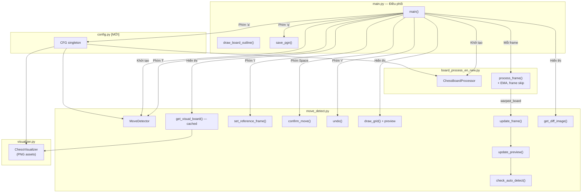

# 🎮 Logic Chi Tiết — `main.py` (Entry Point Modular)

> File điều phối chính, **kết nối tất cả module**. Bao gồm camera retry, auto-detect, flip board, preview arrow.

---

## Tổng Quan Tích Hợp



---

## Import & Tích Hợp Module

```python
import cv2
import numpy as np
import sys              # [MỚI] Dùng sys.argv cho video path
import time

from board_process_en_new import ChessBoardProcessor
from move_detect import MoveDetector
from config import CFG  # [MỚI] Thông số tập trung
```

**Không còn import**:
- ~~`import os`~~ — không dùng trực tiếp trong main

---

## Hàm Tiện Ích

### `draw_board_outline(frame, board_contour)`

Vẽ bounding box xanh lá lên camera frame. *(Không thay đổi.)*

### `save_pgn(game, filename="game.pgn")`

Lưu ván cờ ra file PGN. *(Không thay đổi.)*

---

## Hàm `main()` — Pipeline Chính

### Giai đoạn 1: Khởi Tạo

```python
# Video source: command line argument hoặc camera 0
path = sys.argv[1] if len(sys.argv) > 1 else 0

cap = cv2.VideoCapture(path)
if not cap.isOpened():
    print(f"❌ Cannot open video source: {path}")
    return

cap.set(cv2.CAP_PROP_FRAME_WIDTH, CFG.display_width)   # Dùng config (640)
cap.set(cv2.CAP_PROP_FRAME_HEIGHT, CFG.display_height)  # Dùng config (480)

processor = ChessBoardProcessor()  # + EMA, frame skip, cached CLAHE
detector = MoveDetector()          # + cached visual, auto-detect, flip

start_time = time.time()
frame_count = 0
last_warped_board = None
retry_count = 0  # [S3] Camera retry counter
```

**Sơ đồ khởi tạo**:
```
main.py
  ├─ config.py (CFG)           ← Thông số tập trung
  ├─ ChessBoardProcessor()     ← board_process_en_new.py
  │     ├─ load inner_pts.npy
  │     ├─ cache CLAHE object
  │     └─ EMA + frame skip state
  └─ MoveDetector()            ← move_detect.py
        ├─ chess.Board()
        ├─ chess.pgn.Game()
        ├─ ChessVisualizer()   ← visualizer.py (PNG assets)
        └─ auto-detect + flip state
```

---

### Giai đoạn 2: Vòng Lặp Chính

#### Bước 2a: Đọc Frame + Camera Retry [S3]

```python
ret, frame = cap.read()

# [S3] Error handling — retry thay vì crash
if not ret:
    retry_count += 1
    if retry_count > CFG.camera_retry_limit:  # 30 frame ≈ 1 giây
        print("❌ Camera disconnected")
        save_pgn(detector.game, f"game_{int(current_time)}.pgn")
        break  # Auto-save PGN trước khi thoát
    continue
retry_count = 0
# TRƯỚC: if not ret: break (mất game data)
# SAU:   Retry tối đa 30 frame, auto-save nếu thất bại

frame = cv2.flip(frame, -1)  # Lật 180° (camera ngược)
```

#### Bước 2b: Board Detection + Move Pipeline

```python
warped_board = processor.process_frame(frame)
# → Bên trong: frame skip, EMA stabilization, cached transform

if warped_board is not None:
    last_warped_board = warped_board.copy()

    detector.update_frame(warped_board)
    # → Cập nhật curr_img (grid Hough được bảo vệ bởi L5)

    # [F2] Cập nhật preview move
    detector.update_preview()
    # → Dựa trên diff hiện tại → suy luận nước đi → _preview_move
    # → draw_grid() sẽ vẽ mũi tên cam từ ô đi → ô đến

    # [F1] Auto-detect: tự động confirm khi ổn định
    if detector.check_auto_detect():
        move = detector.confirm_move()
        if move:
            print(f"🤖 Auto-detected: {move.uci()}")
```

#### Bước 2c: Chuẩn Bị 4 Cửa Sổ Hiển Thị

```python
# === CỬA SỔ 1: Camera + Bounding Box ===
# [P3] Không cần frame.copy() — cv2.resize tạo ảnh mới
orig_h, orig_w = frame.shape[:2]
if processor.last_board_contour is not None:
    # Scale contour tọa độ gốc → display size
    scale_x = CFG.display_width / orig_w
    scale_y = CFG.display_height / orig_h
    scaled_contour = (processor.last_board_contour.astype(np.float64)
                      * [scale_x, scale_y]).astype(np.int32)
    camera_display = cv2.resize(frame, (CFG.display_width, CFG.display_height))
    camera_display = draw_board_outline(camera_display, scaled_contour)
else:
    camera_display = cv2.resize(frame, (CFG.display_width, CFG.display_height))

# === CỬA SỔ 2: Warped Board + Grid + Preview Arrow ===
warped_display = detector.draw_grid(last_warped_board)
# → Vẽ grid lines + status text + [F2] mũi tên preview

# === CỬA SỔ 3: Bàn Cờ Ảo (Cached) ===
chess_display = detector.get_visual_board()
# [P1] Chỉ render khi FEN thay đổi (cache theo FEN string)
# [S2] Dùng ChessVisualizer (PNG) thay board_to_image (SVG)

# === CỬA SỔ 4: Diff Heatmap ===
diff_display = detector.get_diff_image()

# Hiển thị trạng thái AUTO/FLIP
if CFG.auto_detect_enabled:
    cv2.putText(camera_display, "AUTO", ...)  # Góc phải trên
if detector.flip_board:
    cv2.putText(camera_display, "FLIP", ...)  # Dưới AUTO
```

**4 cửa sổ và nguồn dữ liệu**:
```
┌─────────────────┐  ┌─────────────────────┐
│ 1. Camera       │  │ 2. Warped+Grid      │
│   + bounding box│  │   + [F2] mũi tên    │
│   + FPS         │  │   + status text     │
│   + AUTO/FLIP   │  │                     │
├─────────────────┤  ├─────────────────────┤
│ 3. Chess Visual │  │ 4. Diff             │
│   [P1] cached   │  │   Heatmap đỏ       │
│   [S2] PNG      │  │                     │
│   [F3] flip     │  │                     │
│   highlight move│  │                     │
└─────────────────┘  └─────────────────────┘
```

---

### Giai đoạn 3: Xử Lý Phím Bấm

#### Phím `'i'` — Init / Calibrate

```python
detector.set_reference_frame(last_warped_board)
# → calibrate_grid_from_hough() → grid Hough chính xác
# → _hough_calibrated = True → L5 bảo vệ
```

#### Phím `Space` — Confirm Move

```python
move = detector.confirm_move()
# → [Bug9] check game over đầu + cuối
# → detect_changes() với [L3] ngưỡng động
# → infer_move() với [L4] queen promotion
# → push + update PGN
```

#### Phím `'r'` — Undo

```python
detector.undo()
# → board.pop() + rebuild PGN
# → prev_img = curr_img → tránh desync
# → cache invalidated
```

#### Phím `'f'` — Flip Board [F3 MỚI]

```python
detector.flip_board = not detector.flip_board
detector._cached_fen = None  # Invalidate cache để render lại
# → Đổi: White ở dưới ↔ Black ở dưới
# → Ảnh hưởng: visual board + detect_changes mapping + preview
```

#### Phím `'a'` — Toggle Auto-detect [F1 MỚI]

```python
CFG.auto_detect_enabled = not CFG.auto_detect_enabled
# → ON: hệ thống tự động confirm move khi phát hiện thay đổi ổn định
# → OFF: user phải nhấn Space thủ công (mặc định TẮT)
```

#### Phím `'q'` — Quit & Save

```python
save_pgn(detector.game, f"game_{int(current_time)}.pgn")
break
```

---

## Tóm Tắt: main.py Gọi Gì Từ Module Nào

| Hành động | Module | Hàm gọi | Thay đổi |
|---|---|---|---|
| Detect bàn cờ | `board_process_en_new` | `processor.process_frame(frame)` | + EMA, frame skip |
| Lấy contour | `board_process_en_new` | `processor.last_board_contour` | — |
| Cập nhật frame | `move_detect` | `detector.update_frame(warped)` | + [L5] grid protection |
| Preview move | `move_detect` | `detector.update_preview()` | [F2 MỚI] |
| Auto-detect | `move_detect` | `detector.check_auto_detect()` | [F1 MỚI] |
| Calibrate grid | `move_detect` | `detector.set_reference_frame(warped)` | — |
| Xác nhận nước đi | `move_detect` | `detector.confirm_move()` | + game over, promotion |
| Hoàn tác | `move_detect` | `detector.undo()` | + cache invalidate |
| Vẽ grid + arrow | `move_detect` | `detector.draw_grid(warped)` | + [F2] preview arrow |
| Render bàn cờ ảo | `move_detect` → `visualizer` | `detector.get_visual_board()` | [P1] cached, [S2] PNG |
| Diff heatmap | `move_detect` | `detector.get_diff_image()` | — |
| Lưu PGN | `move_detect` | `detector.game` | — |
| Flip board | `move_detect` | `detector.flip_board` | [F3 MỚI] |
| Toggle auto | `config` | `CFG.auto_detect_enabled` | [F1 MỚI] |

---

## Phím Tắt

| Phím | Chức năng | Module |
|---|---|---|
| `i` | Calibrate — set reference frame | `move_detect` |
| `SPACE` | Xác nhận nước đi | `move_detect` |
| `r` | Undo nước đi cuối | `move_detect` |
| `q` | Thoát + save PGN | `main` |
| **`f`** | 🆕 Flip board | `move_detect` |
| **`a`** | 🆕 Toggle auto-detect | `config` |
