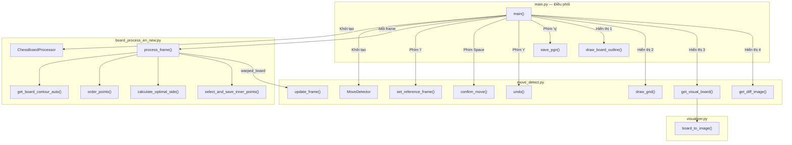

# 🎮 Logic Chi Tiết — `main.py` (Entry Point Modular)

> File điều phối chính, **kết nối tất cả module** lại với nhau. Đây là nơi giải thích rõ nhất cách các file `board_process_en_new.py`, `move_detect.py`, và `visualizer.py` phối hợp.

---

## Tổng Quan Tích Hợp



---

## Import & Tích Hợp Module

```python
import cv2
import numpy as np
import time
import os

# ========== TÍCH HỢP MODULE ==========

from board_process_en_new import ChessBoardProcessor
# → Dùng class ChessBoardProcessor để:
#   1. Auto-detect bàn cờ trong camera frame (CLAHE + OTSU + Contour)
#   2. Perspective Transform 2 lần (outer → inner) → ảnh warped phẳng
#   3. Lưu/load inner_pts.npy cho calibration

from move_detect import MoveDetector
# → Dùng class MoveDetector để:
#   1. Calibrate grid (HoughLines hoặc linspace)
#   2. Detect changes (pixel-diff: absdiff → threshold → count per cell)
#   3. Infer move (match changed squares vs legal_moves)
#   4. Quản lý game state (chess.Board + PGN tree)
#   5. Render visual outputs (draw_grid, get_diff_image)
#
# MoveDetector bên trong import từ visualizer:
#   from visualizer import board_to_image
#   → Dùng board_to_image() để render bàn cờ SVG → OpenCV image
```

---

## Hàm Tiện Ích

### `draw_board_outline(frame, board_contour)`

**Mục đích**: Vẽ bounding box xanh lá lên camera frame để user thấy hệ thống đang track bàn cờ ở đâu.

**Tham số**:
- `frame`: ảnh camera BGR `(H, W, 3)` — **bị sửa trực tiếp** (in-place)
- `board_contour`: `numpy array (4, 1, 2)` hoặc `None`

**Trả về**: `frame` (cùng object, đã vẽ contour)

**Tích hợp**: Dùng `processor.last_board_contour` — thuộc tính được `ChessBoardProcessor.get_board_contour_auto()` cập nhật mỗi frame.

```python
if board_contour is not None:
    cv2.drawContours(frame, [board_contour], 0, (0, 255, 0), 3)
    # [board_contour]: list chứa 1 contour
    # 0: vẽ contour thứ 0
    # (0, 255, 0): màu xanh lá (BGR)
    # 3: độ dày nét vẽ
return frame
```

---

### `save_pgn(game, filename="game.pgn")`

**Mục đích**: Lưu ván cờ ra file PGN.

**Tham số**:
- `game`: `chess.pgn.Game` — object PGN từ `detector.game`
- `filename`: tên file output

**Tích hợp**: Dùng `detector.game` — thuộc tính PGN game tree của `MoveDetector`, được cập nhật mỗi khi `confirm_move()` thành công.

```python
try:
    with open(filename, "w") as f:
        f.write(str(game))
        # str(game) → chuỗi PGN đầy đủ (headers + moves)
except Exception as e:
    print(f"❌ Failed to save PGN: {e}")
```

---

## Hàm `main()` — Pipeline Chính

### Giai đoạn 1: Khởi Tạo

```python
# ===== VIDEO SOURCE =====
path = r"E:\Python_Project\chessboard_move.mp4"  # ⚠️ Hardcoded path
cap = cv2.VideoCapture(path)
# Có thể đổi thành: cap = cv2.VideoCapture(0) cho camera thực

cap.set(cv2.CAP_PROP_FRAME_WIDTH, 640)
cap.set(cv2.CAP_PROP_FRAME_HEIGHT, 480)

# ===== KHỞI TẠO 2 MODULE CHÍNH =====

processor = ChessBoardProcessor()
# → Tạo instance board_process_en_new.ChessBoardProcessor
# → Auto-load inner_pts.npy nếu có (trong __init__)
# → Thuộc tính quan trọng:
#     processor.inner_pts     — 4 góc inner (load từ file hoặc None)
#     processor.wrap_size     — kích thước ảnh warp (tính lần đầu)
#     processor.last_board_contour — contour gần nhất (để vẽ bounding box)

detector = MoveDetector()
# → Tạo instance move_detect.MoveDetector
# → Khởi tạo:
#     detector.board      — chess.Board() (trạng thái ban đầu)
#     detector.game       — chess.pgn.Game() (PGN tree rỗng)
#     detector.h_grid     — linspace(0, 500, 9) (grid mặc định)
#     detector.prev_img   — None (chưa có ảnh tham chiếu)
#     detector.curr_img   — None
#
# MoveDetector.__init__ cũng khởi tạo:
#   → import board_to_image từ visualizer.py (SVG renderer)

# ===== BIẾN CỤC BỘ =====
frame_time = 1.0 / 30        # Target 30 FPS
last_warped_board = None      # Cache ảnh warped gần nhất
                               # (dùng khi processor trả về None ở 1 frame)
```

**Sơ đồ khởi tạo**:
```
main.py
  ├─ ChessBoardProcessor()  ← board_process_en_new.py
  │     └─ load inner_pts.npy (nếu có)
  │
  └─ MoveDetector()          ← move_detect.py
        ├─ chess.Board()
        ├─ chess.pgn.Game()
        └─ import board_to_image  ← visualizer.py
              └─ import cairosvg
```

---

### Giai đoạn 2: Vòng Lặp Chính (Mỗi Frame)

```python
while True:
    # === FRAME RATE CONTROL ===
    if current_time - last_time < frame_time:
        time.sleep(0.1)   # Chờ nếu quá nhanh
        continue

    # === ĐỌC FRAME ===
    ret, frame = cap.read()
    frame = cv2.flip(frame, -1)  # Lật 180° (camera ngược)
```

#### Bước 2a: Board Detection + Warp (→ `board_process_en_new.py`)

```python
warped_board = processor.process_frame(frame)
# ┌─────────────────────────────────────────────────────────────┐
# │ BÊN TRONG processor.process_frame(frame):                   │
# │                                                               │
# │  1. get_board_contour_auto(frame)                            │
# │     → Grayscale → CLAHE → OTSU → findContours → approxPoly  │
# │     → Trả về 4 đỉnh contour hoặc None                       │
# │     → Lưu vào processor.last_board_contour (để vẽ bbox)      │
# │                                                               │
# │  2. calculate_optimal_side() (chỉ lần đầu)                   │
# │     → Tính wrap_size từ cạnh dài nhất contour                │
# │                                                               │
# │  3. order_points() → sắp xếp 4 góc [TL, TR, BR, BL]         │
# │                                                               │
# │  4. Perspective Transform lần 1 (M1)                          │
# │     → Warp frame → ảnh vuông (còn viền gỗ)                   │
# │                                                               │
# │  5. select_and_save_inner_points() (chỉ lần đầu nếu chưa có)│
# │     → GUI click 4 góc inner → lưu inner_pts.npy              │
# │                                                               │
# │  6. Perspective Transform lần 2 (M2)                          │
# │     → Warp theo inner_pts → ảnh vuông CHỈ có 64 ô            │
# │                                                               │
# │  Return: final_board (H, W, 3) hoặc None                     │
# └─────────────────────────────────────────────────────────────┘

if warped_board is not None:
    last_warped_board = warped_board.copy()  # Cache lại

    # === TRUYỀN KẾT QUẢ SANG move_detect.py ===
    detector.update_frame(warped_board)
    # ┌─────────────────────────────────────────────────┐
    # │ BÊN TRONG detector.update_frame(warped_board):  │
    # │                                                   │
    # │  - Lần đầu: calibrate_grid() → linspace 8×8      │
    # │  - Luôn: self.curr_img = warped_board.copy()      │
    # │  - prev_img KHÔNG đổi (chỉ đổi khi confirm_move) │
    # └─────────────────────────────────────────────────┘
```

**Luồng dữ liệu Board → Detector**:
```
Camera Frame ──→ processor.process_frame() ──→ warped_board ──→ detector.update_frame()
                  (board_process_en_new.py)                      (move_detect.py)
                  
                  ảnh camera thô → ảnh 64 ô phẳng → cập nhật curr_img của detector
```

#### Bước 2b: Chuẩn Bị 4 Cửa Sổ Hiển Thị

```python
# === CỬA SỔ 1: Camera + Bounding Box ===
camera_display = frame.copy()
if processor.last_board_contour is not None:
    camera_display = draw_board_outline(camera_display, processor.last_board_contour)
# processor.last_board_contour ← set bởi get_board_contour_auto() mỗi frame
# → Vẽ hình chữ nhật xanh bao quanh bàn cờ

# === CỬA SỔ 2: Warped Board + Grid ===
if last_warped_board is not None:
    warped_display = detector.draw_grid(last_warped_board)
    # ┌──────────────────────────────────────────────┐
    # │ BÊN TRONG detector.draw_grid():              │
    # │  - Vẽ đường dọc (xanh dương) theo v_grid     │
    # │  - Vẽ đường ngang (xanh lá) theo h_grid      │
    # │  - Vẽ status text (vàng) góc trái trên       │
    # │  - Return: ảnh copy có grid overlay            │
    # └──────────────────────────────────────────────┘
else:
    warped_display = np.zeros((500, 500, 3))  # Ảnh đen "No board detected"

# === CỬA SỔ 3: Bàn Cờ Ảo (SVG) ===
chess_display = detector.get_visual_board()
# ┌──────────────────────────────────────────────────────────────┐
# │ BÊN TRONG detector.get_visual_board():                      │
# │   return board_to_image(self.board, size=500)                │
# │                                                                │
# │   BÊN TRONG board_to_image() (visualizer.py):                 │
# │     1. chess.svg.board(board, 500)  → SVG string               │
# │     2. cairosvg.svg2png(svg)       → PNG bytes                 │
# │     3. np.frombuffer(png)          → numpy array               │
# │     4. cv2.imdecode(arr)           → OpenCV BGR (500×500×3)    │
# └──────────────────────────────────────────────────────────────┘

# === CỬA SỔ 4: Diff Heatmap ===
diff_display = detector.get_diff_image()
# → Ảnh threshold gần nhất, kênh đỏ highlight
# → Cập nhật khi confirm_move() → detect_changes() được gọi

# === HIỂN THỊ ===
cv2.imshow("Camera", camera_display)
cv2.imshow("Warped Board + Grid", warped_display)
cv2.imshow("Chess Visual", chess_display)
cv2.imshow("Diff Detection", diff_display)
```

**4 cửa sổ và nguồn dữ liệu**:
```
┌─────────────────┐  ┌─────────────────┐
│ 1. Camera       │  │ 2. Warped+Grid  │
│   Nguồn: frame  │  │   Nguồn:        │
│   + processor.  │  │   warped_board   │
│   last_board_   │  │   + detector.    │
│   contour       │  │   draw_grid()    │
├─────────────────┤  ├─────────────────┤
│ 3. Chess Visual │  │ 4. Diff         │
│   Nguồn:        │  │   Nguồn:        │
│   detector.     │  │   detector.     │
│   get_visual_   │  │   get_diff_     │
│   board()       │  │   image()       │
│   → visualizer. │  │                 │
│   board_to_     │  │                 │
│   image()       │  │                 │
└─────────────────┘  └─────────────────┘
```

---

### Giai đoạn 3: Xử Lý Phím Bấm

#### Phím `'i'` — Init / Calibrate (→ `move_detect.py`)

```python
elif key == ord('i'):
    if last_warped_board is not None:
        detector.set_reference_frame(last_warped_board)
        # ┌──────────────────────────────────────────────────────┐
        # │ BÊN TRONG detector.set_reference_frame():           │
        # │                                                        │
        # │  1. calibrate_grid_from_hough(img)                     │
        # │     → Canny(50,150) → HoughLines(thresh=110)           │
        # │     → Phân loại H/V → _cluster_lines()                 │
        # │     → h_grid, v_grid = 9 đường kẻ chính xác            │
        # │                                                        │
        # │  2. ref_img = prev_img = curr_img = img.copy()          │
        # │     → Đặt mốc so sánh ban đầu                          │
        # └──────────────────────────────────────────────────────┘
        print(f"FEN: {detector.board.fen()}")
```

#### Phím `Space` — Confirm Move (→ `move_detect.py`)

```python
elif key == ord(' '):
    if last_warped_board is not None:
        move = detector.confirm_move()
        # ┌──────────────────────────────────────────────────────────┐
        # │ BÊN TRONG detector.confirm_move():                       │
        # │                                                            │
        # │  1. detect_changes(prev_img, curr_img)                     │
        # │     → _prepare_diff(): Grayscale → Blur → absdiff → thresh│
        # │     → Chia 64 ô theo h_grid/v_grid                        │
        # │     → Đếm pixel thay đổi > 100 → sort by intensity        │
        # │     → Trả về: [e2, e4, ...] (các ô thay đổi)              │
        # │                                                            │
        # │  2. infer_move(changes, scores)                            │
        # │     → Top 4 ô → match vs board.legal_moves                │
        # │     → Trả về: chess.Move hoặc None                        │
        # │                                                            │
        # │  3. Nếu thành công:                                        │
        # │     → board.san(move) → "e4"                               │
        # │     → board.push(move) → cập nhật trạng thái board         │
        # │     → node.add_variation(move) → cập nhật PGN tree         │
        # │     → prev_img = curr_img → mốc so sánh MỚI               │
        # │     → get_pgn_string() → in PGN ra terminal                │
        # │                                                            │
        # │  Return: chess.Move hoặc None                               │
        # └──────────────────────────────────────────────────────────┘
        if move:
            print(f"FEN: {detector.board.fen()}")
```

#### Phím `'r'` — Undo (→ `move_detect.py`)

```python
elif key == ord('r'):
    detector.undo()
    # ┌──────────────────────────────────────┐
    # │ BÊN TRONG detector.undo():          │
    # │  board.pop()      → hoàn tác board   │
    # │  _rebuild_game()  → tạo lại PGN tree │
    # └──────────────────────────────────────┘
    print(f"FEN: {detector.board.fen()}")
```

#### Phím `'q'` — Quit & Save

```python
elif key == ord('q'):
    pgn_filename = f"game_{int(current_time)}.pgn"
    save_pgn(detector.game, pgn_filename)
    # detector.game → PGN tree đầy đủ
    # Tên file: game_1711378800.pgn (timestamp)
    break
```

---

### Giai đoạn 4: Cleanup

```python
cap.release()           # Giải phóng camera/video
cv2.destroyAllWindows()  # Đóng tất cả cửa sổ OpenCV
```

---

## Tóm Tắt: main.py Gọi Gì Từ Module Nào

| Hành động | Module | Hàm gọi | Dữ liệu trả về |
|---|---|---|---|
| Detect bàn cờ | `board_process_en_new` | `processor.process_frame(frame)` | Ảnh warped hoặc None |
| Lấy contour | `board_process_en_new` | `processor.last_board_contour` | numpy (4,1,2) |
| Cập nhật frame | `move_detect` | `detector.update_frame(warped)` | — |
| Calibrate grid | `move_detect` | `detector.set_reference_frame(warped)` | — |
| Xác nhận nước đi | `move_detect` | `detector.confirm_move()` | chess.Move / None |
| Hoàn tác | `move_detect` | `detector.undo()` | — |
| Vẽ grid lên warped | `move_detect` | `detector.draw_grid(warped)` | Ảnh có grid |
| Render bàn cờ ảo | `move_detect` → `visualizer` | `detector.get_visual_board()` | Ảnh SVG 500×500 |
| Diff heatmap | `move_detect` | `detector.get_diff_image()` | Ảnh BGR |
| Lưu PGN | `move_detect` | `detector.game` (thuộc tính) | chess.pgn.Game |

> **`chessboard_processor.py` KHÔNG được dùng trong `main.py`**. File đó là module xử lý ảnh tĩnh riêng biệt (dùng Hough + SciPy clustering), chạy độc lập.
