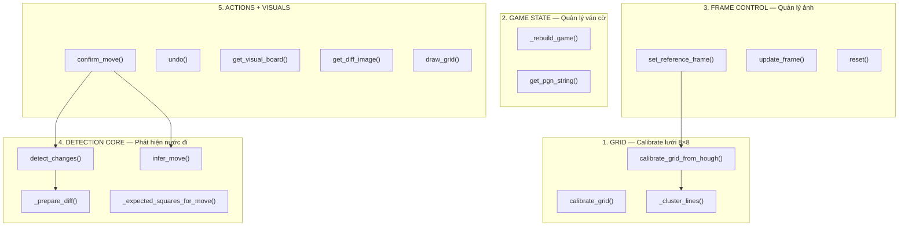

# ♟️ Logic Chi Tiết — `move_detect.py`

> Module phát hiện nước đi cờ vua. Quản lý toàn bộ luồng: nhận ảnh bàn cờ warped → calibrate lưới → so sánh pixel → suy luận nước đi → cập nhật bàn cờ + PGN.

---

## Tổng Quan

`move_detect.py` chứa **một class**: `MoveDetector`, chia thành 5 nhóm chức năng:



---

## Import

```python
import cv2                         # OpenCV — xử lý ảnh
import numpy as np                 # NumPy — mảng số
import chess                       # python-chess — luật cờ, Board, Move
import chess.pgn                   # PGN — Portable Game Notation

from visualizer import board_to_image  # Render bàn cờ SVG → OpenCV image
```

---

## Class `MoveDetector`

### `__init__(self, cells=8)`

**Mục đích**: Khởi tạo detector với bàn cờ mới, PGN trống, grid mặc định.

**Tham số**: `cells = 8` — số ô mỗi chiều (luôn = 8 cho cờ vua)

**Thuộc tính**:

```python
# === BÀN CỜ ===
self.board = chess.Board()
# Board ở trạng thái ban đầu chuẩn (FEN mặc định)
# Theo dõi: vị trí quân, lượt đi (trắng/đen), quyền nhập thành, en passant

# === QUẢN LÝ ẢNH ===
self.prev_img = None    # Ảnh warped TRƯỚC khi đi quân (ảnh tham chiếu)
self.curr_img = None    # Ảnh warped HIỆN TẠI (cập nhật liên tục mỗi frame)
self.ref_img = None     # Ảnh tham chiếu gốc (set khi nhấn 'i')

# === PGN GAME TREE ===
self.game = chess.pgn.Game()
self.game.headers["Event"] = "CV Chess Game"
self.game.headers["White"] = "Player (Camera)"
self.game.headers["Black"] = "Player (Camera)"
self.node = self.game   # Con trỏ đến node hiện tại trong cây PGN
# PGN tree: Game → Node1 (move1) → Node2 (move2) → ...
# self.node luôn trỏ đến node cuối cùng (để add_variation)

# === GRID ===
self.cells = cells      # = 8
self.grid_h = 500       # Chiều cao grid (pixel)
self.grid_w = 500       # Chiều rộng grid (pixel)
self.h_grid = np.linspace(0, 500, 9)  # 9 đường ngang: [0, 62.5, 125, ..., 500]
self.v_grid = np.linspace(0, 500, 9)  # 9 đường dọc:   [0, 62.5, 125, ..., 500]
# → Chia đều thành 8×8 ô, mỗi ô ~62.5px (grid mặc định)

# === TRẠNG THÁI ===
self.last_diff_image = None   # Ảnh diff nhị phân gần nhất (để hiển thị)
self.last_status = "Idle"     # Chuỗi trạng thái (hiển thị trên UI)
```

---

## Nhóm 1: GRID — Calibrate Lưới

---

### `calibrate_grid(self, warped_board)`

**Mục đích**: Calibrate grid **đơn giản** — chia đều 8×8 theo kích thước ảnh.

**Tham số**: `warped_board` — ảnh warped `(H, W, 3)`

**Trả về**: Không. Cập nhật `self.h_grid`, `self.v_grid`.

```python
h, w = warped_board.shape[:2]  # Lấy kích thước ảnh
self.grid_h = h
self.grid_w = w

# Chia đều h pixel thành 8 ô → 9 đường kẻ
self.h_grid = np.linspace(0, h, self.cells + 1)  # [0, h/8, 2h/8, ..., h]
self.v_grid = np.linspace(0, w, self.cells + 1)  # [0, w/8, 2w/8, ..., w]

# Ví dụ: h=w=490 → h_grid = [0, 61.25, 122.5, ..., 490] (9 phần tử)
```

> **Khi nào dùng**: Được gọi tự động khi `update_frame()` nhận frame đầu tiên hoặc khi kích thước ảnh thay đổi. Là fallback đơn giản khi chưa nhấn 'i' (init).

---

### `_cluster_lines(self, data, max_val)`

**Mục đích**: Gom nhóm các giá trị ρ (vị trí đường Hough) gần nhau thành 1 đường đại diện.

**Tham số**:
- `data`: list `float` — giá trị ρ (khoảng cách từ gốc) của các đường Hough cùng loại (ngang hoặc dọc)
- `max_val`: `int` — kích thước ảnh theo chiều tương ứng (height hoặc width)

**Trả về**: `numpy array (9,)` — 9 tọa độ đường kẻ, **hoặc** `linspace` mặc định nếu thất bại

```python
# Fallback: nếu không có data → chia đều
if not data:
    return np.linspace(0, max_val, self.cells + 1)

data.sort()  # Sắp xếp tăng dần

# === THUẬT TOÁN GOM NHÓM ===
# Duyệt tuần tự: nếu 2 giá trị liên tiếp cách nhau > 40px → nhóm mới
res = []
cluster = [data[0]]

for i in range(1, len(data)):
    if abs(data[i] - data[i - 1]) > 40:
        # Khoảng cách > 40px → kết thúc nhóm hiện tại
        res.append(sum(cluster) / len(cluster))  # Trung bình nhóm
        cluster = [data[i]]                       # Bắt đầu nhóm mới
    else:
        # Cùng nhóm (khoảng cách nhỏ → cùng 1 đường kẻ)
        cluster.append(data[i])

res.append(sum(cluster) / len(cluster))  # Nhóm cuối cùng

# Kiểm tra: bàn cờ phải có đúng 9 đường kẻ
if len(res) != self.cells + 1:  # != 9
    return np.linspace(0, max_val, self.cells + 1)  # Fallback

return np.array(res, dtype=np.float32)  # 9 tọa độ chính xác
```

**Ví dụ**:
```
data = [5, 8, 10, 62, 65, 123, 125, 126, 185, 187, 248, 250, 310, 312, 373, 375, 435, 437, 495, 498]
                                                                        
Sau clustering (khoảng cách > 40 → tách nhóm):
  Nhóm 1: [5, 8, 10]     → trung bình = 7.67
  Nhóm 2: [62, 65]       → trung bình = 63.5
  Nhóm 3: [123, 125, 126] → trung bình = 124.67
  ...
  Nhóm 9: [495, 498]     → trung bình = 496.5

Kết quả: 9 đường kẻ → ✅
```

---

### `calibrate_grid_from_hough(self, warped_board)`

**Mục đích**: Calibrate grid **nâng cao** bằng Hough Lines — tìm đường kẻ thực tế trên bàn cờ.

**Tham số**: `warped_board` — ảnh warped `(H, W, 3)`

**Trả về**: Không. Cập nhật `self.h_grid`, `self.v_grid`.

```python
h, w = warped_board.shape[:2]
self.grid_h = h
self.grid_w = w

# Bước 1: Phát hiện cạnh
gray = cv2.cvtColor(warped_board, cv2.COLOR_BGR2GRAY)
edges = cv2.Canny(gray, 50, 150)
# Low threshold = 50, High threshold = 150
# → Phát hiện cạnh nhẹ hơn so với chessboard_processor (80, 200)
#   vì ảnh đã warp (phẳng) → đường kẻ rõ hơn

# Bước 2: Hough Transform
lines = cv2.HoughLines(edges, 1, np.pi / 180, 110)
# rho_res = 1 (chính xác hơn so với chessboard_processor dùng 2)
# threshold = 110 (thấp hơn 600 vì ảnh warp nhỏ hơn, đường kẻ ngắn hơn)

# Bước 3: Phân loại ngang/dọc
h_lines, v_lines = [], []
if lines is not None:
    for l in lines:
        rho, theta = l[0]
        if np.pi / 4 < theta < 3 * np.pi / 4:
            h_lines.append(abs(rho))   # Đường ngang → lấy |ρ|
        else:
            v_lines.append(abs(rho))   # Đường dọc → lấy |ρ|
        # abs(rho) vì ρ có thể âm khi θ > π/2

# Bước 4: Gom nhóm → 9 đường mỗi chiều
self.h_grid = self._cluster_lines(h_lines, h)
self.v_grid = self._cluster_lines(v_lines, w)
```

> **Tại sao Hough tốt hơn linspace?** `linspace` chia đều giả định bàn cờ hoàn hảo. Thực tế, perspective transform có sai số nhỏ → các ô không hoàn toàn bằng nhau. HoughLines tìm đường kẻ **thực tế**, cho grid chính xác hơn.

---

## Nhóm 2: GAME STATE — Quản Lý Ván Cờ

---

### `_rebuild_game(self)`

**Mục đích**: Xây dựng lại cây PGN từ move stack hiện tại. Gọi sau `undo()` hoặc `reset()`.

**Trả về**: Không. Cập nhật `self.game`, `self.node`.

```python
# Tạo Game mới (xóa cây cũ hoàn toàn)
self.game = chess.pgn.Game()
self.game.headers["Event"] = "CV Chess Game"
self.game.headers["White"] = "Player (Camera)"
self.game.headers["Black"] = "Player (Camera)"

# Replay tất cả nước đi từ board.move_stack
node = self.game
for mv in self.board.move_stack:
    node = node.add_variation(mv)
    # add_variation() tạo node con → trả về node con mới
    # Chuỗi: Game → Node(e4) → Node(e5) → Node(Nf3) → ...

self.node = node  # Trỏ đến node cuối cùng
```

> **Tại sao cần rebuild?** `board.pop()` (undo) xóa move khỏi board, nhưng PGN tree không có `.pop()`. Cách duy nhất là xây lại toàn bộ tree từ move_stack còn lại.

---

### `get_pgn_string(self)`

**Mục đích**: Xuất chuỗi PGN hoàn chỉnh.

**Trả về**: `str` — chuỗi PGN (ví dụ: `[Event "CV Chess Game"]\n\n1. e4 e5 2. Nf3 *`)

```python
exporter = chess.pgn.StringExporter(headers=True, variations=False, comments=False)
return self.game.accept(exporter)
# accept() duyệt cây PGN → exporter chuyển thành string
# headers=True → in headers [Event], [White], [Black]
# variations=False → chỉ main line
# comments=False → bỏ bình luận
```

---

## Nhóm 3: FRAME CONTROL — Quản Lý Ảnh

---

### `set_reference_frame(self, img)`

**Mục đích**: Đặt frame tham chiếu ban đầu. Gọi khi user nhấn phím 'i' (Init/Calibrate).

**Tham số**: `img` — ảnh warped hiện tại `(H, W, 3)`

**Trả về**: Không.

```python
self.calibrate_grid_from_hough(img)  # ← QUAN TRỌNG: calibrate grid TRƯỚC
# → h_grid, v_grid được tính từ Hough Lines
# → Grid chính xác nhất vì ảnh tĩnh (user chưa đi quân)

self.ref_img = img.copy()    # Lưu ảnh tham chiếu gốc
self.prev_img = img.copy()   # Set prev = current (mốc so sánh)
self.curr_img = img.copy()   # Set current
self.last_status = "Reference set"
```

> **Workflow**: User đặt bàn cờ → nhấn 'i' → `set_reference_frame()` → hệ thống biết trạng thái ban đầu → user đi quân → nhấn Space → so sánh prev vs curr.

---

### `update_frame(self, img)`

**Mục đích**: Cập nhật frame hiện tại. Được `main.py` gọi **mỗi frame**.

**Tham số**: `img` — ảnh warped mới `(H, W, 3)`

**Trả về**: Không.

```python
# Lần đầu (prev_img = None): auto calibrate + set prev
if self.prev_img is None:
    self.calibrate_grid(img)      # Grid mặc định (linspace)
    self.prev_img = img.copy()

# Kiểm tra kích thước thay đổi → recalibrate
if img.shape[:2] != (self.grid_h, self.grid_w):
    self.calibrate_grid(img)

self.curr_img = img.copy()  # Luôn cập nhật curr_img
```

> **Lưu ý**: `prev_img` KHÔNG được cập nhật ở đây. `prev_img` chỉ thay đổi khi:
> - `set_reference_frame()` (nhấn 'i')
> - `confirm_move()` thành công (nước đi được chấp nhận)

---

### `reset(self)`

**Mục đích**: Reset toàn bộ game về trạng thái ban đầu.

```python
self.board = chess.Board()       # Board mới
self.prev_img = None             # Xóa ảnh
self.curr_img = None
self.ref_img = None
self.last_diff_image = None
self.last_status = "Reset"
self._rebuild_game()             # PGN mới (rỗng)
```

---

## Nhóm 4: DETECTION CORE — Phát Hiện Nước Đi

---

### `_prepare_diff(self, prev_img, curr_img)`

**Mục đích**: Tính sự khác biệt giữa 2 ảnh, trả về ảnh diff và ảnh threshold.

**Tham số**: 2 ảnh warped BGR `(H, W, 3)`

**Trả về**: `(diff, thresh)` — cả hai đều là ảnh grayscale `(H, W)`

```python
# Bước 1: Chuyển xám
prev_gray = cv2.cvtColor(prev_img, cv2.COLOR_BGR2GRAY)
curr_gray = cv2.cvtColor(curr_img, cv2.COLOR_BGR2GRAY)

# Bước 2: Làm mờ Gaussian — giảm nhiễu do rung camera
prev_blur = cv2.GaussianBlur(prev_gray, (5, 5), 0)
curr_blur = cv2.GaussianBlur(curr_gray, (5, 5), 0)
# Kernel 5×5, sigma tự tính từ kernel size
# → Pixel nhiễu nhỏ bị san phẳng, chỉ giữ thay đổi lớn

# Bước 3: Tính hiệu tuyệt đối pixel-by-pixel
diff = cv2.absdiff(prev_blur, curr_blur)
# diff[y][x] = |prev[y][x] - curr[y][x]|
# Giá trị 0-255: 0 = giống nhau, 255 = khác hoàn toàn

# Bước 4: Nhị phân hóa
_, thresh = cv2.threshold(diff, 40, 255, cv2.THRESH_BINARY)
# pixel > 40 → 255 (có thay đổi đáng kể)
# pixel ≤ 40 → 0 (noise, bỏ qua)
# Ngưỡng 40: lọc bỏ thay đổi nhỏ do ánh sáng, rung lắc

return diff, thresh
```

**Minh họa**:
```
prev_img (trước đi quân):     curr_img (sau đi quân):      thresh:
┌──┬──┬──┬──┐                ┌──┬──┬──┬──┐                ┌──┬──┬──┬──┐
│♜│  │  │  │                │  │  │  │  │                │██│  │  │  │ ← quân đi khỏi
├──┼──┼──┼──┤                ├──┼──┼──┼──┤                ├──┼──┼──┼──┤
│  │  │  │  │                │  │  │♜│  │                │  │  │██│  │ ← quân đến
├──┼──┼──┼──┤                ├──┼──┼──┼──┤                ├──┼──┼──┼──┤
│  │  │  │  │                │  │  │  │  │                │  │  │  │  │
└──┴──┴──┴──┘                └──┴──┴──┴──┘                └──┴──┴──┴──┘
                                                          ██ = pixel 255 (thay đổi)
```

---

### `detect_changes(self, prev_img, curr_img)`

**Mục đích**: Xác định **những ô cờ nào** có sự thay đổi, xếp hạng theo mức độ thay đổi.

**Tham số**: 2 ảnh warped `(H, W, 3)`

**Trả về**: `(changed_squares, score_map)`
- `changed_squares`: `list[int]` — danh sách square index (0-63), sorted giảm dần theo intensity
- `score_map`: `dict{int: int}` — square_index → số pixel thay đổi

```python
if prev_img is None or curr_img is None:
    return [], {}

# Bước 1: Tính diff
diff, thresh = self._prepare_diff(prev_img, curr_img)
self.last_diff_image = thresh.copy()  # Lưu để hiển thị

# Bước 2: Duyệt từng ô trên grid
changes = []
rows = min(self.cells, len(self.h_grid) - 1)  # = 8
cols = min(self.cells, len(self.v_grid) - 1)  # = 8

for r in range(rows):       # row 0-7 (từ trên xuống)
    for c in range(cols):   # col 0-7 (từ trái sang)
        # Tọa độ pixel của ô (r, c) theo grid đã calibrate
        y0, y1 = int(self.h_grid[r]), int(self.h_grid[r + 1])
        x0, x1 = int(self.v_grid[c]), int(self.v_grid[c + 1])
        
        # Giới hạn không vượt biên ảnh
        y1 = min(y1, thresh.shape[0])
        x1 = min(x1, thresh.shape[1])

        # Cắt vùng ô từ ảnh threshold
        roi = thresh[y0:y1, x0:x1]
        
        # Đếm pixel trắng (có thay đổi)
        non_zero = cv2.countNonZero(roi)
        
        # Lọc: chỉ giữ ô có thay đổi đáng kể (> 100 pixel)
        if non_zero > 100:
            # === MAPPING ẢNH → TỌA ĐỘ CỜ ===
            # Ảnh: row 0 = trên cùng = rank 8
            # Chess: square(file, rank) với rank 0 = hàng 1 (dưới cùng)
            # → rank = 7 - r
            sq = chess.square(c, 7 - r)
            # chess.square(file, rank):
            #   file = c (cột: 0=a, 1=b, ..., 7=h)
            #   rank = 7-r (hàng: r=0→rank 7, r=7→rank 0)
            # Ví dụ: (r=0, c=4) → chess.square(4, 7) = e8
            
            changes.append((sq, non_zero))

# Bước 3: Sắp xếp giảm dần theo intensity
changes.sort(key=lambda x: x[1], reverse=True)

# Bước 4: Tách thành 2 output
changed_squares = [sq for sq, _ in changes]  # Chỉ lấy square index
score_map = {sq: score for sq, score in changes}  # Dict tra cứu

return changed_squares, score_map
# Ví dụ: ([e2, e4, d7, d5], {e2: 2340, e4: 1890, d7: 450, d5: 220})
```

---

### `_expected_squares_for_move(self, move)`

**Mục đích**: Tính **tập hợp ô kỳ vọng** sẽ thay đổi cho 1 nước đi cụ thể. Xử lý trường hợp đặc biệt.

**Tham số**: `move` — `chess.Move` object

**Trả về**: `set` of `int` — tập square index kỳ vọng

```python
expected = {move.from_square, move.to_square}  # Mặc định: 2 ô

# === NHẬP THÀNH (Castling) — 4 ô thay đổi ===
# Vua đi 2 ô + Xe nhảy qua vua
if self.board.is_castling(move):
    if move.to_square == chess.G1:       # Trắng nhập thành ngắn (O-O)
        expected.add(chess.H1)           # Xe từ h1
        expected.add(chess.F1)           # Xe đến f1
    elif move.to_square == chess.C1:     # Trắng nhập thành dài (O-O-O)
        expected.add(chess.A1)           # Xe từ a1
        expected.add(chess.D1)           # Xe đến d1
    elif move.to_square == chess.G8:     # Đen nhập thành ngắn
        expected.add(chess.H8)
        expected.add(chess.F8)
    elif move.to_square == chess.C8:     # Đen nhập thành dài
        expected.add(chess.A8)
        expected.add(chess.D8)

# === BẮT TỐT QUA ĐƯỜNG (En Passant) — 3 ô thay đổi ===
# Tốt ăn chéo nhưng quân bị bắt ở ô KHÁC (cùng hàng với tốt đi)
if self.board.is_en_passant(move):
    cap_sq = chess.square(
        chess.square_file(move.to_square),     # Cùng cột với ô đến
        chess.square_rank(move.from_square)    # Cùng hàng với ô đi
    )
    expected.add(cap_sq)  # Ô quân tốt bị bắt

return expected
# Nước đi thường:    {from, to}         → 2 ô
# Nhập thành:        {king_from, king_to, rook_from, rook_to} → 4 ô
# En passant:        {from, to, captured_pawn} → 3 ô
```

> **⚠️ Lưu ý**: Hàm này được định nghĩa nhưng **chưa được gọi** bởi `infer_move()` hay `confirm_move()`. Logic castling/en passant chưa tích hợp vào detection pipeline.

---

### `infer_move(self, changed_squares, square_scores)`

**Mục đích**: Suy luận nước đi hợp lệ từ các ô thay đổi.

**Tham số**:
- `changed_squares`: `list[int]` — ô thay đổi (sorted by intensity)
- `square_scores`: `dict` — (không được dùng trực tiếp trong hàm này)

**Trả về**: `(move, status)` — `chess.Move` hoặc `None`, kèm chuỗi trạng thái

```python
# Kiểm tra tối thiểu 2 ô thay đổi (from + to)
if len(changed_squares) < 2:
    return None, "Not enough changes"

# Lấy top 4 ô thay đổi nhiều nhất
top_changes = changed_squares[:4]
# Top 4 vì: nước đi thường = 2 ô, nhập thành = 4 ô, ăn quân qua đường = 3 ô

# Lấy tất cả nước đi hợp lệ từ board
legal_moves = list(self.board.legal_moves)
possible_moves = []

# Duyệt từng nước đi hợp lệ
for mv in legal_moves:
    # Kiểm tra: CẢ from_square VÀ to_square đều nằm trong top 4?
    if mv.from_square in top_changes and mv.to_square in top_changes:
        possible_moves.append(mv)

# Kết luận
if len(possible_moves) == 1:
    return possible_moves[0], "Success"       # Duy nhất → chắc chắn
if len(possible_moves) > 1:
    return possible_moves[0], "Ambiguous, picked best match"  # Mơ hồ → lấy cái đầu
return None, "No matching legal move"         # Không khớp
```

**Ví dụ**: Trắng đi e2→e4
```
changed_squares = [e2(12), e4(28), ...]  (e2 thay đổi nhiều nhất vì quân đi ra)
top_changes = [12, 28, ...]

Duyệt legal_moves:
  - e2e4 (Move(12→28)): from=12 ✅ in top, to=28 ✅ in top → MATCH
  - d2d4: from=11 ❌ not in top → SKIP
  - ...

possible_moves = [Move(e2e4)] → len=1 → return (Move(e2e4), "Success")
```

---

## Nhóm 5: ACTIONS + VISUALS

---

### `confirm_move(self)`

**Mục đích**: **Hàm chính** — xác nhận nước đi. Gọi khi user nhấn Space.

**Trả về**: `chess.Move` hoặc `None`

```python
# Bước 0: Kiểm tra đã init chưa
if self.prev_img is None or self.curr_img is None:
    self.last_status = "Need initialization"
    return None

# Bước 1: Phát hiện ô thay đổi
changes, scores = self.detect_changes(self.prev_img, self.curr_img)

# Bước 2: Suy luận nước đi
move, status = self.infer_move(changes, scores)

# In debug info
top = [chess.square_name(sq) for sq in changes[:6]]
print(f"Changes: {top} | Status: {status}")
# Ví dụ: "Changes: ['e2', 'e4'] | Status: Success"

# Bước 3: Xử lý kết quả
if move is None:
    self.last_status = f"Detect fail: {status}"
    return None

# Bước 4: Cập nhật game state
san = self.board.san(move)         # Notation: "e4", "Nf3", "O-O"
self.board.push(move)              # Đẩy move vào board
self.node = self.node.add_variation(move)  # Thêm vào PGN tree
self.prev_img = self.curr_img.copy()       # ← CẬP NHẬT PREV
# prev_img giờ = trạng thái SAU khi đi quân
# → Lần Space tiếp theo sẽ so sánh với trạng thái này

self.last_status = f"Move: {san}"

print(f"Move accepted: {move.uci()} ({san})")
print(self.get_pgn_string())
return move
```

**Flow hoàn chỉnh khi nhấn Space**:
```
Space → confirm_move()
  ├─ detect_changes(prev, curr) → [e2, e4]
  ├─ infer_move([e2, e4]) → Move(e2e4), "Success"
  ├─ board.san(e2e4) → "e4"
  ├─ board.push(e2e4) → Board cập nhật
  ├─ node.add_variation(e2e4) → PGN tree cập nhật
  ├─ prev_img = curr_img → Mốc so sánh mới
  └─ return Move(e2e4)
```

---

### `undo(self)`

**Mục đích**: Hoàn tác nước đi cuối cùng.

```python
if len(self.board.move_stack) > 0:
    self.board.pop()          # Bỏ move cuối khỏi board
    self._rebuild_game()      # Xây lại PGN tree từ đầu
    self.last_status = "Undo"
```

> **Lưu ý**: `undo()` KHÔNG hoàn tác `prev_img`. Sau khi undo, nước đi tiếp theo có thể bị sai vì `prev_img` vẫn là trạng thái cũ. Nên nhấn 'i' để set lại reference sau khi undo.

---

### `get_visual_board(self)`

**Mục đích**: Render bàn cờ hiện tại thành ảnh OpenCV.

**Trả về**: `numpy array (500, 500, 3)` — ảnh BGR

```python
return board_to_image(self.board, size=500)
# board_to_image() từ visualizer.py:
#   chess.Board → SVG string → cairosvg → PNG bytes → OpenCV image
```

---

### `get_diff_image(self)`

**Mục đích**: Tạo ảnh heatmap màu từ diff gần nhất.

**Trả về**: `numpy array (grid_h, grid_w, 3)` — ảnh BGR

```python
# Nếu chưa có diff → ảnh đen
if self.last_diff_image is None:
    return np.zeros((self.grid_h, self.grid_w, 3), dtype=np.uint8)

# Chuyển grayscale → BGR (3 kênh giống nhau)
diff_bgr = cv2.cvtColor(self.last_diff_image, cv2.COLOR_GRAY2BGR)

# Tô đậm kênh đỏ (channel 2 trong BGR)
diff_bgr[:, :, 2] = np.maximum(diff_bgr[:, :, 2], self.last_diff_image)
# → Vùng thay đổi hiển thị màu đỏ/hồng (kênh R mạnh hơn G, B)
# → Vùng không đổi vẫn đen

return diff_bgr
```

---

### `draw_grid(self, img)`

**Mục đích**: Vẽ lưới 8×8 và status text lên ảnh warped.

**Tham số**: `img` — ảnh warped `(H, W, 3)`

**Trả về**: `numpy array (H, W, 3)` — ảnh có grid overlay

```python
img_copy = img.copy()  # Không sửa ảnh gốc

# Recalibrate nếu kích thước thay đổi
if img.shape[:2] != (self.grid_h, self.grid_w):
    self.calibrate_grid(img)

# Vẽ đường dọc (xanh dương)
for x in self.v_grid:
    cv2.line(img_copy, (int(x), 0), (int(x), img_copy.shape[0]), (255, 0, 0), 1)

# Vẽ đường ngang (xanh lá)
for y in self.h_grid:
    cv2.line(img_copy, (0, int(y)), (img_copy.shape[1], int(y)), (0, 255, 0), 1)

# Vẽ status text (vàng cyan) ở góc trái trên
cv2.putText(
    img_copy,
    self.last_status,                              # "Idle", "Move: e4", "Detect fail"
    (8, max(22, int(0.045 * img_copy.shape[0]))),  # Vị trí y = 4.5% chiều cao ảnh
    cv2.FONT_HERSHEY_SIMPLEX, 0.6,
    (0, 255, 255),  # Màu vàng cyan
    2, cv2.LINE_AA
)
return img_copy
```

---

## Tóm Tắt Flow Gọi Hàm Từ `main.py`

```
╔══════════════════════════════════════════════════════════════╗
║                    VÒNG LẶP CHÍNH (main.py)                ║
╠══════════════════════════════════════════════════════════════╣
║                                                              ║
║  Mỗi frame:                                                 ║
║    detector.update_frame(warped)    ── cập nhật curr_img     ║
║    detector.draw_grid(warped)       ── hiển thị grid         ║
║    detector.get_visual_board()      ── hiển thị bàn cờ ảo    ║
║    detector.get_diff_image()        ── hiển thị heatmap      ║
║                                                              ║
║  Nhấn 'i':                                                   ║
║    detector.set_reference_frame(warped)                      ║
║      └─ calibrate_grid_from_hough() → grid chính xác        ║
║      └─ prev_img = curr_img = ref_img = warped               ║
║                                                              ║
║  Nhấn Space:                                                 ║
║    detector.confirm_move()                                   ║
║      ├─ detect_changes(prev, curr) → changed squares         ║
║      │    └─ _prepare_diff() → absdiff + threshold           ║
║      ├─ infer_move(changes) → chess.Move                     ║
║      ├─ board.push(move) → cập nhật bàn cờ                   ║
║      ├─ node.add_variation(move) → cập nhật PGN              ║
║      └─ prev_img = curr_img → mốc so sánh mới               ║
║                                                              ║
║  Nhấn 'r':                                                   ║
║    detector.undo()                                           ║
║      ├─ board.pop() → hoàn tác board                         ║
║      └─ _rebuild_game() → xây lại PGN                        ║
║                                                              ║
╚══════════════════════════════════════════════════════════════╝
```
