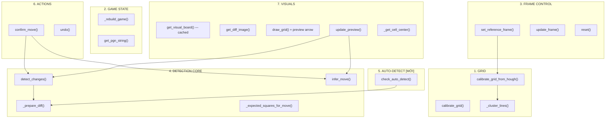

# ♟️ Logic Chi Tiết — `move_detect.py`

> Module phát hiện nước đi cờ vua. Quản lý toàn bộ luồng: nhận ảnh bàn cờ warped → calibrate lưới → so sánh pixel → suy luận nước đi → cập nhật bàn cờ + PGN. Bao gồm auto-detect, preview arrow, flip board.

---

## Tổng Quan

`move_detect.py` chứa **một class**: `MoveDetector`, chia thành 7 nhóm chức năng:



---

## Import

```python
import cv2
import numpy as np
import chess
import chess.pgn
from config import CFG             # [MỚI] Thông số tập trung
from visualizer import ChessVisualizer  # [MỚI] Thay thế board_to_image
```

**Không còn import**:
- ~~`from visualizer import board_to_image`~~ → dùng `ChessVisualizer` class

---

## `__init__(self, cells=8)`

```python
# === BÀN CỜ ===
self.board = chess.Board()
self.prev_img = None     # Ảnh warped TRƯỚC khi đi quân
self.curr_img = None     # Ảnh warped HIỆN TẠI
self.ref_img = None      # Ảnh tham chiếu gốc (set khi nhấn 'i')

# === PGN ===
self.game = chess.pgn.Game()
self.node = self.game    # Con trỏ node cuối cùng

# === GRID ===
self.cells = cells       # 8
self.grid_h = self.grid_w = 500
self.h_grid = np.linspace(0, 500, 9)
self.v_grid = np.linspace(0, 500, 9)

self.last_diff_image = None
self.last_status = "Idle"

# === [MỚI] Visualizer ===
self._visualizer = ChessVisualizer()  # [S2] PNG-based thay SVG

# === [MỚI] Cache Visual Board ===
self._cached_visual = None   # [P1] Cached rendered board
self._cached_fen = None      # [P1] FEN tương ứng

# === [MỚI] Grid Protection ===
self._hough_calibrated = False  # [L5] Chống ghi đè grid Hough

# === [MỚI] Auto-detect State ===
self._stable_count = 0       # [F1] Đếm frame ổn định
self._last_change_level = 0  # [F1] Mức thay đổi frame trước

# === [MỚI] Preview ===
self._preview_move = None    # [F2] Nước đi dự đoán (vẽ mũi tên)

# === [MỚI] Flip Board ===
self.flip_board = False      # [F3] True = đen ở dưới
```

---

## Nhóm 1: GRID

### `calibrate_grid(self, warped_board)`

Chia đều 8×8 theo kích thước ảnh (fallback đơn giản).

### `_cluster_lines(self, data, max_val)`

Gom nhóm giá trị ρ gần nhau (khoảng cách > `CFG.hough_cluster_gap` px → nhóm mới).

### `calibrate_grid_from_hough(self, warped_board)`

Calibrate grid bằng Hough Lines — tìm đường kẻ thực tế.

```python
lines = cv2.HoughLines(edges, 1, np.pi/180, CFG.hough_threshold)
# Dùng CFG.hough_threshold thay hardcoded 110

# [L5] Đánh dấu đã calibrate bằng Hough
self._hough_calibrated = True
```

---

## Nhóm 3: FRAME CONTROL

### `update_frame(self, img)` — Thay đổi [L5]

```python
def update_frame(self, img):
    if self.prev_img is None:
        self.calibrate_grid(img)
        self.prev_img = img.copy()

    # [L5] Không ghi đè grid Hough khi kích thước thay đổi
    if img.shape[:2] != (self.grid_h, self.grid_w) and not self._hough_calibrated:
        self.calibrate_grid(img)
    # TRƯỚC: if shape != grid → calibrate (ghi đè Hough grid)
    # SAU:   if shape != grid AND chưa Hough → calibrate

    self.curr_img = img.copy()
```

### `set_reference_frame(self, img)`

```python
self.calibrate_grid_from_hough(img)  # → _hough_calibrated = True
self.ref_img = img.copy()
self.prev_img = img.copy()
self.curr_img = img.copy()
self._stable_count = 0  # [F1] Reset auto-detect counter
```

### `reset(self)`

Reset toàn bộ: board, images, flags, cache.

---

## Nhóm 4: DETECTION CORE

### `_prepare_diff(self, prev_img, curr_img)`

```python
prev_blur = cv2.GaussianBlur(prev_gray, CFG.blur_kernel, 0)  # Dùng config
curr_blur = cv2.GaussianBlur(curr_gray, CFG.blur_kernel, 0)
diff = cv2.absdiff(prev_blur, curr_blur)
_, thresh = cv2.threshold(diff, CFG.diff_threshold, 255, cv2.THRESH_BINARY)
# Dùng CFG.diff_threshold thay hardcoded 40
```

### `detect_changes(self, prev_img, curr_img)` — Thay đổi [L3], [F3]

```python
for r in range(rows):
    for c in range(cols):
        roi = thresh[y0:y1, x0:x1]
        non_zero = cv2.countNonZero(roi)

        # [L3] Ngưỡng pixel ĐỘNG — tỉ lệ % diện tích ô
        cell_area = max(1, (y1 - y0) * (x1 - x0))
        if non_zero > cell_area * CFG.change_ratio:
            # TRƯỚC: if non_zero > 100 (hardcoded)
            # SAU:   if non_zero > cell_area * 0.05 (5% diện tích)

            # [F3] Flip board mapping
            if self.flip_board:
                sq = chess.square(7 - c, r)      # Đảo file + rank
            else:
                sq = chess.square(c, 7 - r)      # Mapping bình thường
            changes.append((sq, non_zero))
```

### `infer_move(self, changed_squares, square_scores)` — Thay đổi [L4]

```python
top_changes = set(changed_squares[:CFG.top_changes_count])  # Dùng config (6)

# ... matching logic giữ nguyên ...

# [L4] Ưu tiên Queen Promotion
best_score = scored_moves[0][1]
best_moves = [mv for mv, sc in scored_moves if sc == best_score]

if len(best_moves) > 1:
    for mv in best_moves:
        if mv.promotion == chess.QUEEN:
            return mv, "Success (queen promotion)"
# Khi tốt đến hàng cuối, python-chess sinh 4 nước legal (Q/R/B/N)
# Code ưu tiên chọn Queen (phổ biến nhất)
```

---

## Nhóm 5: AUTO-DETECT [F1 MỚI]

### `check_auto_detect(self)`

**Mục đích**: Kiểm tra có nên tự động confirm move không.

**Logic**: So sánh `curr_img` vs `prev_img` liên tục:
1. Nếu có thay đổi lớn → reset counter (đang di chuyển quân / tay trên bàn)
2. Khi thay đổi giảm về dưới ngưỡng → tay đã rút ra → tăng stable counter
3. Nếu stable counter ≥ `auto_stable_frames` → return True → auto confirm

```python
if not CFG.auto_detect_enabled:
    return False

_, thresh = self._prepare_diff(self.prev_img, self.curr_img)
total_change = cv2.countNonZero(thresh) / max(1, thresh.size)

if total_change > CFG.auto_change_threshold:
    self._stable_count = 0   # Đang thay đổi → reset
else:
    if self._last_change_level > CFG.auto_change_threshold:
        self._stable_count += 1  # Vừa ổn định
    else:
        self._stable_count = 0

if self._stable_count >= CFG.auto_stable_frames:
    self._stable_count = 0
    return True  # → main.py gọi confirm_move()
```

**Tinh chỉnh**:
- `auto_stable_frames = 15`: Tăng → chờ lâu hơn, ít false positive
- `auto_change_threshold = 0.02`: Tăng nếu camera rung nhiều

---

## Nhóm 6: ACTIONS

### `confirm_move(self)` — Thay đổi [Bug9]

```python
def confirm_move(self):
    # [Bug9] Kiểm tra game over TRƯỚC khi detect
    if self.board.is_game_over():
        self.last_status = f"Game Over: {self.board.result()}"
        return None

    # ... detect + infer giữ nguyên ...

    # [Bug9] Kiểm tra game over SAU khi push
    if self.board.is_game_over():
        reason = ""
        if self.board.is_checkmate():     reason = "Checkmate"
        elif self.board.is_stalemate():   reason = "Stalemate"
        elif self.board.is_insufficient_material(): reason = "Insufficient material"
        elif self.board.is_fifty_moves(): reason = "Fifty-move rule"
        elif self.board.is_repetition():  reason = "Threefold repetition"
        self.last_status = f"Game Over: {reason} ({result})"

    self._cached_fen = None  # Invalidate visual cache
    self._preview_move = None
    return move
```

### `undo(self)`

```python
if len(self.board.move_stack) > 0:
    self.board.pop()
    self._rebuild_game()
    if self.curr_img is not None:
        self.prev_img = self.curr_img.copy()
    self._cached_fen = None    # [P1] Invalidate cache
    self._preview_move = None  # [F2] Clear preview
    self.last_status = "Undo (press 'i' to re-sync)"
```

---

## Nhóm 7: VISUALS

### `get_visual_board(self)` — Thay đổi [P1], [S2]

```python
def get_visual_board(self):
    current_fen = self.board.fen()
    if current_fen != self._cached_fen:
        last_move = self.board.peek() if self.board.move_stack else None
        self._cached_visual = self._visualizer.draw_board(
            self.board, last_move=last_move, flip=self.flip_board
        )
        self._cached_fen = current_fen
    return self._cached_visual
# TRƯỚC: return board_to_image(self.board, size=500)  ← SVG mỗi frame
# SAU:   Cache + ChessVisualizer → chỉ render khi FEN thay đổi
```

### `update_preview(self)` [F2 MỚI]

Dựa trên diff hiện tại → suy luận nước đi → lưu vào `_preview_move` để `draw_grid()` vẽ mũi tên.

### `_get_cell_center(self, sq)` [F2 MỚI]

Tính tọa độ pixel trung tâm ô `sq` trên warped board (dùng `h_grid`, `v_grid`). Hỗ trợ flip.

### `draw_grid(self, img)` — Thay đổi [F2]

```python
# ... vẽ grid lines giữ nguyên ...

# [F2] Vẽ mũi tên preview nếu có
if self._preview_move is not None:
    pt_from = self._get_cell_center(self._preview_move.from_square)
    pt_to = self._get_cell_center(self._preview_move.to_square)
    if pt_from and pt_to:
        cv2.arrowedLine(img_copy, pt_from, pt_to, (0, 200, 255), 3, tipLength=0.2)
        # Mũi tên cam: từ ô đi → ô đến
        move_text = chess.square_name(from_sq) + "→" + chess.square_name(to_sq)
        cv2.putText(img_copy, move_text, ...)
```

---

## Tóm Tắt Flow Từ `main.py`

```
╔══════════════════════════════════════════════════════════════╗
║                    VÒNG LẶP CHÍNH (main.py)                ║
╠══════════════════════════════════════════════════════════════╣
║                                                              ║
║  Mỗi frame:                                                 ║
║    detector.update_frame(warped)    ── cập nhật curr_img     ║
║    detector.update_preview()        ── [F2] suy luận preview ║
║    detector.check_auto_detect()     ── [F1] auto confirm?    ║
║    detector.draw_grid(warped)       ── grid + mũi tên preview║
║    detector.get_visual_board()      ── [P1] cached render    ║
║    detector.get_diff_image()        ── heatmap               ║
║                                                              ║
║  Nhấn 'i':  set_reference_frame() → Hough calibrate         ║
║  Nhấn Space: confirm_move() → detect + infer + push          ║
║  Nhấn 'r':  undo() + invalidate cache                       ║
║  Nhấn 'f':  [F3] flip_board toggle                           ║
║  Nhấn 'a':  [F1] auto_detect toggle                          ║
║                                                              ║
╚══════════════════════════════════════════════════════════════╝
```
