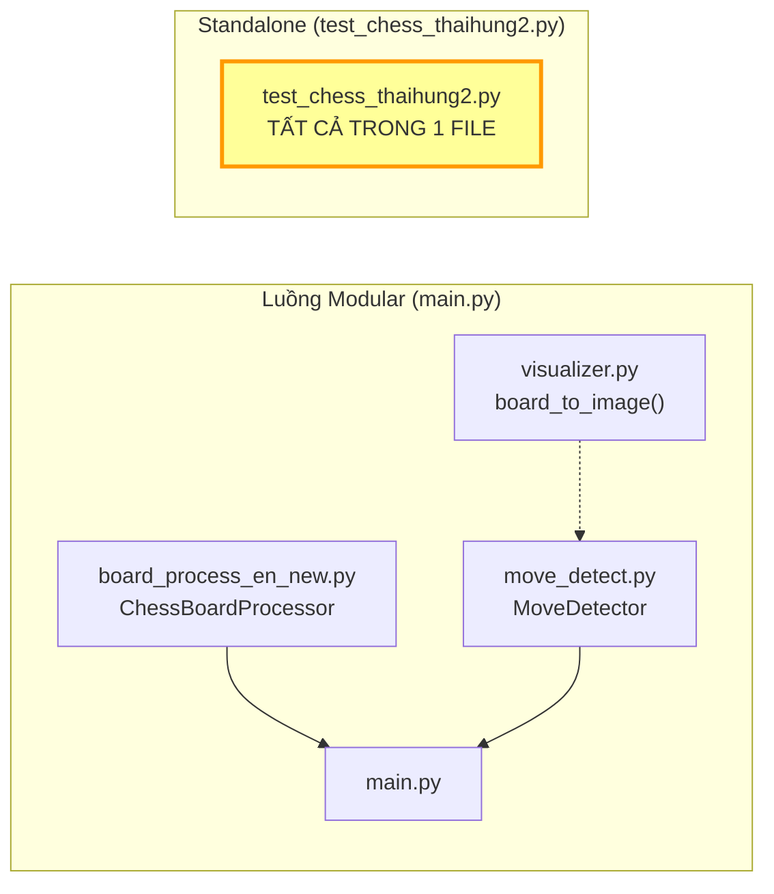

# 🧪 Logic Chi Tiết — `test_chess_thaihung2.py` (All-in-One Standalone)

> File self-contained, chứa **toàn bộ logic** từ detect board → infer move → PGN. Tự triển khai lại mọi thứ mà luồng modular (`main.py`) phải import từ 3 file khác. File này **không import bất kỳ module nào trong project**.

---

## So Sánh Với Luồng Modular



### Bảng Mapping: Code Nào Trong test_chess Tương Ứng Module Nào

| Chức năng | Luồng Modular dùng | test_chess_thaihung2 tự viết | Giống/Khác |
|---|---|---|---|
| **Detect board** | `ChessBoardProcessor.get_board_contour_auto()` | Inline tại dòng 263-294 | **Giống** logic (CLAHE + OTSU + Contour) |
| **Order points** | `ChessBoardProcessor.order_points()` | `order_points()` hàm riêng (dòng 89) | **Giống** hoàn toàn |
| **Perspective warp** | `ChessBoardProcessor.process_frame()` (2 lần warp) | Inline 1 lần warp + InnerPad trackbar | **Khác** — test_chess dùng 1 warp + crop padding |
| **Stabilize matrix** | ❌ Không có | ✅ `alpha = 0.85` blend M cũ/mới | **Khác** — test_chess thêm tính năng |
| **Grid calibrate** | `MoveDetector.calibrate_grid_from_hough()` | Inline `cluster_lines()` tại dòng 355-371 | **Giống** logic (Hough → cluster > 40px) |
| **Detect changes** | `MoveDetector.detect_changes()` | `detect_changes()` hàm riêng (dòng 103) | **Giống** logic (absdiff → thresh 40 → count > 100) |
| **Infer move** | `MoveDetector.infer_move()` | `infer_move()` hàm riêng (dòng 149) | **Giống** logic (top 4 → match legal_moves) |
| **Visual board** | `visualizer.board_to_image()` (SVG) | `ChessVisualizer.draw_board()` (PNG assets) | **Khác** — SVG vs Asset-based |
| **PGN management** | `MoveDetector._rebuild_game()`, `get_pgn_string()` | Inline GameNode (dòng 213-217, 403, 409-411) | **Khác** — modular có rebuild/undo |
| **Undo** | `MoveDetector.undo()` + `_rebuild_game()` | ❌ Không có | **Khác** — test_chess thiếu undo |
| **Manual mode** | ❌ Không có | ✅ Click 4 góc + phím 'm' | **Khác** — test_chess thêm tính năng |
| **Inner padding** | `inner_pts.npy` (click 4 góc) | Trackbar InnerPad (crop %) | **Khác** — cơ chế loại viền khác |
| **PGN save** | `save_pgn()` (tên file timestamp) | Phím 's' → `game_recorded.pgn` | Giống chức năng, khác implement |

---

## Import

```python
import cv2           # OpenCV
import numpy as np   # NumPy
import chess          # python-chess — Board, Move, legal_moves
import chess.pgn      # PGN game tree
import os            # os.path.exists, os.path.join (cho asset loading)

# ⚠️ KHÔNG import board_process_en_new, move_detect, visualizer
# → File này hoàn toàn standalone
```

---

## Phần 1: Helpers (Tương ứng `visualizer.py`)

### Class `ChessVisualizer` (dòng 19-83)

**So với `visualizer.py`**: Đây là phiên bản **hoàn chỉnh hơn** với thêm:
- ✅ Kiểm tra `os.path.exists(piece_dir)` trước khi load
- ✅ Flag `self.has_assets` — fallback vẽ text nếu thiếu PNG
- ✅ Highlight nước đi gần nhất bằng **màu xanh** (không phải vàng)
- ✅ Nhận `last_move` là `chess.Move` object (không phải UCI string)

```python
def __init__(self, piece_dir, square_size=60):
    self.square = square_size   # 60px (nhỏ hơn visualizer.py dùng 80px)
    self.has_assets = True      # Flag kiểm tra asset

    # Kiểm tra thư mục tồn tại (visualizer.py KHÔNG làm điều này)
    if not os.path.exists(piece_dir):
        self.has_assets = False
        return

    # Load 12 PNG + resize sẵn (visualizer.py resize trong overlay)
    for k, v in PIECE_MAP.items():
        img = cv2.imread(path, cv2.IMREAD_UNCHANGED)
        if img is None:
            self.has_assets = False  # Nếu 1 file thiếu → tắt asset mode
        else:
            self.pieces[k] = cv2.resize(img, (square_size, square_size))
```

**`draw_board()` — khác `show()` trong visualizer.py**:
```python
def draw_board(self, board, last_move=None):
    # ... vẽ 64 ô ...
    
    # ✅ KHÁC: Highlight bằng chess.Move object (không phải UCI string)
    if last_move:
        sq_idx = chess.square(c, 7 - r)
        if sq_idx == last_move.from_square or sq_idx == last_move.to_square:
            color = (100, 200, 100)  # Xanh nhạt (visualizer.py dùng vàng)
    
    # ✅ KHÁC: Fallback text nếu thiếu assets
    if self.has_assets and symbol in self.pieces:
        self.overlay(img, self.pieces[symbol], ...)
    else:
        cv2.putText(img, symbol, ...)  # Vẽ ký tự thay vì hình

    return img  # ✅ KHÁC: return img (visualizer.py gọi imshow trực tiếp)
```

---

### Hàm `order_points(pts)` (dòng 89-97)

**Tương ứng**: `ChessBoardProcessor.order_points()` trong `board_process_en_new.py`

**Giống/Khác**: **Giống hoàn toàn** — cùng thuật toán sum/diff.

```python
# Là hàm module-level (không phải method của class)
# → Khác: board_process_en_new viết thành self.order_points() (method)
def order_points(pts):
    rect = np.zeros((4, 2), dtype="float32")
    s = pts.sum(axis=1)
    rect[0] = pts[np.argmin(s)]   # TL
    rect[2] = pts[np.argmax(s)]   # BR
    diff = np.diff(pts, axis=1)
    rect[1] = pts[np.argmin(diff)] # TR
    rect[3] = pts[np.argmax(diff)] # BL
    return rect
```

---

## Phần 2: Detection Functions (Tương ứng `move_detect.py`)

### `detect_changes(prev_img, curr_img, h_grid, v_grid)` (dòng 103-146)

**Tương ứng**: `MoveDetector.detect_changes()` trong `move_detect.py`

**Giống/Khác**: Logic **gần giống**, nhưng:

| Điểm | `move_detect.py` | `test_chess_thaihung2.py` |
|---|---|---|
| Grid là... | thuộc tính class (`self.h_grid`) | **tham số hàm** (`h_grid, v_grid`) |
| Trả về | `(list, dict)` — squares + score_map | `list` — chỉ squares |
| Boundary check | `min(y1, thresh.shape[0])` | ❌ Không check |

```python
def detect_changes(prev_img, curr_img, h_grid, v_grid):
    # Giống move_detect.py:
    prev_gray = cv2.cvtColor(prev_img, cv2.COLOR_BGR2GRAY)
    curr_gray = cv2.cvtColor(curr_img, cv2.COLOR_BGR2GRAY)
    prev_blur = cv2.GaussianBlur(prev_gray, (5, 5), 0)
    curr_blur = cv2.GaussianBlur(curr_gray, (5, 5), 0)
    diff = cv2.absdiff(prev_blur, curr_blur)
    _, thresh = cv2.threshold(diff, 40, 255, cv2.THRESH_BINARY)

    # Grid tham số (không phải self.h_grid)
    for r in range(min(8, len(h_grid) - 1)):
        for c in range(min(8, len(v_grid) - 1)):
            roi = thresh[y_start:y_end, x_start:x_end]
            non_zero = cv2.countNonZero(roi)
            if non_zero > 100:
                sq_idx = chess.square(c, 7 - r)
                changes.append((sq_idx, non_zero))

    changes.sort(key=lambda x: x[1], reverse=True)
    return [c[0] for c in changes]  # Chỉ trả squares, KHÔNG trả score_map
```

---

### `infer_move(board, changed_squares)` (dòng 149-175)

**Tương ứng**: `MoveDetector.infer_move()` trong `move_detect.py`

**Giống/Khác**: Logic **giống hoàn toàn** — top 4 ô → match legal_moves.

```python
# Khác: nhận board làm tham số (không phải self.board)
def infer_move(board, changed_squares):
    top_changes = changed_squares[:4]
    for move in board.legal_moves:
        if move.from_square in top_changes and move.to_square in top_changes:
            possible_moves.append(move)
    # Logic chọn move: giống move_detect.py
```

> **Khác `move_detect.py`**: Không có `_expected_squares_for_move()` (hàm xử lý castling/en passant). Phiên bản move_detect.py đã viết nhưng cũng chưa tích hợp.

---

### `draw_grid(img, h_grid, v_grid, grid_size, cells)` (dòng 177-190)

**Tương ứng**: `MoveDetector.draw_grid()` trong `move_detect.py`

**Giống/Khác**:

| Điểm | `move_detect.py` | `test_chess_thaihung2.py` |
|---|---|---|
| Grid nguồn | `self.h_grid` (thuộc tính) | Tham số hàm |
| Status text | ✅ Vẽ `self.last_status` | ❌ Không vẽ |
| Fallback | Auto recalibrate nếu size đổi | Tự tạo linspace nếu grid None |

---

## Phần 3: Hàm `main()` (dòng 203-442)

### Giai đoạn 1: Khởi Tạo

```python
VIDEO_PATH = 0  # 0 = webcam (main.py dùng hardcoded path file)
cap = cv2.VideoCapture(VIDEO_PATH)

# ===== PGN — Tự quản lý (tương ứng MoveDetector.__init__) =====
game = chess.pgn.Game()
game.headers["Event"] = "CV Chess Game"
game.headers["White"] = "Player (Camera)"
game.headers["Black"] = "Player (Camera)"
node = game   # Con trỏ PGN node

# ===== TRACKBAR — KHÔNG CÓ trong main.py =====
cv2.namedWindow("Settings")
cv2.createTrackbar("Threshold", "Settings", 70, 300, nothing)   # Ngưỡng Hough
cv2.createTrackbar("AngleDelta", "Settings", 20, 100, nothing)  # Delta góc
cv2.createTrackbar("InnerPad", "Settings", 5, 100, nothing)     # % padding inner
# → 3 trackbar cho phép chỉnh tham số real-time (main.py không có)

# ===== MOUSE CALLBACK — KHÔNG CÓ trong main.py =====
cv2.setMouseCallback("Camera", mouse_callback)
# → Cho phép click 4 góc manual mode

# ===== CHESS — Tương ứng MoveDetector =====
board = chess.Board()
visualizer = ChessVisualizer(piece_dir=ASSET_PATH, square_size=60)
# → Dùng ChessVisualizer TỰ VIẾT (Asset-based, không dùng visualizer.py)

# ===== BIẾN TRẠNG THÁI =====
prev_warped_img = None         # ~ MoveDetector.prev_img
current_warped_img = None      # ~ MoveDetector.curr_img
h_grid = np.linspace(0, 500, 9)  # ~ MoveDetector.h_grid
v_grid = np.linspace(0, 500, 9)  # ~ MoveDetector.v_grid
prev_M = None                 # Ma trận warp trước đó (cho stabilize)
```

**So sánh khởi tạo**:
```
main.py:                          test_chess_thaihung2.py:
  processor = ChessBoardProcessor()   ← KHÔNG CÓ (tự viết inline)
  detector  = MoveDetector()          ← KHÔNG CÓ (tự quản lý bằng biến cục bộ)
                                       + board = chess.Board()
                                       + game / node = chess.pgn.Game()
                                       + visualizer = ChessVisualizer()
                                       + prev_M, prev_warped_img, h_grid, v_grid
```

---

### Giai đoạn 2: Board Detection (tương ứng `board_process_en_new.py`)

#### Chế Độ Tự Động (dòng 263-294)

```python
if not manual_mode:
    # === PIPELINE GIỐNG get_board_contour_auto() ===
    gray = cv2.cvtColor(img_res, cv2.COLOR_BGR2GRAY)
    clahe = cv2.createCLAHE(2.0, (8,8))         # Tương tự board_process_en_new
    contrast = clahe.apply(gray)
    _, thresh_img = cv2.threshold(contrast, 0, 255, cv2.THRESH_BINARY + cv2.THRESH_OTSU)
    thresh_img = cv2.bitwise_not(thresh_img)
    contours, _ = cv2.findContours(thresh_img, cv2.RETR_EXTERNAL, cv2.CHAIN_APPROX_SIMPLE)

    if contours:
        largest_contour = max(contours, key=cv2.contourArea)
        if cv2.contourArea(largest_contour) > 5000:
            approx = cv2.approxPolyDP(largest_contour, 0.02 * peri, True)
            if len(approx) == 4:
                # === KHÁC: Vẽ contour TRỰC TIẾP (không lưu last_board_contour) ===
                cv2.drawContours(frame_resized, [approx], -1, (0, 255, 0), 2)
                
                rect = order_points(approx.reshape(4, 2))
                M = cv2.getPerspectiveTransform(rect, dst_pts)

                # === KHÁC: STABILIZE MATRIX (main.py KHÔNG CÓ) ===
                if prev_M is None:
                    prev_M = M
                else:
                    alpha = 0.85
                    M = alpha * prev_M + (1 - alpha) * M
                    # → 85% ma trận cũ + 15% ma trận mới
                    # → Giảm rung lắc (jitter) khi contour dao động giữa các frame
                    prev_M = M

                # === KHÁC: Chỉ 1 lần warp (không có inner_pts/warp lần 2) ===
                current_warped_img = cv2.warpPerspective(img_res, M, (500, 500))
```

#### Chế Độ Thủ Công (dòng 295-308) — **KHÔNG CÓ trong main.py**

```python
else:  # manual_mode = True
    # Vẽ các điểm đã click lên frame
    for i, pt in enumerate(calibration_points):
        cv2.circle(frame_resized, pt, 5, (0, 0, 255), -1)
    
    if len(calibration_points) == 4:
        # Dùng 4 điểm user click → warp
        pts = np.array(calibration_points, dtype=np.float32)
        rect = order_points(pts)
        M = cv2.getPerspectiveTransform(rect, dst_pts)
        current_warped_img = cv2.warpPerspective(img_res, M, (500, 500))
```

#### Inner Padding (dòng 310-320) — Thay thế cho `inner_pts.npy`

```python
if board_found:
    # === KHÁC: Dùng trackbar InnerPad thay vì inner_pts.npy ===
    pad_percent = cv2.getTrackbarPos("InnerPad", "Settings") / 100.0
    # Ví dụ: trackbar = 5 → pad_percent = 0.05 → crop 5% mỗi bên
    
    pad = int(WARPED_SIZE * pad_percent / 2)
    # Ví dụ: 500 * 0.05 / 2 = 12.5 → pad = 12 pixel mỗi bên
    
    inner = current_warped_img[pad : WARPED_SIZE - pad, pad : WARPED_SIZE - pad]
    # Crop viền → ảnh nhỏ hơn (500-24 = 476×476)
    
    inner = cv2.resize(inner, (WARPED_SIZE, WARPED_SIZE))
    # Resize lại về 500×500
    
    current_warped_img = inner
```

**So sánh loại viền**:
```
board_process_en_new.py:            test_chess_thaihung2.py:
  Warp lần 1 → ảnh có viền            Warp 1 lần → ảnh có viền
  Click 4 góc inner → inner_pts.npy    Trackbar InnerPad → crop %
  Warp lần 2 → chỉ 64 ô               Crop + resize → xấp xỉ 64 ô

  ✅ Chính xác (4 góc cụ thể)          ✅ Tiện (chỉnh real-time)
  ❌ Cần click 1 lần                   ❌ Crop đều 4 bên (có thể lệch)
```

---

### Giai đoạn 3: Xử Lý Phím Bấm

#### Phím `'m'` — Toggle Manual Mode (dòng 327-331) — **không có trong main.py**

```python
manual_mode = not manual_mode
calibration_points = []   # Reset điểm click
prev_M = None             # Reset stabilize
```

#### Phím `'i'` — Init + Calibrate Grid (dòng 338-377)

**Tương ứng**: `MoveDetector.set_reference_frame()` nhưng logic viết inline.

```python
if board_found:
    prev_warped_img = current_warped_img.copy()
    # ~ detector.prev_img = img.copy()

    # === CALIBRATE GRID (tương ứng calibrate_grid_from_hough) ===
    warp_gray = cv2.cvtColor(prev_warped_img, cv2.COLOR_BGR2GRAY)
    edges_w = cv2.Canny(warp_gray, 50, 150)       # Giống move_detect.py
    lines_w = cv2.HoughLines(edges_w, 1, np.pi/180, 110)  # Giống move_detect.py

    # Phân loại H/V
    h_lines, v_lines = [], []
    if lines_w is not None:
        for l in lines_w:
            rho, theta = l[0]
            if np.pi/4 < theta < 3*np.pi/4:
                h_lines.append(abs(rho))
            else:
                v_lines.append(abs(rho))

    # === CLUSTER (tương ứng _cluster_lines) ===
    def cluster_lines(data, max_val):
        # Logic GIỐNG move_detect._cluster_lines():
        # Sort → gom nhóm cách > 40px → trung bình → fallback linspace
        if not data: return np.linspace(0, max_val, 9).tolist()
        data.sort()
        # ... (giống logic đã giải thích trong logic_move_detect.md)
        if len(res) != 9: return np.linspace(0, max_val, 9).tolist()
        return res

    h_grid = cluster_lines(h_lines, WARPED_SIZE)
    v_grid = cluster_lines(v_lines, WARPED_SIZE)
```

#### Phím `Space` — Xác Nhận Nước Đi (dòng 382-422)

**Tương ứng**: `MoveDetector.confirm_move()` nhưng logic viết inline.

```python
# 1. Gọi hàm detect_changes() CÙNG FILE
changes = detect_changes(prev_warped_img, current_warped_img, h_grid, v_grid)
# → Tương ứng: detector.detect_changes(prev_img, curr_img)
# → Khác: truyền h_grid, v_grid explicit (không phải self.h_grid)

# 2. Gọi hàm infer_move() CÙNG FILE
move, msg = infer_move(board, changes)
# → Tương ứng: detector.infer_move(changes, scores)
# → Khác: truyền board explicit (không phải self.board)

if move:
    # 3. Lấy info quân cờ (main.py KHÔNG làm điều này)
    piece = board.piece_at(move.from_square)
    piece_name = piece.symbol() if piece else "Unknown"
    color_name = "White" if piece.color == chess.WHITE else "Black"

    # 4. Cập nhật game state
    board.push(move)               # ~ detector.board.push(move)
    node = node.add_variation(move)  # ~ detector.node.add_variation(move)

    # 5. In PGN (main.py dùng detector.get_pgn_string())
    exporter = chess.pgn.StringExporter(headers=False, variations=True, comments=True)
    pgn_string = game.accept(exporter)
    print(f"[PGN Current]: {pgn_string}")

    # 6. Check game over (main.py KHÔNG kiểm tra)
    if board.is_game_over():
        print("-> GAME OVER:", board.result())

    # 7. Cập nhật ảnh tham chiếu
    prev_warped_img = current_warped_img.copy()
    # ~ detector.prev_img = detector.curr_img.copy()
```

#### Phím `'s'` — Lưu PGN (dòng 424-432) — **thêm so với main.py**

```python
with open("game_recorded.pgn", "w", encoding="utf-8") as f:
    exporter = chess.pgn.FileExporter(f)
    game.accept(exporter)
# main.py dùng save_pgn() khi thoát ('q')
# test_chess dùng phím riêng ('s') để lưu bất kỳ lúc nào
```

---

### Giai đoạn 4: Hiển Thị (dòng 434-439)

```python
# Lấy nước đi gần nhất (nếu có)
last_move = board.peek() if len(board.move_stack) > 0 else None
# board.peek() → chess.Move object (nước đi cuối, không pop)

# Render bàn cờ ảo bằng ChessVisualizer (Asset-based, KHÔNG phải SVG)
virtual_img = visualizer.draw_board(board, last_move)
# → Tương ứng: detector.get_visual_board() trong main.py
# → Nhưng dùng PNG assets thay vì cairosvg

# Hiển thị 3 cửa sổ (main.py có 4)
cv2.imshow("Camera", frame_resized)
cv2.imshow("Virtual Board", virtual_img)
# Warped View đã imshow ở dòng 318 (trong phần board detection)
# → Không có cửa sổ Diff Detection riêng (main.py có)
```

**So sánh cửa sổ**:
```
main.py (4 cửa sổ):                test_chess_thaihung2.py (3 cửa sổ):
  1. Camera + Bbox                   1. Camera + Bbox
  2. Warped + Grid                   2. Warped View + Grid
  3. Chess Visual (SVG)              3. Virtual Board (Asset PNG)
  4. Diff Detection                  ❌ Không có
```

---

## Tóm Tắt: Mapping Chức Năng ↔ Module

```
╔═══════════════════════════════════════════════════════════════════════╗
║          test_chess_thaihung2.py — Mapping sang các module           ║
╠══════════════════════╦═════════════════════╦══════════════════════════╣
║ Tính năng            ║ Tương ứng module    ║ Dòng code trong test     ║
╠══════════════════════╬═════════════════════╬══════════════════════════╣
║ CLAHE + OTSU detect  ║ board_process_en_new ║ 264-270                 ║
║ Contour → 4 đỉnh     ║  .get_board_contour  ║ 272-280                 ║
║ order_points()       ║  .order_points()     ║ 89-97                   ║
║ Perspective warp     ║  .process_frame()    ║ 283-293                 ║
║ Stabilize matrix     ║ ❌ KHÔNG CÓ         ║ 286-291                 ║
║ Inner padding        ║  .select_inner_pts   ║ 311-314 (trackbar crop) ║
║ Manual mode          ║ ❌ KHÔNG CÓ         ║ 295-308                 ║
╠══════════════════════╬═════════════════════╬══════════════════════════╣
║ HoughLines grid      ║ move_detect          ║ 343-345                 ║
║ cluster_lines()     ║  ._cluster_lines()   ║ 355-371                 ║
║ detect_changes()    ║  .detect_changes()   ║ 103-146                 ║
║ infer_move()        ║  .infer_move()       ║ 149-175                 ║
║ draw_grid()         ║  .draw_grid()        ║ 177-190                 ║
║ board.push()        ║  .confirm_move()     ║ 402                     ║
║ PGN node tracking   ║  ._rebuild_game()    ║ 213-217, 403            ║
╠══════════════════════╬═════════════════════╬══════════════════════════╣
║ ChessVisualizer     ║ visualizer.py         ║ 19-83 (Asset-based)     ║
║ Alpha blending      ║  .overlay()           ║ 38-47                   ║
║ draw_board()        ║  .show()              ║ 49-83                   ║
╠══════════════════════╬═════════════════════╬══════════════════════════╣
║ (không dùng)        ║ chessboard_processor  ║ ❌ Không liên quan      ║
╚══════════════════════╩═════════════════════╩══════════════════════════╝
```

---

## Điểm Mạnh/Yếu So Với Luồng Modular

| | test_chess_thaihung2.py | main.py + modules |
|---|---|---|
| **Ưu điểm** | | |
| Dễ chạy | ✅ 1 file, không cần import | ❌ Cần 3 file module |
| Manual mode | ✅ Click 4 góc | ❌ Chỉ auto |
| Stabilize | ✅ Alpha blending matrix | ❌ Rung lắc |
| Trackbar | ✅ Chỉnh tham số real-time | ❌ Hardcoded |
| PGN save riêng | ✅ Phím 's' | ❌ Chỉ khi thoát |
| Game over check | ✅ Kiểm tra | ❌ Không |
| **Nhược điểm** | | |
| Kiến trúc | ❌ Procedural, 446 dòng 1 file | ✅ OOP, tách module |
| Undo | ❌ Không có | ✅ `detector.undo()` |
| Game reset | ❌ Không có | ✅ `detector.reset()` |
| Castling/EP logic | ❌ Không | ✅ `_expected_squares_for_move()` (dù chưa dùng) |
| SVG render | ❌ Phụ thuộc PNG assets | ✅ Vector (crisp mọi size) |
| Diff heatmap | ❌ Không hiển thị | ✅ Cửa sổ riêng |
| Code reuse | ❌ Copy–paste logic | ✅ Import module |
