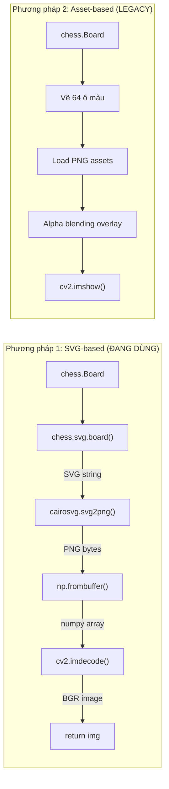

# 🖥️ Logic Chi Tiết — `visualizer.py`

> Module render bàn cờ ảo. Chứa 2 phương pháp: **SVG-based** (dùng trong luồng modular) và **Asset-based** (legacy, dùng PNG assets).

---

## Tổng Quan



---

## Import

```python
import chess          # python-chess — Board, SQUARES, square_rank, square_file
import chess.svg      # Module SVG render của python-chess
import cv2            # OpenCV — imdecode, resize, rectangle, imshow
import numpy as np    # NumPy — frombuffer, zeros
import cairosvg       # Thư viện chuyển SVG → PNG (cần cài riêng: pip install cairosvg)
```

---

## Hằng Số

### `PIECE_MAP`

```python
PIECE_MAP = {
    'P': 'wp', 'N': 'wn', 'B': 'wb',   # Quân trắng (chữ IN HOA)
    'R': 'wr', 'Q': 'wq', 'K': 'wk',
    'p': 'bp', 'n': 'bn', 'b': 'bb',   # Quân đen (chữ thường)
    'r': 'br', 'q': 'bq', 'k': 'bk',
}
# Key = ký hiệu python-chess (piece.symbol())
# Value = tên file asset (không có .png)
# Ví dụ: 'K' → 'wk' → file "wk.png" = White King
```

**Mapping ký hiệu**:
| Symbol | Tên file | Quân cờ |
|---|---|---|
| `P` / `p` | `wp.png` / `bp.png` | Tốt (Pawn) |
| `N` / `n` | `wn.png` / `bn.png` | Mã (Knight) |
| `B` / `b` | `wb.png` / `bb.png` | Tượng (Bishop) |
| `R` / `r` | `wr.png` / `br.png` | Xe (Rook) |
| `Q` / `q` | `wq.png` / `bq.png` | Hậu (Queen) |
| `K` / `k` | `wk.png` / `bk.png` | Vua (King) |

---

## Phương Pháp 1: `board_to_image()` — SVG-based (ĐANG DÙNG)

### `board_to_image(board, size=500)`

**Mục đích**: Chuyển trạng thái bàn cờ thành ảnh OpenCV. Được gọi bởi `MoveDetector.get_visual_board()`.

**Tham số**:
- `board`: `chess.Board` — trạng thái bàn cờ hiện tại
- `size`: `int = 500` — kích thước ảnh output (pixel)

**Trả về**: `numpy array (size, size, 3), dtype uint8` — ảnh BGR

```python
# Bước 1: Board → SVG string
svg_data = chess.svg.board(board=board, size=size)
# chess.svg.board() tạo chuỗi SVG hoàn chỉnh:
#   - Bàn cờ 8×8 với màu sáng/tối
#   - Quân cờ vector (built-in trong python-chess)
#   - Tọa độ (a-h, 1-8) ở viền
#   - Kích thước = size × size pixel
# Trả về: str (XML/SVG)

# Bước 2: SVG → PNG bytes
png_data = cairosvg.svg2png(bytestring=svg_data.encode("utf-8"))
# cairosvg dùng Cairo rendering engine để rasterize SVG
# Input:  bytes (SVG encoded UTF-8)
# Output: bytes (PNG binary data)

# Bước 3: PNG bytes → numpy array
np_arr = np.frombuffer(png_data, np.uint8)
# Chuyển bytes thô → mảng numpy 1D
# dtype=uint8 vì PNG là dữ liệu 8-bit

# Bước 4: Decode PNG → OpenCV image
img = cv2.imdecode(np_arr, cv2.IMREAD_COLOR)
# cv2.IMREAD_COLOR → đọc dưới dạng BGR 3 kênh
# Bỏ kênh alpha (nếu có) → chỉ giữ BGR
# Output shape: (size, size, 3)

return img
```

**Ưu điểm**:
- Render đẹp (vector → crisp ở mọi kích thước)
- Không cần file asset PNG riêng
- Tự động có tọa độ a-h, 1-8 ở viền

**Nhược điểm**:
- Cần cài thêm `cairosvg` (+ dependencies hệ thống: Cairo, GObject)
- Chậm hơn asset-based (phải render SVG mỗi frame)

---

## Phương Pháp 2: `ChessVisualizer` — Asset-based (LEGACY)

> **⚠️ Bug**: Class này dùng `os.path.join()` nhưng **không import `os`** → sẽ gây `NameError` khi khởi tạo. Class hiện không được dùng trong luồng modular.

---

### `__init__(self, piece_dir="assets/pieces", square_size=80)`

**Mục đích**: Load tất cả PNG assets quân cờ từ thư mục.

**Tham số**:
- `piece_dir`: đường dẫn thư mục chứa 12 file PNG
- `square_size`: kích thước mỗi ô (pixel)

```python
self.square = square_size  # Mỗi ô = 80×80 pixel → bàn cờ = 640×640
self.pieces = {}           # Dict lưu ảnh quân cờ đã load

for k, v in PIECE_MAP.items():
    path = os.path.join(piece_dir, f"{v}.png")
    # Ví dụ: os.path.join("assets/pieces", "wk.png") → "assets/pieces/wk.png"
    # ⚠️ BUG: os chưa được import → NameError
    
    self.pieces[k] = cv2.imread(path, cv2.IMREAD_UNCHANGED)
    # cv2.IMREAD_UNCHANGED → đọc kèm kênh alpha (BGRA, 4 kênh)
    # → self.pieces['K'] = ảnh (H, W, 4) của vua trắng
```

**Yêu cầu file assets** (trong thư mục `assets/pieces/`):
```
wp.png  wn.png  wb.png  wr.png  wq.png  wk.png   ← 6 quân trắng
bp.png  bn.png  bb.png  br.png  bq.png  bk.png   ← 6 quân đen
```

---

### `overlay(self, bg, png, x, y)`

**Mục đích**: Đặt ảnh quân cờ (có nền trong suốt) lên bàn cờ bằng **alpha blending**.

**Tham số**:
- `bg`: ảnh nền (bàn cờ) `(H, W, 3)` — BGR, sẽ bị sửa trực tiếp
- `png`: ảnh quân cờ `(H', W', 4)` — BGRA (có kênh alpha)
- `x, y`: tọa độ góc trái trên của ô cần đặt quân

```python
s = self.square                   # = 80
png = cv2.resize(png, (s, s))     # Resize quân cờ về đúng kích thước ô
alpha = png[:, :, 3] / 255.0      # Kênh alpha: 0.0 (trong suốt) → 1.0 (đục)

# Alpha blending cho từng kênh màu (B, G, R)
for c in range(3):
    bg[y:y+s, x:x+s, c] = (
        alpha * png[:, :, c] +           # Phần quân cờ (foreground)
        (1 - alpha) * bg[y:y+s, x:x+s, c]  # Phần nền (background)
    )
    # Công thức: output = α × foreground + (1-α) × background
    # - Nơi alpha=1 (quân cờ đặc): output = 100% quân cờ
    # - Nơi alpha=0 (nền trong suốt): output = 100% bàn cờ
    # - Nơi 0<alpha<1 (viền mềm): pha trộn mượt
```

**Minh họa**:
```
Bàn cờ (bg):        Quân cờ (png):       Kết quả:
┌────────┐          ┌────────┐           ┌────────┐
│████████│          │  ♚     │           │██♚█████│
│████████│    +     │ ████   │    =      │█████████│
│████████│          │  ██    │           │████████│
└────────┘          └────────┘           └────────┘
 (nền sáng)    (có alpha channel)     (blending mượt)
```

---

### `show(self, board, move=None)`

**Mục đích**: Vẽ và hiển thị bàn cờ hoàn chỉnh.

**Tham số**:
- `board`: `chess.Board` — trạng thái bàn cờ
- `move`: `str` hoặc `None` — UCI notation (ví dụ: `"e2e4"`) để highlight

**Trả về**: Không. Hiển thị trực tiếp qua `cv2.imshow()`.

```python
# Bước 1: Tạo ảnh nền đen
img = np.zeros((8*self.square, 8*self.square, 3), dtype=np.uint8)
# Ví dụ: 8*80 = 640 → ảnh 640×640×3

# Bước 2: Vẽ 64 ô bàn cờ
for r in range(8):        # Row 0-7
    for c in range(8):    # Col 0-7
        # Ô sáng/tối xen kẽ
        color = (240, 217, 181) if (r+c) % 2 == 0 else (181, 136, 99)
        # (240,217,181) = ô sáng (beige) ← BGR
        # (181,136,99)  = ô tối (nâu)    ← BGR
        
        cv2.rectangle(
            img,
            (c*self.square, r*self.square),           # Góc trái trên
            ((c+1)*self.square, (r+1)*self.square),   # Góc phải dưới
            color, -1                                  # -1 = tô đặc
        )

# Bước 3: Vẽ quân cờ
for sq in chess.SQUARES:  # 0-63 (a1=0, b1=1, ..., h8=63)
    piece = board.piece_at(sq)  # Trả về Piece object hoặc None
    if piece:
        # === MAPPING chess square → pixel coordinate ===
        r = 7 - chess.square_rank(sq)  # Rank 7 (hàng 8) → row 0 (trên cùng)
        c = chess.square_file(sq)       # File 0 (cột a) → col 0 (trái)
        
        self.overlay(
            img,
            self.pieces[piece.symbol()],  # 'K' → ảnh vua trắng
            c * self.square,               # x pixel
            r * self.square                # y pixel
        )

# Bước 4: Highlight nước đi (nếu có)
if move:
    # move = "e2e4" → from="e2", to="e4"
    for s in [move[:2], move[2:4]]:
        sq = chess.parse_square(s)        # "e2" → 12
        r = 7 - chess.square_rank(sq)
        c = chess.square_file(sq)
        cv2.rectangle(
            img,
            (c*self.square, r*self.square),
            ((c+1)*self.square, (r+1)*self.square),
            (0, 255, 255),   # Màu vàng (BGR)
            3                 # Thickness = 3 (không tô đặc, chỉ viền)
        )

# Bước 5: Hiển thị
cv2.imshow("Chess Board", img)
cv2.waitKey(1)  # Refresh cửa sổ, không chờ
```

---

## So Sánh 2 Phương Pháp

| Đặc điểm | `board_to_image()` (SVG) | `ChessVisualizer` (Asset) |
|---|---|---|
| **Được dùng bởi** | `move_detect.py` → `main.py` | `test_chess_thaihung2.py` |
| **Render quality** | Vector (crisp) | Bitmap (phụ thuộc chất lượng PNG) |
| **Dependencies** | `cairosvg` (nặng) | Chỉ cần 12 file PNG |
| **Tọa độ viền** | ✅ Có sẵn (a-h, 1-8) | ❌ Không có |
| **Highlight move** | ❌ Mặc định chess.svg | ✅ Khung vàng tùy chỉnh |
| **Hiệu suất** | Chậm hơn (SVG→PNG mỗi frame) | Nhanh hơn (chỉ composite) |
| **Bug** | Không | ⚠️ Thiếu `import os` |

---

## Mapping Tọa Độ: Chess ↔ Pixel

```
Chess:                          Pixel (OpenCV):
  rank 8 (row=0)                Y=0
  rank 7 (row=1)                Y=1*square
  rank 6 (row=2)                Y=2*square
  ...                           ...
  rank 1 (row=7)                Y=7*square

  file a (col=0)                X=0
  file b (col=1)                X=1*square
  ...
  file h (col=7)                X=7*square

Công thức:
  pixel_x = file_index * square_size
  pixel_y = (7 - rank_index) * square_size
  
  hoặc:
  pixel_row = 7 - chess.square_rank(sq)
  pixel_col = chess.square_file(sq)
```
