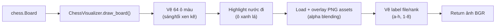

# 🖥️ Logic Chi Tiết — `visualizer.py`

> Module render bàn cờ ảo. Dùng **ChessVisualizer** class với asset PNG — nhanh, không cần `cairosvg`.

---

## Tổng Quan



> **Thay đổi lớn**: Loại bỏ `board_to_image()` (SVG → cairosvg → PNG) → dùng `ChessVisualizer` (PNG assets → alpha blending). Nhanh hơn 10-50x, bỏ dependency `cairosvg`.

---

## Import

```python
import os           # OS — kiểm tra file, join path
import chess        # python-chess — Board, SQUARES, square_rank, square_file
import cv2          # OpenCV — imread, resize, rectangle, putText
import numpy as np  # NumPy — zeros, array operations
from config import CFG  # Thông số tập trung
```

**Không còn import**:
- ~~`chess.svg`~~ — không dùng SVG nữa
- ~~`cairosvg`~~ — bỏ dependency nặng

---

## Hằng Số

### `PIECE_MAP`

```python
PIECE_MAP = {
    'P': 'wp', 'N': 'wn', 'B': 'wb',   # Quân trắng (chữ IN HOA)
    'R': 'wr', 'Q': 'wq', 'K': 'wk',
    'p': 'bp', 'n': 'bn', 'b': 'bb',   # Quân đen (chữ thường)
    'r': 'br', 'q': 'bq', 'k': 'bk',
}
# Key = ký hiệu python-chess (piece.symbol())
# Value = tên file asset (không có extension)
```

| Symbol | Tên file | Quân cờ |
|---|---|---|
| `P` / `p` | `wp.png` / `bp.png` | Tốt (Pawn) |
| `N` / `n` | `wn.png` / `bn.png` | Mã (Knight) |
| `B` / `b` | `wb.png` / `bb.png` | Tượng (Bishop) |
| `R` / `r` | `wr.png` / `br.png` | Xe (Rook) |
| `Q` / `q` | `wq.png` / `bq.png` | Hậu (Queen) |
| `K` / `k` | `wk.png` / `bk.png` | Vua (King) |

---

## Class `ChessVisualizer`

### `__init__(self, piece_dir=None, square_size=None)`

**Mục đích**: Load tất cả PNG assets quân cờ.

```python
self.square = square_size or CFG.square_size  # 62 (từ config)
self.pieces = {}          # Dict lưu ảnh quân cờ đã load + resize
self.has_assets = True    # Flag: có đủ assets không

piece_dir = piece_dir or CFG.piece_dir  # "assets/pieces"

# Kiểm tra thư mục tồn tại
if not os.path.exists(piece_dir):
    self.has_assets = False
    return

for k, v in PIECE_MAP.items():
    path = os.path.join(piece_dir, f"{v}.png")
    # Thử cả uppercase (.PNG) nếu lowercase không tồn tại
    if not os.path.exists(path):
        path = os.path.join(piece_dir, f"{v}.PNG")

    img = cv2.imread(path, cv2.IMREAD_UNCHANGED)
    # IMREAD_UNCHANGED → đọc kênh alpha (BGRA, 4 kênh)
    if img is None:
        self.has_assets = False
    else:
        self.pieces[k] = cv2.resize(img, (self.square, self.square))
        # Pre-resize 1 lần → không resize mỗi lần overlay
```

---

### `overlay(self, bg, png, x, y)`

**Mục đích**: Đặt ảnh quân cờ (có alpha) lên bàn cờ bằng **alpha blending**.

```python
s = self.square
if png.shape[2] == 4:  # Có kênh alpha
    alpha = png[:, :, 3] / 255.0  # 0.0 (trong suốt) → 1.0 (đục)
    for c in range(3):  # B, G, R
        bg[y:y+s, x:x+s, c] = (
            alpha * png[:, :, c] +               # Foreground (quân cờ)
            (1 - alpha) * bg[y:y+s, x:x+s, c]   # Background (bàn cờ)
        )
else:  # Không có alpha → paste trực tiếp
    bg[y:y+s, x:x+s] = png
```

---

### `draw_board(self, board, last_move=None, flip=False)` — **HÀM CHÍNH**

**Mục đích**: Render bàn cờ hoàn chỉnh thành ảnh OpenCV.

**Tham số**:
- `board`: `chess.Board` — trạng thái bàn cờ hiện tại
- `last_move`: `chess.Move` hoặc `None` — highlight nước đi gần nhất (ô xanh lá)
- `flip`: `bool` — `True` = đen ở dưới (Black perspective) *[F3 MỚI]*

**Trả về**: `numpy array (8*square, 8*square, 3)` — ảnh BGR

```python
img = np.zeros((8 * self.square, 8 * self.square, 3), dtype=np.uint8)

# === 1. Vẽ 64 ô bàn cờ ===
for r in range(8):
    for c in range(8):
        color = (240, 217, 181) if (r+c) % 2 == 0 else (181, 136, 99)

        # Highlight nước đi vừa rồi
        if last_move:
            # [F3] Mapping khác nhau tùy flip
            sq_idx = chess.square(c, 7-r) if not flip else chess.square(7-c, r)
            if sq_idx == last_move.from_square or sq_idx == last_move.to_square:
                color = (100, 200, 100)  # Xanh nhạt

        cv2.rectangle(img, (c*self.square, r*self.square),
                      ((c+1)*self.square, (r+1)*self.square), color, -1)

# === 2. Vẽ quân cờ ===
for sq in chess.SQUARES:
    piece = board.piece_at(sq)
    if piece:
        # [F3] Flip mapping
        if flip:
            r = chess.square_rank(sq)
            c = 7 - chess.square_file(sq)
        else:
            r = 7 - chess.square_rank(sq)
            c = chess.square_file(sq)

        symbol = piece.symbol()
        if self.has_assets and symbol in self.pieces:
            self.overlay(img, self.pieces[symbol], c*self.square, r*self.square)
        else:
            # Fallback: vẽ text nếu thiếu asset
            text_color = (0,0,0) if piece.color == chess.BLACK else (255,255,255)
            cv2.putText(img, symbol, ...)

# === 3. Vẽ label file/rank ===
for i in range(8):
    file_label = chr(ord('a') + i) if not flip else chr(ord('h') - i)
    rank_label = str(8 - i) if not flip else str(i + 1)
    # Vẽ ở cạnh dưới và cạnh trái

return img
```

---

## Mapping Tọa Độ: Chess ↔ Pixel

### Chế độ bình thường (`flip=False`):
```
pixel_row = 7 - chess.square_rank(sq)    # rank 8 → row 0 (trên cùng)
pixel_col = chess.square_file(sq)         # file a → col 0 (trái)
```

### Chế độ flip (`flip=True`):
```
pixel_row = chess.square_rank(sq)         # rank 1 → row 0 (trên cùng)
pixel_col = 7 - chess.square_file(sq)     # file h → col 0 (trái)
```

---

## So Sánh Với Phiên Bản Cũ

| Đặc điểm | Phiên bản cũ (`board_to_image`) | Phiên bản mới (`ChessVisualizer`) |
|---|---|---|
| **Render** | SVG → cairosvg → PNG → decode | PNG assets → alpha blending |
| **Tốc độ** | ~20-50ms/call | ~1-2ms/call |
| **Dependencies** | `cairosvg` (+ Cairo, GTK) | Chỉ cần 12 file PNG |
| **Highlight move** | ❌ Không | ✅ Ô xanh lá |
| **Flip board** | ❌ Không | ✅ Phím 'f' |
| **Labels a-h, 1-8** | ✅ Có sẵn từ chess.svg | ✅ Vẽ thủ công |
| **Fallback khi thiếu asset** | N/A | ✅ Hiển thị text symbol |
