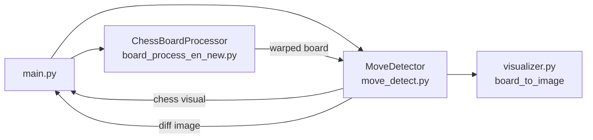

# 📊 Đánh Giá & Tối Ưu Project — Chess Board Detection

> Đánh giá toàn bộ project khi chạy từ `main.py`, phân tích logic, hiệu năng, cấu trúc, và đề xuất cải thiện.

---

## 1. Tổng Quan Kiến Trúc Hiện Tại



| File | Dòng | Vai trò |
|---|---|---|
| `main.py` | 178 | Vòng lặp chính, đọc camera, điều phối hiển thị |
| `board_process_en_new.py` | 132 | Phát hiện bàn cờ, perspective transform 2 lần |
| `move_detect.py` | 307 | Grid, diff ảnh, suy luận nước đi, quản lý game state |
| `visualizer.py` | 97 | Render bàn cờ SVG → PNG → OpenCV |
| `test_chess_thaihung2.py` | 446 | File cũ monolithic (không dùng trong main) |

---

## 2. Các Vấn Đề Hiệu Năng (Performance)

### 🔴 P1 — `board_to_image()` gọi SVG→PNG mỗi frame

**File**: [visualizer.py:15-23](file:///c:/Users/Admin/BTL_XLA/testChess/visualizer.py#L15-L23)

**Vấn đề**: `board_to_image()` gọi `chess.svg.board()` + `cairosvg.svg2png()` **mỗi lần** `get_visual_board()` được gọi từ main loop — tức **mỗi frame**. Đây là bottleneck lớn nhất vì:
- `cairosvg` render SVG → PNG rất chậm (~20-50ms/call)
- Bàn cờ chỉ thay đổi khi có nước đi mới, nhưng render lại liên tục

**Đề xuất**:
```python
# Trong MoveDetector: cache ảnh bàn cờ, chỉ render lại khi state thay đổi
def __init__(self):
    ...
    self._cached_visual = None
    self._cached_fen = None

def get_visual_board(self):
    current_fen = self.board.fen()
    if current_fen != self._cached_fen:
        self._cached_visual = board_to_image(self.board, size=500)
        self._cached_fen = current_fen
    return self._cached_visual
```
> **Ước tính cải thiện**: FPS tăng **2-5x** do loại bỏ SVG render mỗi frame.

---

### 🔴 P2 — `process_frame()` tính perspective transform mỗi frame

**File**: [board_process_en_new.py:95-130](file:///c:/Users/Admin/BTL_XLA/testChess/board_process_en_new.py#L95-L130)

**Vấn đề**: Mỗi frame đều chạy full pipeline:
1. `cvtColor` → CLAHE → OTSU threshold → `findContours` → `approxPolyDP`
2. `getPerspectiveTransform` + `warpPerspective` (lần 1)
3. `getPerspectiveTransform` + `warpPerspective` (lần 2 với inner_pts)

Tức 2 lần warp + full contour detection mỗi frame.

**Đề xuất**:
```python
class ChessBoardProcessor:
    def __init__(self, ...):
        ...
        self._cached_M = None          # Ma trận tổng hợp
        self._frame_skip = 0
        self._skip_interval = 5        # Chỉ detect lại contour mỗi 5 frame
    
    def process_frame(self, frame):
        self._frame_skip += 1
        
        # Dùng cached transform nếu chưa đến frame detect
        if self._cached_M is not None and self._frame_skip % self._skip_interval != 0:
            return cv2.warpPerspective(frame, self._cached_M, (self.wrap_size, self.wrap_size))
        
        # Full detection
        board_contour = self.get_board_contour_auto(frame)
        if board_contour is not None:
            ...
            # Tính M tổng hợp (M1 @ M2) và cache
            M_combined = M2 @ M1  # Ghép 2 warp thành 1
            self._cached_M = M_combined
            return cv2.warpPerspective(frame, M_combined, (self.wrap_size, self.wrap_size))
```
> **Ước tính cải thiện**: Giảm ~60% CPU trên các frame không detect.

---

### 🟡 P3 — `img.copy()` dư thừa

**Các vị trí**:
- [main.py:82](file:///c:/Users/Admin/BTL_XLA/testChess/main.py#L82): `last_warped_board = warped_board.copy()` — mỗi frame
- [main.py:91](file:///c:/Users/Admin/BTL_XLA/testChess/main.py#L91): `camera_display = frame.copy()` — rồi resize ngay sau
- [move_detect.py:108-110](file:///c:/Users/Admin/BTL_XLA/testChess/move_detect.py#L108-L110): 3 lần `.copy()` trong `set_reference_frame`
- [move_detect.py:132](file:///c:/Users/Admin/BTL_XLA/testChess/move_detect.py#L132): `self.curr_img = img.copy()` — mỗi frame

**Đề xuất**:
- `camera_display`: không cần `copy()` rồi resize — `cv2.resize()` đã tạo ảnh mới.
- `update_frame`: chỉ copy khi thực sự cần so sánh (khi nhấn SPACE), không cần copy mỗi frame.
- Giữ `copy()` cho `prev_img` và `ref_img` vì cần snapshot bất biến.

---

### 🟡 P4 — `detect_changes()` gọi diff trên toàn ảnh rồi mới crop từng ô

**File**: [move_detect.py:137-174](file:///c:/Users/Admin/BTL_XLA/testChess/move_detect.py#L137-L174)

**Vấn đề**: `GaussianBlur` toàn ảnh + `absdiff` toàn ảnh, rồi duyệt 64 ô → `countNonZero`.

**Đề xuất**: Đây là OK cho 500×500, nhưng có thể tối ưu bằng:
```python
# Dùng numpy sum thay vì loop 64 lần countNonZero
cell_h = self.grid_h // 8
cell_w = self.grid_w // 8
reshaped = thresh[:cell_h*8, :cell_w*8].reshape(8, cell_h, 8, cell_w)
cell_sums = reshaped.sum(axis=(1, 3))  # Shape (8, 8) — tổng pixel mỗi ô
```
> Giảm overhead vòng lặp Python, nhưng chỉ đáng kể khi grid đều (linspace).

---

### 🟡 P5 — `CLAHE` tạo mới mỗi frame

**File**: [board_process_en_new.py:45](file:///c:/Users/Admin/BTL_XLA/testChess/board_process_en_new.py#L45)

```python
clahe = cv2.createCLAHE(clipLimit=2.0, tileGridSize=(8, 8))  # Tạo mới mỗi lần gọi
```

**Đề xuất**: Tạo 1 lần trong `__init__` và tái sử dụng:
```python
def __init__(self, ...):
    ...
    self._clahe = cv2.createCLAHE(clipLimit=2.0, tileGridSize=(8, 8))
```

---

## 3. Các Vấn Đề Logic & Tính Đúng Đắn

### 🔴 L1 — `wrap_size` chỉ tính 1 lần, không cập nhật

**File**: [board_process_en_new.py:102-103](file:///c:/Users/Admin/BTL_XLA/testChess/board_process_en_new.py#L102-L103)

```python
if self.wrap_size is None:
    self.wrap_size = self.calculate_optimal_side(board_contour)
```

**Vấn đề**: Nếu camera di chuyển hoặc zoom, kích thước bàn cờ trên frame thay đổi nhưng `wrap_size` vẫn giữ giá trị cũ. Ảnh warp ra có thể bị méo/mờ.

**Đề xuất**: Cập nhật `wrap_size` mỗi N frame hoặc khi kích thước thay đổi đáng kể (>10%):
```python
new_size = self.calculate_optimal_side(board_contour)
if self.wrap_size is None or abs(new_size - self.wrap_size) > self.wrap_size * 0.1:
    self.wrap_size = new_size
```

---

### 🔴 L2 — Không có transform stabilization (rung lắc)

**File**: [board_process_en_new.py:111](file:///c:/Users/Admin/BTL_XLA/testChess/board_process_en_new.py#L111)

**Vấn đề**: `test_chess_thaihung2.py` có **EMA stabilization** (`alpha = 0.85`) cho ma trận perspective transform (dòng 286-291), nhưng `board_process_en_new.py` không có → warped board bị rung từ frame này sang frame khác.

**Đề xuất**:
```python
class ChessBoardProcessor:
    def __init__(self, ...):
        ...
        self._prev_M = None
        self._alpha = 0.85  # EMA smoothing factor
    
    def process_frame(self, frame):
        ...
        M1 = cv2.getPerspectiveTransform(pts_src, pts_dst)
        
        # Stabilize
        if self._prev_M is not None:
            M1 = self._alpha * self._prev_M + (1 - self._alpha) * M1
        self._prev_M = M1.copy()
        ...
```
> **Tác động**: Loại bỏ jitter trên warped board → detect move chính xác hơn.

---

### 🟡 L3 — `non_zero > 100` hardcoded — nhạy cảm với kích thước ô

**File**: [move_detect.py:167](file:///c:/Users/Admin/BTL_XLA/testChess/move_detect.py#L167)

**Vấn đề**: Ngưỡng cố định 100 pixel. Nếu ảnh warped nhỏ hơn (ô nhỏ hơn), ngưỡng tương đối lớn → bỏ sót thay đổi. Ngược lại nếu ô lớn → quá nhạy.

**Đề xuất**: Dùng tỉ lệ % diện tích ô:
```python
cell_area = (y1 - y0) * (x1 - x0)
threshold_ratio = 0.05  # 5% diện tích ô
if non_zero > cell_area * threshold_ratio:
    ...
```

---

### 🟡 L4 — `infer_move()` chưa xử lý promotion (phong cấp)

**File**: [move_detect.py:201-228](file:///c:/Users/Admin/BTL_XLA/testChess/move_detect.py#L201-L228)

**Vấn đề**: Khi tốt đến hàng cuối, `python-chess` sinh ra nhiều nước đi legal với promotion (Q/R/B/N). `infer_move()` chỉ trả về nước đầu tiên → có thể sai loại promotion.

**Đề xuất**: Default chọn Queen promotion (phổ biến nhất):
```python
# Trong scored_moves, ưu tiên queen promotion
for mv, score in scored_moves:
    if mv.promotion == chess.QUEEN:
        return mv, "Success (queen promotion)"
# Fallback: trả về nước đầu tiên
return scored_moves[0][0], "Success"
```

---

### 🟡 L5 — `calibrate_grid()` và `calibrate_grid_from_hough()` có thể xung đột

**File**: [move_detect.py:34-41, 61-82](file:///c:/Users/Admin/BTL_XLA/testChess/move_detect.py#L34-L82)

**Vấn đề**: `update_frame()` gọi `calibrate_grid()` (chia đều), nhưng `set_reference_frame()` gọi `calibrate_grid_from_hough()` (Hough lines). Nếu sau khi nhấn `'i'`, kích thước ảnh thay đổi → `update_frame()` ghi đè grid Hough bằng grid chia đều.

**Đề xuất**: Thêm flag `self._hough_calibrated`:
```python
def update_frame(self, img):
    if self.prev_img is None:
        self.calibrate_grid(img)
        self.prev_img = img.copy()
    
    if img.shape[:2] != (self.grid_h, self.grid_w) and not self._hough_calibrated:
        self.calibrate_grid(img)
    
    self.curr_img = img.copy()
```

---

## 4. Vấn Đề Cấu Trúc & Bảo Trì

### 🟡 S1 — `test_chess_thaihung2.py` nên loại bỏ hoặc chuyển sang thư mục archive

**Vấn đề**: File 446 dòng chứa code trùng lặp với hệ thống modular hiện tại. Gây nhầm lẫn khi đọc project.

**Đề xuất**: Di chuyển sang `archive/` hoặc xóa nếu không còn cần thiết.

---

### 🟡 S2 — `visualizer.py` có 2 implementation song song: `board_to_image()` và `ChessVisualizer`

**File**: [visualizer.py](file:///c:/Users/Admin/BTL_XLA/testChess/visualizer.py)

**Vấn đề**:
- `board_to_image()` (dùng `cairosvg`) — đang dùng trong `main.py`
- `ChessVisualizer` class (dùng asset PNG) — không dùng, nhưng **nhanh hơn** vì không cần SVG→PNG conversion

**Đề xuất**: Chuyển sang dùng `ChessVisualizer` với asset PNG → loại bỏ dependency `cairosvg`:
```python
# Trong MoveDetector.__init__:
self.visualizer = ChessVisualizer(piece_dir="assets/pieces", square_size=62)

# Trong get_visual_board():
def get_visual_board(self):
    last_move = self.board.peek() if self.board.move_stack else None
    return self.visualizer.draw_board(self.board, last_move)
```
> **Lợi ích**: Nhanh hơn 10-50x, bỏ dependency nặng (`cairosvg`), hiển thị đẹp hơn (highlight nước đi).

---

### 🟡 S3 — Thiếu error handling cho camera/video

**File**: [main.py:66-70](file:///c:/Users/Admin/BTL_XLA/testChess/main.py#L66-L70)

**Vấn đề**: Khi khung hình lỗi (`ret = False`), chương trình break ngay → không save game.

**Đề xuất**:
```python
if not ret:
    retry_count += 1
    if retry_count > 30:  # ~1 giây
        print("❌ Camera disconnected")
        save_pgn(detector.game, f"game_{int(time.time())}.pgn")
        break
    continue
retry_count = 0
```

---

### 🟡 S4 — Thiếu logging/config

**Vấn đề**: Tất cả thông số đều hardcoded:
- Ngưỡng diff: `40` ([move_detect.py:143](file:///c:/Users/Admin/BTL_XLA/testChess/move_detect.py#L143))
- Ngưỡng pixel thay đổi: `100` ([move_detect.py:167](file:///c:/Users/Admin/BTL_XLA/testChess/move_detect.py#L167))
- Contour area tối thiểu: `5000` ([board_process_en_new.py:53](file:///c:/Users/Admin/BTL_XLA/testChess/board_process_en_new.py#L53))
- GaussianBlur kernel: `(5,5)` ([move_detect.py:140-141](file:///c:/Users/Admin/BTL_XLA/testChess/move_detect.py#L140))
- Hough threshold: `110` ([move_detect.py:69](file:///c:/Users/Admin/BTL_XLA/testChess/move_detect.py#L69))

**Đề xuất**: Tạo file `config.py` hoặc dùng dataclass:
```python
# config.py
from dataclasses import dataclass

@dataclass
class Config:
    diff_threshold: int = 40
    change_pixel_min: int = 100
    min_contour_area: int = 5000
    blur_kernel: tuple = (5, 5)
    hough_threshold: int = 110
    ema_alpha: float = 0.85
    frame_skip: int = 5
```

---

## 5. Tính Năng Khuyến Nghị

> Các tính năng dưới đây **không bắt buộc** nhưng sẽ nâng cao chất lượng project đáng kể.

### ⭐ F1 — Auto-detect nước đi (không cần nhấn SPACE)

**Ý tưởng**: So sánh liên tục `curr_img` với `prev_img`. Khi phát hiện thay đổi lớn rồi ổn định (tay rút ra), tự động confirm move.

```python
# Pseudocode
if change_detected and stable_for_N_frames:
    auto_confirm_move()
```

---

### ⭐ F2 — Hiển thị thông tin nước đi trên warped board

Vẽ mũi tên từ ô đi → ô đến trên ảnh warped để user xác nhận trực quan trước khi nhấn SPACE.

---

### ⭐ F3 — Hỗ trợ flip board (đen ở dưới)

Hiện tại giả định trắng ở dưới. Thêm phím `'f'` để flip mapping giữa image coordinate và chess coordinate.

---

### ⭐ F4 — Xuất video replay

Lưu lại các frame warped board ở mỗi lần confirm move → xuất thành video/gif recap.

---

## 6. Bảng Tổng Hợp Ưu Tiên

| ID | Loại | Mức độ | Mô tả | File ảnh hưởng |
|---|---|---|---|---|
| **P1** | Hiệu năng | 🔴 Cao | Cache SVG render | `visualizer.py`, `move_detect.py` |
| **P2** | Hiệu năng | 🔴 Cao | Frame skip / cache transform | `board_process_en_new.py` |
| **L2** | Logic | 🔴 Cao | EMA stabilization cho warp | `board_process_en_new.py` |
| **L1** | Logic | 🔴 Cao | `wrap_size` không cập nhật | `board_process_en_new.py` |
| **S2** | Cấu trúc | 🟡 TB | Dùng ChessVisualizer thay cairosvg | `visualizer.py`, `move_detect.py` |
| **P3** | Hiệu năng | 🟡 TB | Giảm copy() dư thừa | `main.py`, `move_detect.py` |
| **L3** | Logic | 🟡 TB | Ngưỡng pixel động | `move_detect.py` |
| **L4** | Logic | 🟡 TB | Xử lý promotion | `move_detect.py` |
| **L5** | Logic | 🟡 TB | Xung đột calibrate grid | `move_detect.py` |
| **S3** | Cấu trúc | 🟡 TB | Error handling camera | `main.py` |
| **S4** | Cấu trúc | 🟡 TB | Config file | Toàn project |
| **S1** | Cấu trúc | 🟡 TB | Dọn file cũ | `test_chess_thaihung2.py` |
| **P5** | Hiệu năng | 🟢 Nhỏ | Cache CLAHE object | `board_process_en_new.py` |
| **P4** | Hiệu năng | 🟢 Nhỏ | Vectorize cell sum | `move_detect.py` |

---

## 7. Thứ Tự Triển Khai Đề Xuất

```
Phase 1 — Quick Wins (FPS boost)
├── P1: Cache board_to_image
├── P5: Cache CLAHE object
└── S2: Chuyển sang ChessVisualizer (bỏ cairosvg)

Phase 2 — Stability
├── L2: EMA stabilization
├── L1: Cập nhật wrap_size
└── L5: Fix calibrate grid conflict

Phase 3 — Robustness
├── L3: Ngưỡng pixel động
├── L4: Xử lý promotion
├── S3: Error handling camera
└── S4: Config file

Phase 4 — Polish
├── P2: Frame skip transform
├── P3: Giảm copy()
├── S1: Archive file cũ
└── (Optional) F1-F4: Tính năng mới
```

> 📌 **Ưu tiên Phase 1** sẽ cho cải thiện FPS ngay lập tức mà không thay đổi logic chương trình.
