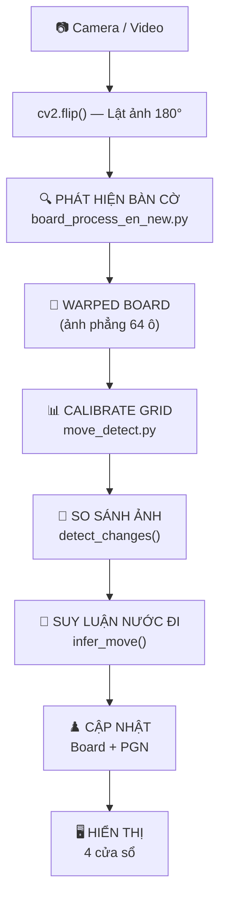

# 🎯 Flow Thuyết Trình — Pipeline Xử Lý Ảnh Bàn Cờ

> Tổng quan các hàm, thuật toán khi chạy `main.py` — dùng cho thuyết trình.

---

## Pipeline Tổng Quan



---

## Giai Đoạn 1: Phát Hiện Bàn Cờ

| Bước | Thuật toán / Hàm | Giải quyết vấn đề gì |
|---|---|---|
| 1.1 | `cv2.cvtColor(BGR→GRAY)` | Chuyển ảnh màu → xám để xử lý |
| 1.2 | **CLAHE** (`cv2.createCLAHE`) | Tăng tương phản cục bộ → bàn cờ nổi rõ trong ánh sáng không đều |
| 1.3 | **OTSU Threshold** (`cv2.threshold`) | Tự động tìm ngưỡng nhị phân tối ưu → tách bàn cờ khỏi nền |
| 1.4 | `cv2.findContours` | Tìm đường viền (contour) các vùng trắng → xác định hình dạng bàn cờ |
| 1.5 | **Douglas-Peucker** (`cv2.approxPolyDP`) | Xấp xỉ contour thành đa giác đơn giản → kiểm tra có đúng 4 đỉnh (tứ giác) |

**Kết quả**: 4 đỉnh góc bàn cờ trong frame camera.

---

## Giai Đoạn 2: Biến Đổi Phối Cảnh (Perspective Transform)

| Bước | Thuật toán / Hàm | Giải quyết vấn đề gì |
|---|---|---|
| 2.1 | `order_points()` (Sum + Diff) | Sắp xếp 4 góc thành TL→TR→BR→BL chuẩn |
| 2.2 | `cv2.getPerspectiveTransform` | Tính ma trận biến đổi 3×3 từ tọa độ méo → tọa độ vuông |
| 2.3 | **EMA Stabilization** (α=0.85) | Làm mượt ma trận giữa các frame → loại bỏ rung lắc camera |
| 2.4 | `cv2.warpPerspective` (M1) | **Warp lần 1**: Ảnh camera méo → ảnh bàn cờ phẳng (còn viền gỗ) |
| 2.5 | `cv2.warpPerspective` (M2) | **Warp lần 2**: Loại viền gỗ → chỉ giữ 64 ô cờ |
| 2.6 | **Frame Skip** (cache M2@M1) | Ghép 2 ma trận → chỉ detect contour mỗi 5 frame, tăng FPS |

**Kết quả**: Ảnh bàn cờ vuông, phẳng, chỉ chứa 64 ô.

---

## Giai Đoạn 3: Calibrate Grid (Lưới 8×8)

| Bước | Thuật toán / Hàm | Giải quyết vấn đề gì |
|---|---|---|
| 3.1 | `cv2.Canny` | Phát hiện cạnh (đường kẻ bàn cờ) trên ảnh warped |
| 3.2 | **Hough Transform** (`cv2.HoughLines`) | Tìm đường thẳng trong ảnh → xác định vị trí 9 đường kẻ ngang + 9 dọc |
| 3.3 | **Line Clustering** (`_cluster_lines`) | Gom nhóm đường Hough gần nhau → 9 đường đại diện chính xác |

**Kết quả**: `h_grid[9]` + `v_grid[9]` — tọa độ chính xác 9 đường kẻ mỗi chiều → chia đúng 64 ô.

---

## Giai Đoạn 4: Phát Hiện Nước Đi

| Bước | Thuật toán / Hàm | Giải quyết vấn đề gì |
|---|---|---|
| 4.1 | `cv2.GaussianBlur` | Làm mờ ảnh → giảm nhiễu trước khi so sánh |
| 4.2 | **Absolute Difference** (`cv2.absdiff`) | Tính hiệu pixel giữa ảnh trước & sau đi quân → "bản đồ thay đổi" |
| 4.3 | `cv2.threshold` (Binary) | Nhị phân hóa diff → pixel thay đổi = 255, không đổi = 0 |
| 4.4 | `cv2.countNonZero` (per cell) | Đếm pixel thay đổi trong từng ô → xác định ô nào thay đổi đáng kể |
| 4.5 | **Score Sorting** | Sắp xếp ô theo mức thay đổi → ô đi/đến thay đổi nhiều nhất |

**Kết quả**: Danh sách ô thay đổi, ví dụ: `[e2, e4]`.

---

## Giai Đoạn 5: Suy Luận Nước Đi (Kết Hợp Luật Cờ)

| Bước | Thuật toán / Hàm | Giải quyết vấn đề gì |
|---|---|---|
| 5.1 | `chess.Board.legal_moves` | Lấy tất cả nước đi hợp lệ từ python-chess |
| 5.2 | **Expected Squares Matching** | Với mỗi nước hợp lệ, tính tập ô kỳ vọng thay đổi → so khớp với ô thực tế |
| 5.3 | **Scoring** (match count) | Nước nào khớp nhiều ô nhất → nước đi chính xác nhất |
| 5.4 | **Promotion Handling** | Khi tốt đến hàng cuối → ưu tiên phong Hậu (Queen) |
| 5.5 | `chess.Board.push(move)` | Cập nhật trạng thái bàn cờ logic |
| 5.6 | `chess.pgn.Game.add_variation` | Ghi lại nước đi vào PGN tree |

**Kết quả**: Nước đi xác định (ví dụ: `e2e4`), bàn cờ logic cập nhật.

---

## Giai Đoạn 6: Hiển Thị

| Cửa sổ | Thuật toán / Hàm | Hiển thị gì |
|---|---|---|
| Camera | `cv2.drawContours` | Frame camera + bounding box xanh bàn cờ |
| Warped + Grid | `cv2.line` + `cv2.arrowedLine` | Ảnh phẳng + lưới 8×8 + mũi tên preview nước đi |
| Chess Visual | **Alpha Blending** (ChessVisualizer) | Bàn cờ ảo từ PNG assets + highlight nước đi |
| Diff Detection | `cv2.cvtColor` (heatmap) | Ảnh diff nhị phân → vùng thay đổi hiện đỏ |

---

## Sơ Đồ Tổng Hợp Thuật Toán

```
Camera Frame
    │
    ▼
┌─────────────────────────────────────────────┐
│  TIỀN XỬ LÝ ẢNH                            │
│  Grayscale → CLAHE → OTSU → Contour        │
│  → Tìm 4 góc bàn cờ                        │
└─────────────────┬───────────────────────────┘
                  │
                  ▼
┌─────────────────────────────────────────────┐
│  PERSPECTIVE TRANSFORM                       │
│  Order Points → getPerspectiveTransform      │
│  → EMA Stabilization → warpPerspective ×2   │
│  → Frame Skip (cache M2@M1)                 │
└─────────────────┬───────────────────────────┘
                  │
                  ▼
┌─────────────────────────────────────────────┐
│  CALIBRATE GRID                              │
│  Canny → HoughLines → Line Clustering       │
│  → 9 đường ngang + 9 đường dọc              │
└─────────────────┬───────────────────────────┘
                  │
                  ▼
┌─────────────────────────────────────────────┐
│  PHÁT HIỆN THAY ĐỔI                         │
│  GaussianBlur → absdiff → threshold         │
│  → countNonZero per cell → Score Sort       │
└─────────────────┬───────────────────────────┘
                  │
                  ▼
┌─────────────────────────────────────────────┐
│  SUY LUẬN NƯỚC ĐI                            │
│  legal_moves → Expected Squares Matching     │
│  → Scoring → Promotion Handling              │
│  → push(move) → PGN update                  │
└─────────────────┬───────────────────────────┘
                  │
                  ▼
┌─────────────────────────────────────────────┐
│  HIỂN THỊ                                    │
│  Camera + Warped + Chess Visual + Diff       │
│  Alpha Blending (PNG assets) + Grid Overlay  │
└─────────────────────────────────────────────┘
```

---

## Danh Sách Thuật Toán Sử Dụng

| # | Thuật toán | Thư viện | Mục đích |
|---|---|---|---|
| 1 | **CLAHE** | OpenCV | Tăng tương phản cục bộ, xử lý ánh sáng không đều |
| 2 | **OTSU Thresholding** | OpenCV | Tự động tìm ngưỡng nhị phân tối ưu |
| 3 | **Douglas-Peucker** | OpenCV | Xấp xỉ đa giác từ contour phức tạp |
| 4 | **Perspective Transform** | OpenCV | Chiếu ảnh méo → ảnh phẳng (ma trận 3×3) |
| 5 | **EMA (Exponential Moving Average)** | NumPy | Làm mượt ma trận transform giữa các frame |
| 6 | **Canny Edge Detection** | OpenCV | Phát hiện cạnh để tìm đường kẻ bàn cờ |
| 7 | **Hough Transform** | OpenCV | Tìm đường thẳng trong ảnh cạnh |
| 8 | **Line Clustering** | Custom | Gom nhóm đường Hough gần nhau → 9 đường đại diện |
| 9 | **Gaussian Blur** | OpenCV | Giảm nhiễu trước khi so sánh pixel |
| 10 | **Absolute Difference** | OpenCV | Tính sự khác biệt giữa 2 ảnh |
| 11 | **Alpha Blending** | Custom | Overlay quân cờ PNG (có alpha) lên bàn cờ |
| 12 | **Legal Move Matching** | python-chess | Đối chiếu ô thay đổi với nước đi hợp lệ |
