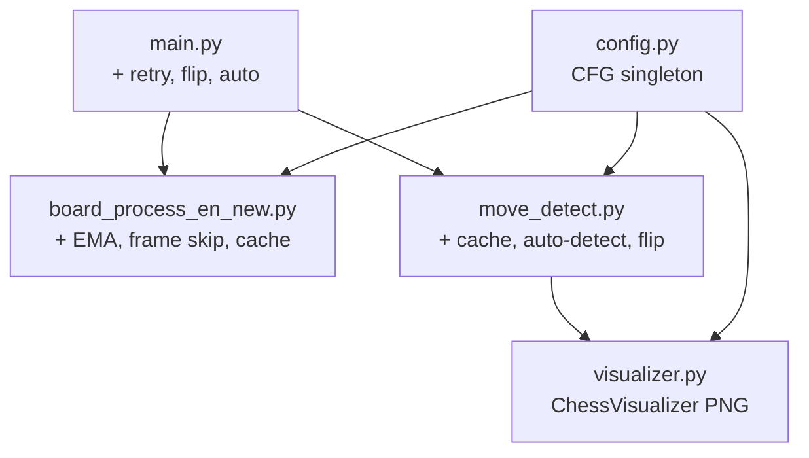

# 📋 Changelog & Hướng Dẫn — Chess Board Detection Optimization

> Ghi lại toàn bộ thay đổi đã thực thi, mục đích, và hướng dẫn sử dụng.

---

## Tổng Quan Thay Đổi

| ID | Loại | Mô tả | File ảnh hưởng | Trạng thái |
|---|---|---|---|---|
| **S4** | Cấu trúc | Tạo config tập trung | `config.py` [MỚI] | ✅ |
| **P5** | Hiệu năng | Cache CLAHE object | `board_process_en_new.py` | ✅ |
| **L2** | Logic | EMA stabilization cho warp | `board_process_en_new.py` | ✅ |
| **L1** | Logic | Cập nhật `wrap_size` động | `board_process_en_new.py` | ✅ |
| **P2** | Hiệu năng | Frame skip + cache transform | `board_process_en_new.py` | ✅ |
| **P1** | Hiệu năng | Cache visual board (FEN check) | `move_detect.py` | ✅ |
| **L3** | Logic | Ngưỡng pixel động (% diện tích) | `move_detect.py` | ✅ |
| **L4** | Logic | Ưu tiên Queen promotion | `move_detect.py` | ✅ |
| **L5** | Logic | Fix xung đột calibrate grid | `move_detect.py` | ✅ |
| **S2** | Cấu trúc | Dùng ChessVisualizer, bỏ cairosvg | `visualizer.py`, `move_detect.py` | ✅ |
| **P3** | Hiệu năng | Giảm copy() dư thừa | `main.py` | ✅ |
| **S3** | Cấu trúc | Camera retry thay vì crash | `main.py` | ✅ |
| **F1** | Tính năng | Auto-detect nước đi | `move_detect.py`, `main.py` | ✅ |
| **F2** | Tính năng | Preview mũi tên trên warped | `move_detect.py`, `main.py` | ✅ |
| **F3** | Tính năng | Flip board (đen ở dưới) | `visualizer.py`, `move_detect.py`, `main.py` | ✅ |
| **Bug9** | Sửa lỗi | Game over / checkmate check | `move_detect.py` | ✅ |

---

## Chi Tiết Từng Thay Đổi

### S4 — Config tập trung (`config.py`) [MỚI]

Tạo file `config.py` chứa tất cả thông số hardcoded trước đây, dùng `dataclass` để dễ thay đổi.

**Thông số quan trọng**:

| Thông số | Mặc định | Ý nghĩa |
|---|---|---|
| `diff_threshold` | `40` | Ngưỡng binary cho diff ảnh |
| `change_ratio` | `0.05` | Tỉ lệ % diện tích ô coi là thay đổi |
| `min_contour_area` | `5000` | Diện tích contour tối thiểu |
| `ema_alpha` | `0.85` | Hệ số EMA (càng cao càng mượt, càng chậm phản ứng) |
| `frame_skip_interval` | `5` | Detect contour mỗi N frame |
| `auto_stable_frames` | `15` | Số frame ổn định trước khi auto-confirm |
| `auto_detect_enabled` | `False` | Auto-detect tắt mặc định |

**Cách dùng**: Import `CFG` singleton:
```python
from config import CFG
# Đọc: CFG.ema_alpha
# Sửa runtime: CFG.auto_detect_enabled = True
```

---

### P1 — Cache Visual Board

**File**: `move_detect.py` → `get_visual_board()`

**Trước**: Gọi `cairosvg.svg2png()` mỗi frame (~30ms/call)
**Sau**: Cache ảnh board, chỉ render lại khi FEN thay đổi (khi có nước đi mới)

```python
def get_visual_board(self):
    current_fen = self.board.fen()
    if current_fen != self._cached_fen:
        self._cached_visual = self._visualizer.draw_board(...)
        self._cached_fen = current_fen
    return self._cached_visual
```

---

### P2 — Frame Skip + Cached Transform

**File**: `board_process_en_new.py` → `process_frame()`

**Trước**: Full pipeline mỗi frame (CLAHE → OTSU → findContours → 2× warpPerspective)
**Sau**: Chỉ detect contour mỗi `frame_skip_interval` frame. Các frame giữa dùng cached combined matrix `M2 @ M1`.

**Lưu ý**: `frame_skip_interval = 5` trong config. Tăng lên nếu camera cố định, giảm xuống nếu camera di chuyển nhiều.

---

### P3 — Giảm copy() dư thừa

**File**: `main.py`

- Bỏ `frame.copy()` trước resize (resize tạo ảnh mới)
- Giữ `copy()` cho `prev_img` và `last_warped_board` (cần snapshot bất biến)

---

### P5 — Cache CLAHE Object

**File**: `board_process_en_new.py`

Tạo `cv2.createCLAHE()` 1 lần trong `__init__`, tái sử dụng mỗi frame thay vì tạo mới.

---

### L1 — Cập nhật `wrap_size` động

**File**: `board_process_en_new.py` → `process_frame()`

**Trước**: `wrap_size` chỉ tính lần đầu, không bao giờ cập nhật
**Sau**: Cập nhật khi kích thước bàn cờ thay đổi > 10% (`CFG.wrap_size_update_ratio`)

---

### L2 — EMA Stabilization

**File**: `board_process_en_new.py` → `process_frame()`

Thêm **Exponential Moving Average** cho ma trận perspective transform:
```python
M1 = alpha * prev_M1 + (1 - alpha) * M1
```

**Hệ số `ema_alpha = 0.85`**: 85% trọng số từ frame trước → warped board mượt hơn, giảm rung lắc.

**Tinh chỉnh**:
- Tăng `ema_alpha` → mượt hơn nhưng chậm phản ứng khi camera di chuyển
- Giảm `ema_alpha` → phản ứng nhanh nhưng rung hơn

---

### L3 — Ngưỡng Pixel Động

**File**: `move_detect.py` → `detect_changes()`

**Trước**: `if non_zero > 100` (hardcoded)
**Sau**: `if non_zero > cell_area * CFG.change_ratio` — tỉ lệ 5% diện tích ô

Tự động thích ứng với kích thước ô khác nhau.

---

### L4 — Ưu tiên Queen Promotion

**File**: `move_detect.py` → `infer_move()`

Khi tốt đến hàng cuối, `python-chess` sinh 4 nước legal (Q/R/B/N promotion). Code mới ưu tiên chọn Queen:
```python
for mv in best_moves:
    if mv.promotion == chess.QUEEN:
        return mv, "Success (queen promotion)"
```

---

### L5 — Fix Xung Đột Calibrate Grid

**File**: `move_detect.py` → `update_frame()`

**Trước**: `update_frame()` ghi đè grid Hough bằng grid chia đều khi kích thước ảnh thay đổi
**Sau**: Thêm flag `_hough_calibrated` — nếu đã calibrate bằng Hough thì không ghi đè

---

### S2 — ChessVisualizer thay cairosvg

**File**: `visualizer.py`, `move_detect.py`

**Trước**: `board_to_image()` dùng `chess.svg.board()` → `cairosvg.svg2png()` → decode
**Sau**: `ChessVisualizer` class dùng asset PNG trong `assets/pieces/`

**Lợi ích**:
- ⚡ Nhanh hơn 10-50x
- 📦 Bỏ dependency `cairosvg` (và cài đặt GTK phức tạp trên Windows)
- 🎨 Highlight nước đi mới (ô xanh), hiển thị label file/rank

**Lưu ý**: Cần thư mục `assets/pieces/` chứa 12 file PNG (`wp.png`, `bp.png`,...). File có thể extension `.PNG` (uppercase) — code xử lý được cả hai.

---

### S3 — Camera Error Handling

**File**: `main.py`

**Trước**: `break` ngay khi `ret = False`
**Sau**: Retry tối đa `camera_retry_limit` frame (30 frame ≈ 1 giây). Nếu quá giới hạn → auto-save PGN rồi thoát.

---

### Bug 9 — Game Over Check

**File**: `move_detect.py` → `confirm_move()`

Thêm kiểm tra `board.is_game_over()`:
- **Đầu hàm**: Nếu game đã kết thúc → từ chối detect
- **Sau push**: Phân loại lý do (Checkmate / Stalemate / Insufficient material / Fifty-move / Repetition)

---

## Tính Năng Mới

### F1 — Auto-detect Nước Đi

**Cách hoạt động**: So sánh liên tục `curr_img` vs `prev_img`. Khi phát hiện thay đổi lớn rồi ổn định trong `auto_stable_frames` frame liên tiếp → tự động gọi `confirm_move()`.

**Bật/tắt**: Nhấn phím `'a'` hoặc sửa `CFG.auto_detect_enabled = True` trong config.

**Tinh chỉnh**:
- `auto_stable_frames = 15`: Tăng nếu phát hiện sai nhiều (chờ lâu hơn)
- `auto_change_threshold = 0.02`: Tăng nếu camera rung nhiều

> ⚠️ **Mặc định TẮT**. Nên test kỹ trước khi dùng trong game thật.

---

### F2 — Preview Mũi Tên Trên Warped Board

Khi có thay đổi trên bàn cờ, hệ thống tự động suy luận nước đi khả thi và vẽ **mũi tên cam** từ ô đi → ô đến trên cửa sổ "Warped Board + Grid".

Giúp user xác nhận trực quan trước khi nhấn SPACE.

---

### F3 — Flip Board

Nhấn phím `'f'` để đổi góc nhìn:
- **Mặc định**: Trắng ở dưới (White perspective)
- **Flip**: Đen ở dưới (Black perspective)

Ảnh hưởng: Visual board, grid mapping, và move detection coordinate.

---

## Phím Tắt Mới

| Phím | Chức năng |
|---|---|
| `i` | Calibrate — set reference frame |
| `SPACE` | Xác nhận nước đi |
| `r` | Undo nước đi cuối |
| `q` | Thoát + save PGN |
| **`f`** | 🆕 Flip board (đổi trắng/đen) |
| **`a`** | 🆕 Toggle auto-detect ON/OFF |

---

## Kiến Trúc Sau Tối Ưu

```
main.py                    ← Vòng lặp chính, keyboard, display
├── config.py              ← [MỚI] Thông số tập trung
├── board_process_en_new.py ← Board detection + warp (EMA, frame skip)
├── move_detect.py          ← Move engine (cache, auto-detect, flip)
│   └── visualizer.py      ← ChessVisualizer (PNG assets, không cairosvg)
└── assets/pieces/          ← 12 file PNG quân cờ
```



---

## Dependency Changes

**Bỏ được** (không cần cài nữa):
- ❌ `cairosvg`
- ❌ `chess.svg` (không dùng nữa)

**Vẫn cần**:
- ✅ `opencv-python`
- ✅ `numpy`
- ✅ `python-chess`
